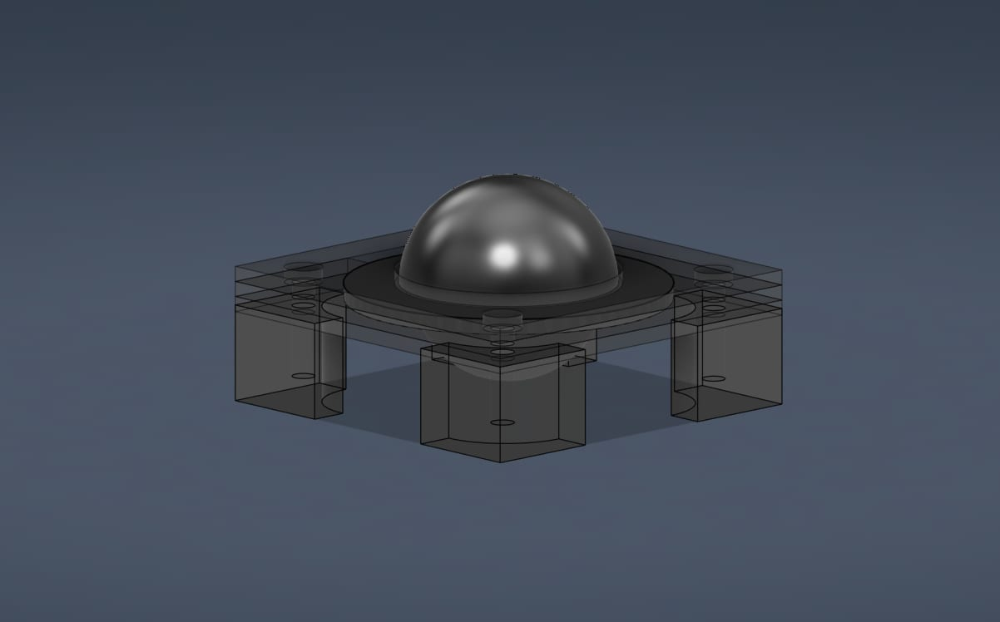
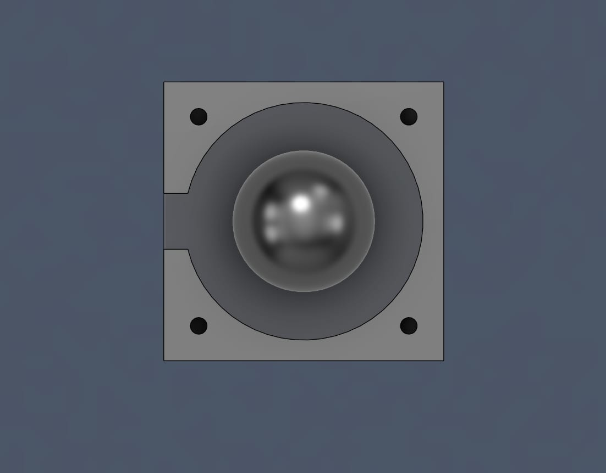
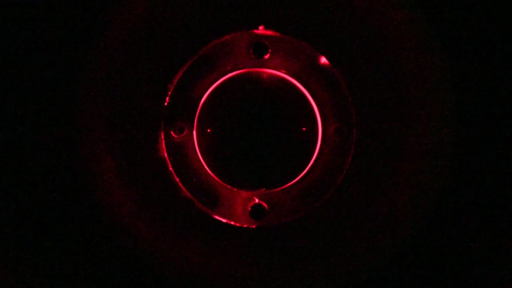
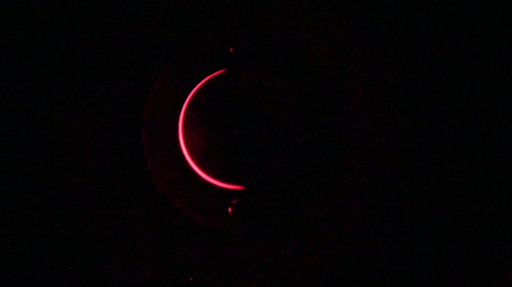
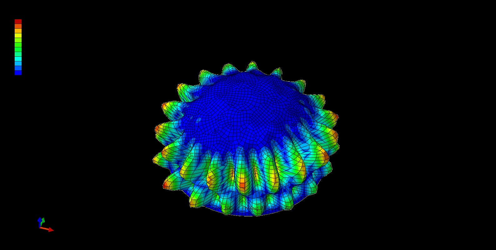
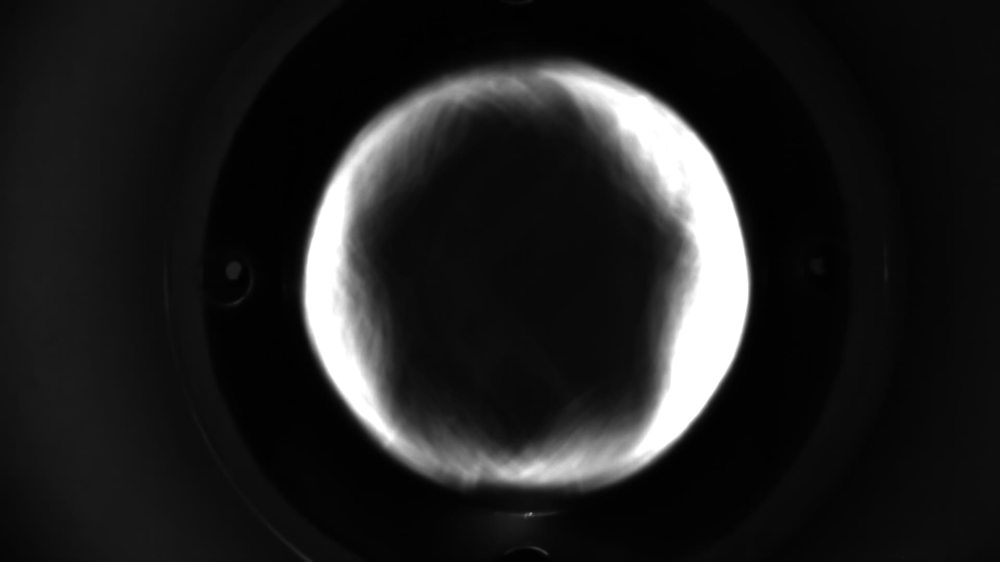
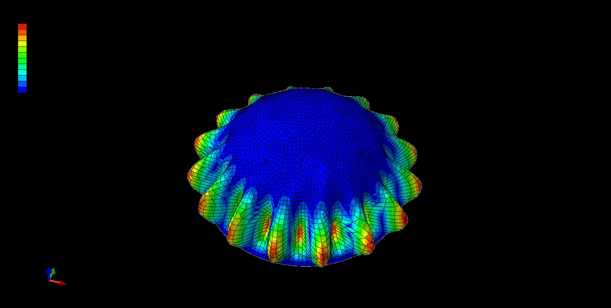

I spent the summer of 2025 as a materials research intern at the
[Architected Intelligent Matter Laboratory](https://aim.me.uh.edu/) at the
University of Houston. The lead researcher was away at Stanford for the summer, so I was handed a single open question and told to run with it: *could a thin elastomer shell stretched over a sphere be used to physically model fluid motion across a spherical surface?*

I took the project from an inherited, unreliable casting process to a rigorous measurement chain. Over the summer, I single-handedly built an automated laser-sheet rig, characterized material models via OpenCV, and ran Abaqus modal simulations that closely matched our physical reality.

## Making a Shell of Uniform Thickness

The work I inherited was aimed at a narrower problem: making the elastomer a consistent thickness. Without that, nothing downstream means anything — the resonant frequencies move, and you can't separate a real fluid result from a random casting defect.

The method involved pouring Mold Star silicone over a ball bearing. A bearing ball is manufactured as a near-perfect sphere, making it a precision mold you can buy for a few dollars. But the manual pouring process was a mess. Consistency depended entirely on the steadiness of whoever was holding the silicone.

The custom jig I designed to rigidly locate the ball bearing identically every single pour.

I rebuilt the arrangement with a custom jig that completely removed the human element. We now had silicone hemispheres cast to a repeatable wall within 0.2 mm. 

## Characterizing the Elastomer

Every candidate elastomer had to be characterized before it could go into the Abaqus simulation. The problem? A real physical extensometer was out of reach on both budget and lead time. 

So I built a software one.

Left: My OpenCV script tracking gauge marks on an Instron. Right: The final cast shell mounted in its flange.

I marked the specimen with gauge marks, filmed the tensile test, and wrote an OpenCV script to track the marks in real time, converting pixels to millimetres. 

It started as a workaround but ended up being the better measurement: optical strain avoids the error you get from grip displacement on a soft material, where the crosshead travels considerably further than the gauge section actually stretches. Feeding those precise properties back into the model improved the simulation's accuracy by 10%.

## The Laser Sheet

To see the motion, I built a jig coupling the shell to the speaker and shot it from directly above. A top view shows the mode pattern but flattens it — you get the shape, not the true Z-displacement.

The automated test rig driving the laser sheet (left) and the resulting laser profile slice (right).

Sweeping the sheet's height with servos driven by a microcontroller turns one slice into a full 3D stack. I wrote a script to step both the sheet height and the drive frequency automatically. The rig could run unattended for an hour and record a full frequency sweep, reconstructing the shell's complete 3D motion instead of a single 2D plane.

## Measured Against Predicted

The entire summer's payoff was a direct comparison at matching frequencies. If the physical casting process, the optical material model, and the Abaqus simulation were all correct, the results would match.

Measured physical reality (left) vs. Abaqus simulated reality (right) at 162 Hz. The lobed petal patterns are identical.

Measured (left) vs. Simulated (right) at 121 Hz.

Counting lobes in the photograph and in the simulation gave the exact same answer across multiple frequencies. That agreement was the ultimate validation of everything built leading up to it.

## What I'd Change

Wall thickness drift is still the weak link. Even with the jig, thickness varies around the hemisphere as the silicone flows under gravity before it cures. Picking it up again, I'd attack that first: rotate the mold during cure so gravity averages around the shell instead of accumulating on one side, ensuring the thickness going into the simulation is exactly the thickness that actually exists.
