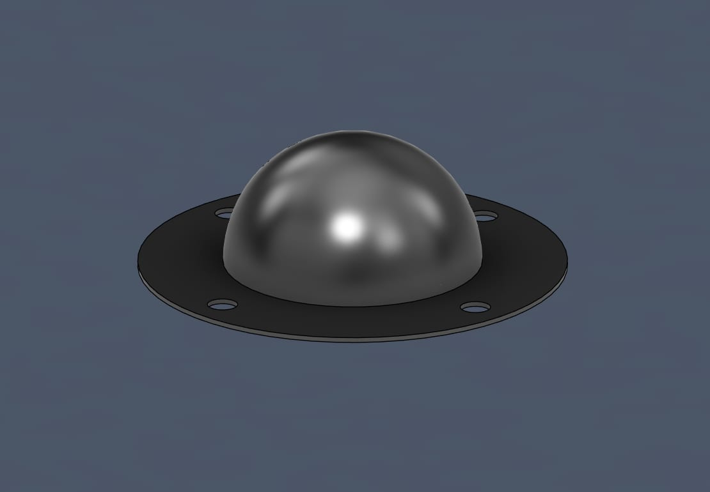
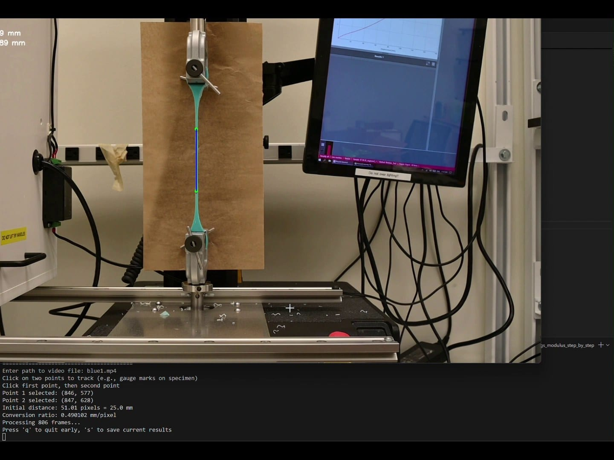
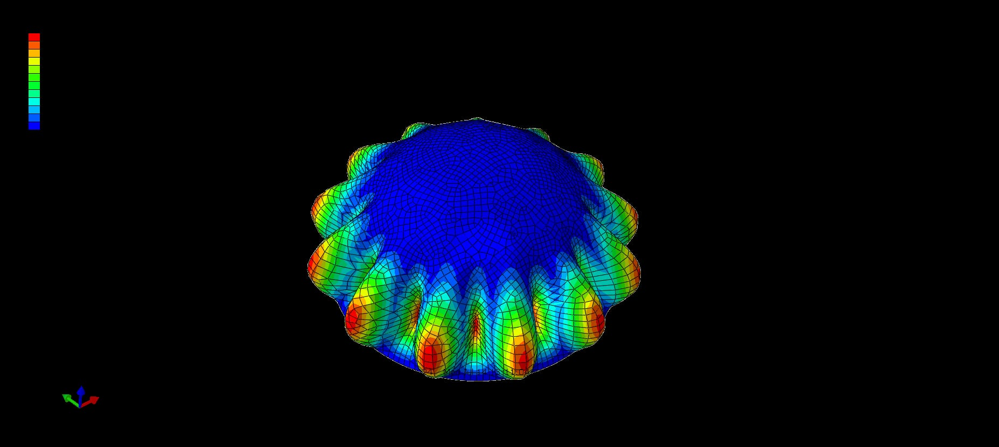
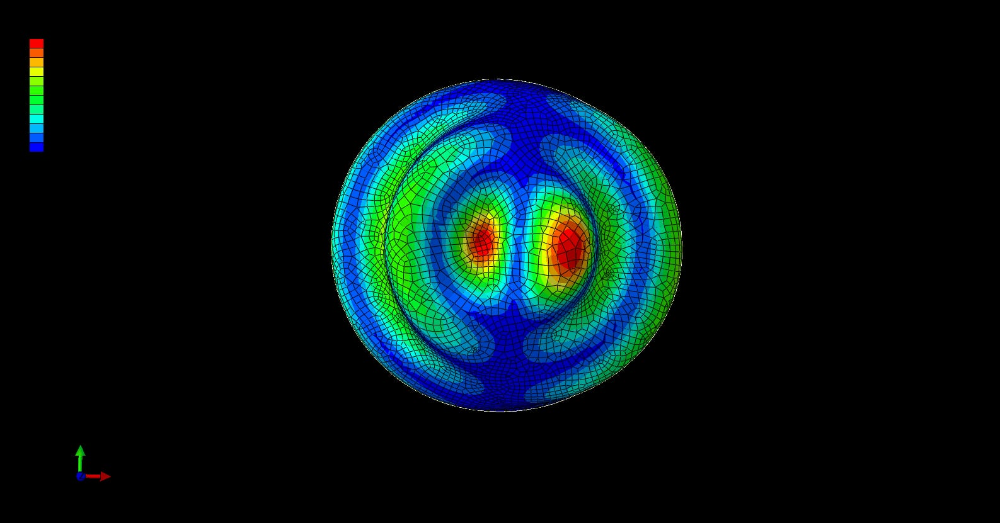
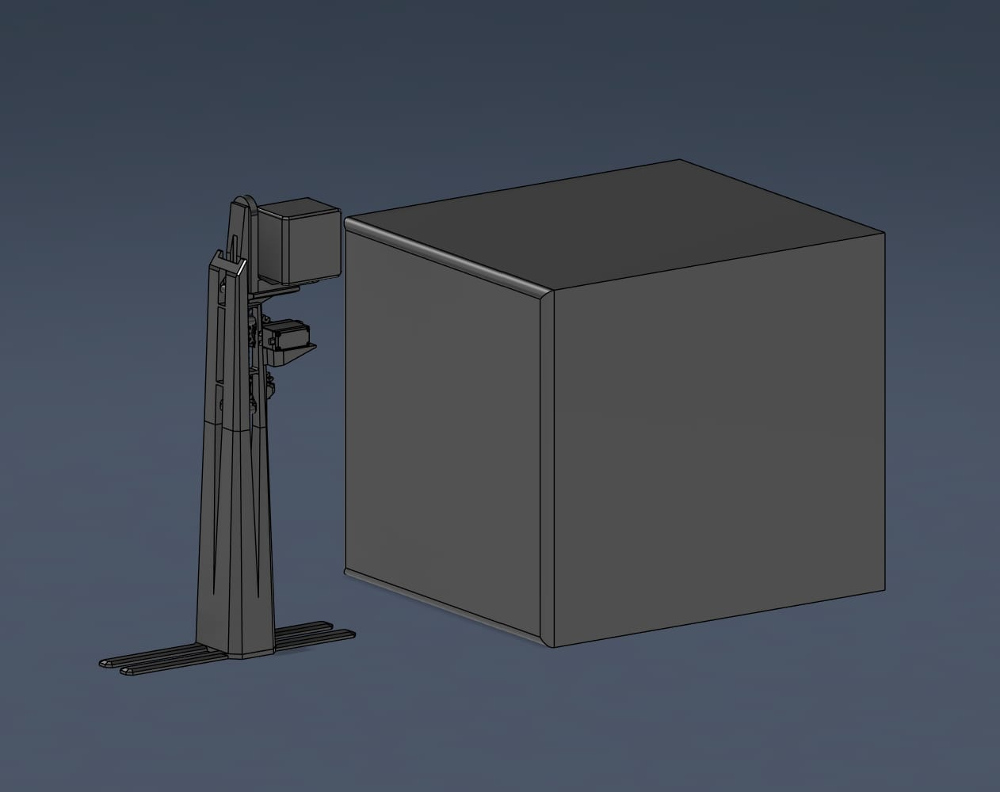
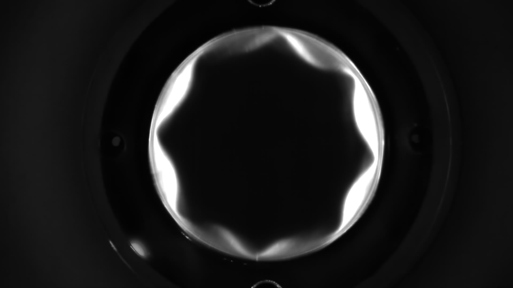
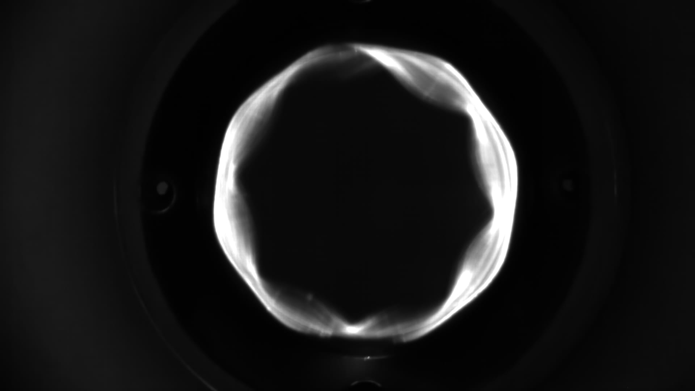

I spent the summer of 2025 as a materials research intern at the
[Architected Intelligent Matter Laboratory](https://aim.me.uh.edu/) at the
University of Houston. The researcher leading this line of work was away at a
PhD program hosted by Stanford for the whole summer, so I was handed the
question and left to run at it: **could a thin elastomer shell stretched over a
sphere be used to model fluid motion across a spherical surface** — the kind of
behavior the Navier–Stokes equations describe?

## Outcome

I took the project from an inherited, unreliable casting process to a working
measurement chain: silicone hemispheres cast to a repeatable wall within
**0.2 mm**, a material model built from my own tensile data, an Abaqus modal
simulation predicting where the interesting motion would be, and an automated
laser-sheet rig that sliced the vibrating shell so real mode shapes could be
compared against predicted ones. Calibrating the material model against measured
data improved the modal simulation's accuracy by about **10%**, and the measured
modes matched the simulation closely enough to be recognizable frequency by
frequency.

## My Role

All of it, for one summer, largely alone — the casting process and its jigs, the
material characterization and the code behind it, learning Abaqus from scratch,
building the test rig and its microcontroller sweep, and processing the footage
into results.

## Making a Shell of Uniform Thickness

The work I inherited was aimed at a narrower problem: making the elastomer a
consistent thickness. Without that, nothing downstream means anything — the
resonant frequencies move, and you can't separate a real result from a casting
defect.

The method was to pour **Mold Star silicone** over a **ball bearing** in
successive layers. The bearing is the clever part of that setup and it wasn't
mine: a bearing ball is manufactured as a near-perfect sphere, so it's a
precision mold you can buy for a few dollars. The pouring arrangement around it
was the weak point, so my first few weeks went into rebuilding it — a jig that
holds the ball and locates it identically every pour, so consistency stops
depending on whoever is holding it.

I also checked whether the shell could be made some other way entirely, rather
than assuming pour-over was right. I tried a laser-based layer-by-layer FDM
process and a **Formlabs SLA** printer. Pour-over still won on uniformity —
worth establishing by test rather than by assumption.

## Characterizing the Elastomer Without a Strain Gauge

Every candidate elastomer had to be characterized before any of it could go into
a simulation, and a real extensometer was out of reach on both budget and lead
time. So I built one: mark the specimen with gauge marks, film the tensile test
on the Instron, and track the marks in **OpenCV**, converting pixels to
millimetres from a known starting distance. The frame above is that tracker
running — two points locked onto the gauge marks, 51.01 pixels calibrated to
25.0 mm, 806 frames of a pull being turned into strain.

It started as a workaround but it's the better measurement anyway: optical
strain avoids the error you get from grip displacement on a soft material, where
the crosshead travels considerably further than the gauge section actually
stretches. Feeding those properties back into the model is what produced the 10%
accuracy improvement.

## Simulating, to Know Where to Look

With real material properties in hand I learned **Abaqus** and ran modal
analyses on the shell. The simulation wasn't the deliverable — it was how I
found the frequencies where the shell's motion would be large and distinct
enough to actually see. A modal analysis across a wide band returns hundreds of
modes; only a handful are worth pointing a camera at, and guessing would have
wasted the summer.

## Checking the Speaker Before Trusting It

The shell is driven acoustically, so every measurement rests on the speaker
actually producing the frequency it was told to. Before building results on that
assumption I tested it, recording the output and reading the frequency back to
confirm commanded and actual agreed. They did — it was an expensive speaker. The
check cost an afternoon, and skipping it would have left an unverified
assumption underneath every number that followed.

## The Laser Sheet

To see the motion I built a jig coupling the shell to the speaker and shot it
from directly above. A top view shows the mode pattern but flattens it — you get
the shape, not the displacement.

So I moved to a **laser sheet**. A sheet of laser light grazing the shell
illuminates exactly one cross-section, and the camera sees that slice deform in
real time.

Sweeping the sheet's height with **servos driven by a microcontroller** turns one
slice into a stack of them. I wrote a script to step both the sheet height and
the drive frequency automatically, so the rig could run unattended for an hour or
two and record a full sweep. Pulling frames from that footage and combining the
slices reconstructs the shell's complete motion instead of a single plane
through it.

Pouring wet silicone over the vibrating shell made the surface motion visible a
second way, on top of the slicing.

## Measured Against Predicted

The payoff is a direct comparison at matching frequencies. At **162 Hz** the
laser sheet shows a clear polygonal standing wave around the shell:

And the Abaqus modal result at that same 162 Hz predicts the matching petal
pattern:

Counting lobes in the photograph and in the simulation gives the same answer.
That agreement is what justifies everything behind it — the casting process, the
optically measured material model, and the simulation all have to be right for
those two images to look alike.

## What I'd Change

Wall thickness drift is still the weak link. Even with the jig, thickness varies
around the hemisphere as the silicone flows under gravity before it cures, and
that variation moves the resonant frequencies — so some of the disagreement
between measured and predicted modes is likely my casting rather than the model.
Picking it up again, I'd attack that first: rotate the mold during cure so
gravity averages around the shell instead of accumulating on one side, and
measure the finished wall at several points rather than trusting the process, so
the thickness going into the simulation is the thickness that actually exists.
