I spent the summer of 2025 as a materials research intern at the <a href="https://aim.me.uh.edu/" target="_blank" rel="noopener">Architected Intelligent Matter Laboratory</a> at the University of Houston. The researcher leading this project was away at a PhD program hosted by Stanford for the summer, so this project was handed over to me. The main question we were trying to answer was whether we could accurately model how a fluid behaves over a spherical surface, much like the behavior the Navier–Stokes equations describe over a flat surface. To do this, the plan was to recreate a fluid's motion with a speaker playing a frequency below it, then compare that motion to a simulation.

When I inherited the project, I decided to first improve upon what was already done, then complete the research. First, I improved the silicone hemisphere casting process to have a repeatable wall within 0.01 mm, then built a material model from my own tensile data, an Abaqus modal simulation predicting where the interesting motion would be, and an automated laser-sheet rig that sliced the vibrating shell so the real mode shapes could be compared against the predicted ones. Although I was very passionate about this project, the hardest part was working on it alone.

<h3 class="text-centered">Making a Shell of Uniform Thickness</h3>

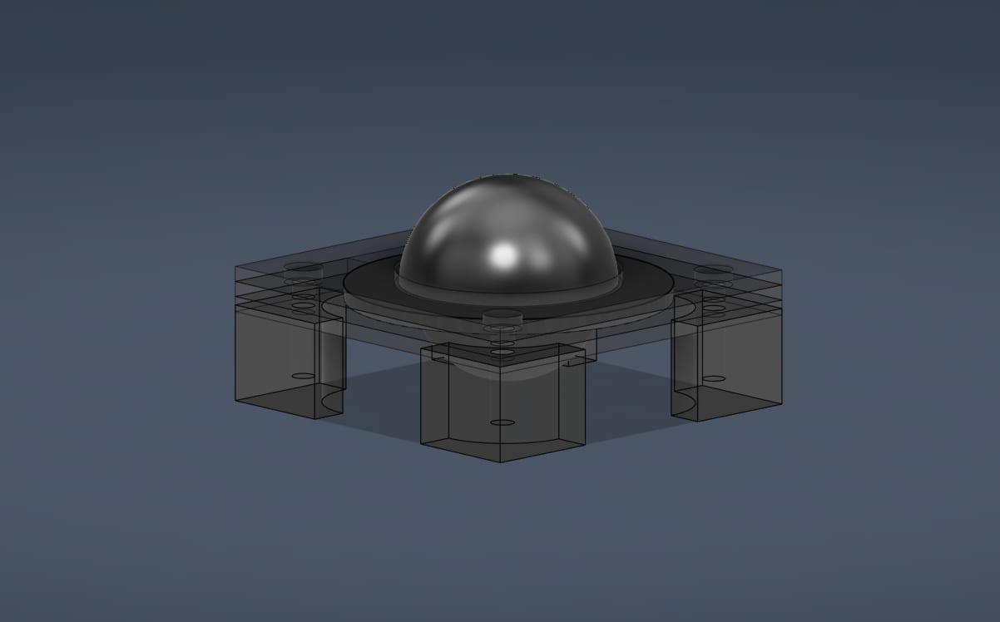

The pour jig holding the ball bearing mold

The work I inherited was aimed at a narrower problem: making the elastomer a consistent thickness. Without that, nothing downstream means anything, since the resonant frequencies move and you can't tell a real result apart from a casting defect.

The method was to pour Mold Star silicone over a ball bearing in layers. Each layer worked out to be about 0.2 mm thick, and I hoped to achieve a total thickness of 1 mm. The setup I was given was a bearing ball held up by a makeshift stand, with the cast silicone trimmed down to a half sphere. This half sphere was then placed above a speaker with more silicone poured over it and the behavior was modeled. The pouring setup around it was the weak point, so my first few weeks went into rebuilding it with a laser-cut acrylic jig that holds the ball and locates it the same way every pour.

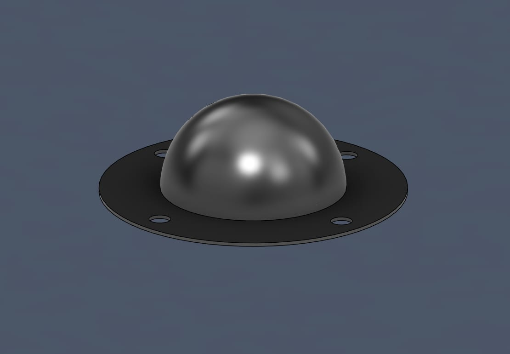

The cast hemisphere shell in CAD

To make sure all my bases were covered, I also checked whether the shell could be made some other way entirely instead of assuming pouring was the right call. I tried a laser-based layer-by-layer FDM process with a Stratasys printer and SLA via a Formlabs printer. The Stratasys and Formlabs materials couldn't match the silicone's elasticity, which made the behavior over the speaker less apparent.

Once the material was chosen, I decided to run some tests on the sphere. After pouring over 15 molds, I cut each one up and measured the thickness to determine whether there was enough consistency to proceed. The results were surprisingly positive, with an error of less than 0.01 mm across the elastomer when poured with the right technique, allowing me to move on to the next step.

<h3 class="text-centered">Characterizing the Elastomer</h3>

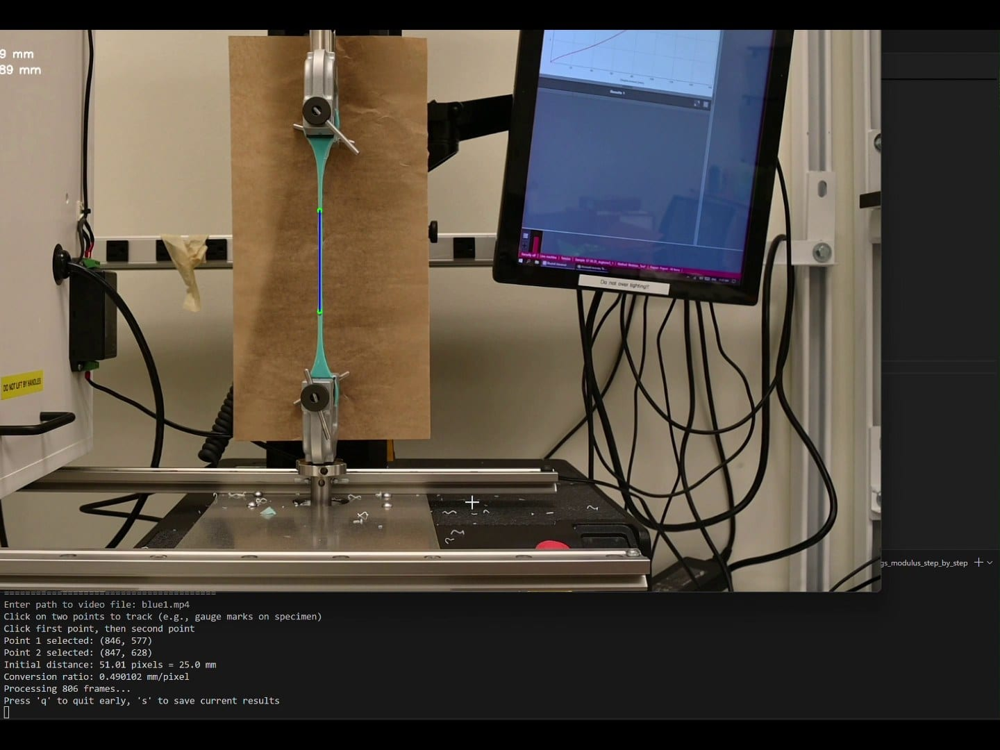

My OpenCV tracker following the gauge marks during a tensile test

Every candidate elastomer had to be characterized before it could go into a simulation. We wanted to perform our own testing since the listed properties could differ slightly from what our casting actually produced, which would invalidate our findings. However, we didn't have an extensometer for the Instron UTM, which made measuring strain much harder, so I built one in software. I marked each specimen with a sharpie, filmed the ASTM D412 tensile test on the Instron, and tracked the marks in OpenCV, converting pixels to millimeters from a known starting distance.

It started as a workaround, but it ended up being the better measurement. On a soft material, the crosshead travels a lot further than the gauge section actually stretches, and tracking the marks optically avoids that error. I automated the whole characterization workflow in Python, which cut the analysis time by 60%, allowing me to process the entire set of data in just one night.

<h3 class="text-centered">Simulating</h3>

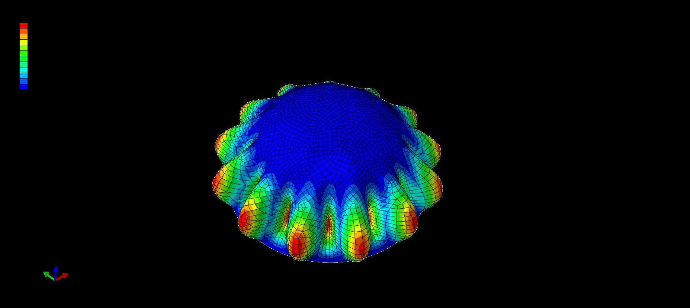

One of the shell's modes in Abaqus

With real material properties in hand, I learned Abaqus and ran modal analyses on the shell. The simulation wasn't the deliverable. It was how I found the frequencies where the shell's motion would be large and distinct enough to actually see. A modal analysis across a wide band returns hundreds of modes, and only a handful are worth pointing a camera at. To determine these frequencies, I went through the data and picked out the best-looking modes. From there, I took isometric and top views to compare with real life. The top view was the most important, since I decided the best way to see the mode shape was to buy a laser sheet, shine it at different heights along the half sphere, film each height from a bird's-eye view, and combine the frames.

<h3 class="text-centered">The Laser Sheet</h3>

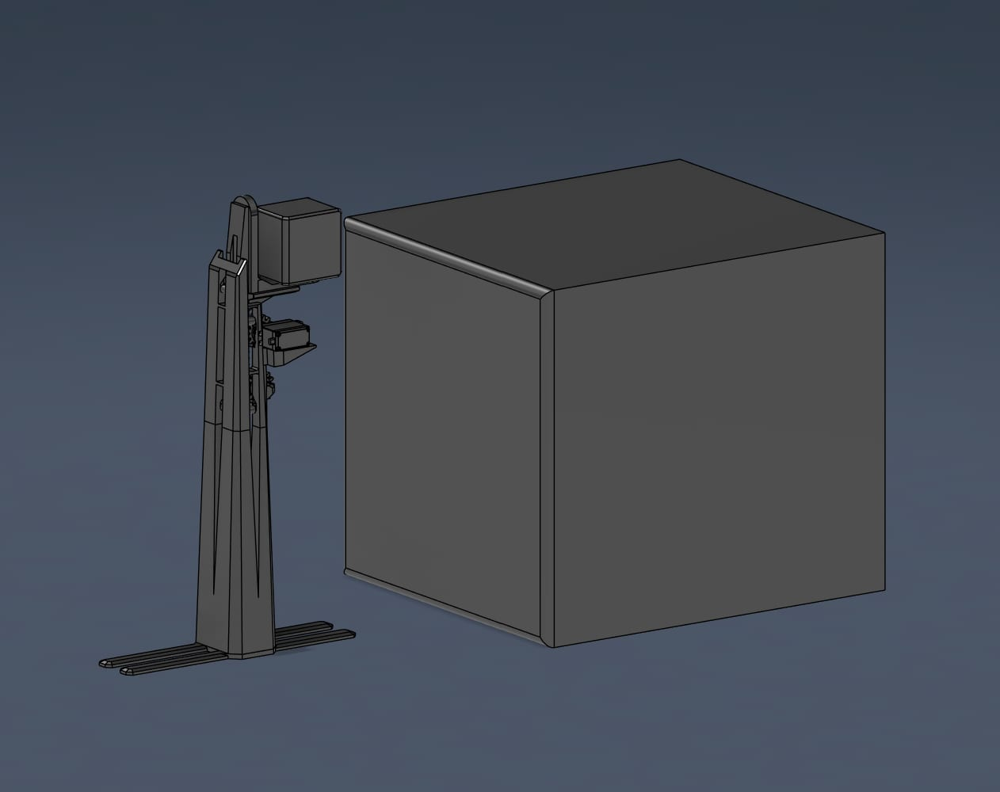

The laser sheet tower and test enclosure in CAD

However, before I could grab that data, I had to address the speaker. Every measurement relies on the speaker actually producing the frequency it was told to. Before building any results on that, I tested it by recording the output and reading the frequency back to make sure the commanded and actual frequencies agreed. I wrote a script that played through the list of frequencies I would need and recorded the output to see if they matched. I also tried continuously increasing the frequency and graphing the actual output, hoping the two would match. Luckily, the speaker checked out, and I could continue.

To see the motion, I built a jig coupling the shell to the speaker and filmed it from directly above. A top view shows the mode pattern, but it flattens it, so you get the shape without the displacement. A sheet of laser light grazing the shell lights up exactly one cross-section. To get the behavior at different heights, I built a small jig that used a servo that worked in combination with my computer to slowly move the laser sheet up after each frequency cycle. This allowed me to run the test for hours unattended, which made eating lunch much more fun!

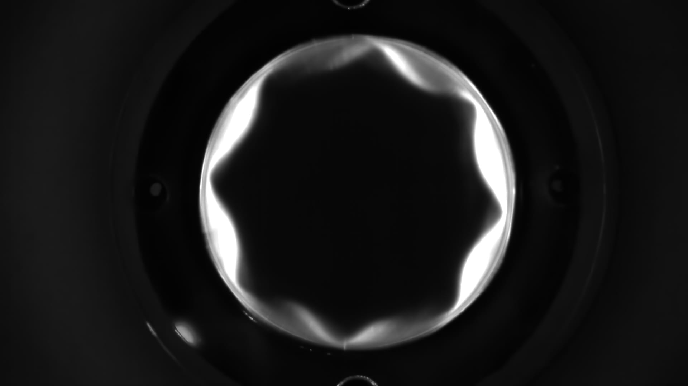

The laser sheet lighting up one cross-section of the shell

The script changed both the sheet height and the drive frequency automatically, so the rig could run on its own for an hour or two and record a full sweep. Pulling frames from that footage and combining the slices rebuilds the shell's complete motion instead of a single plane through it. I also picked certain frames from the video based on the frequency, hoping to catch the elastomer at its peak of movement, and combined them to capture the full extent of the elastomer's movement.

<h3 class="text-centered">Measured Against Predicted</h3>

The payoff is a direct comparison at matching frequencies. At 162 Hz, the laser sheet shows a clear polygonal standing wave around the shell; however, when counting the peaks, the real-life measurements show stark differences from the simulation. Unfortunately, I didn't get enough time that summer to tackle this new issue that arose. I believe it comes from a buildup of small imperfections in the setup, such as the way the elastomer was mounted to the face of the speaker, where the speaker's own vibration could have impeded its movement.

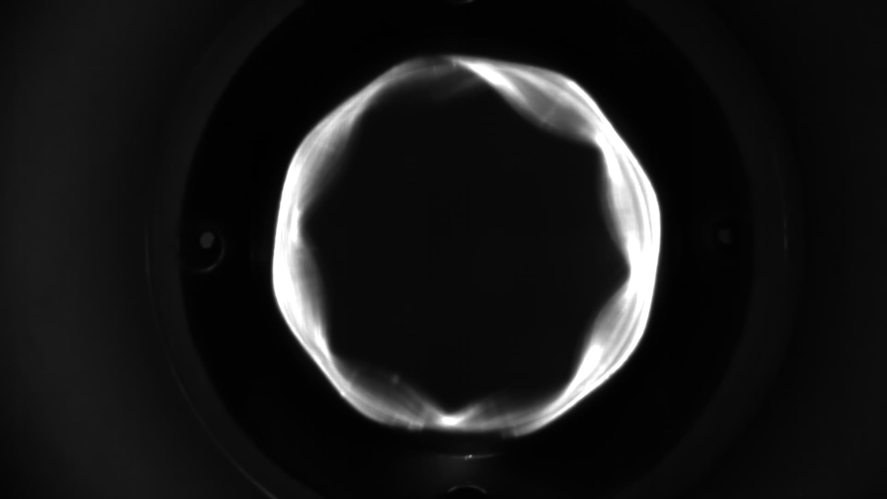
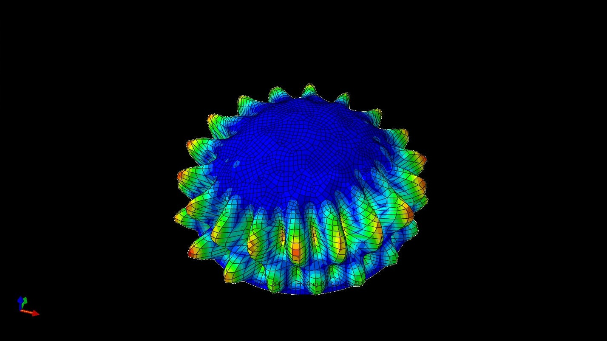

Measured at 162 Hz

Simulated at 162 Hz

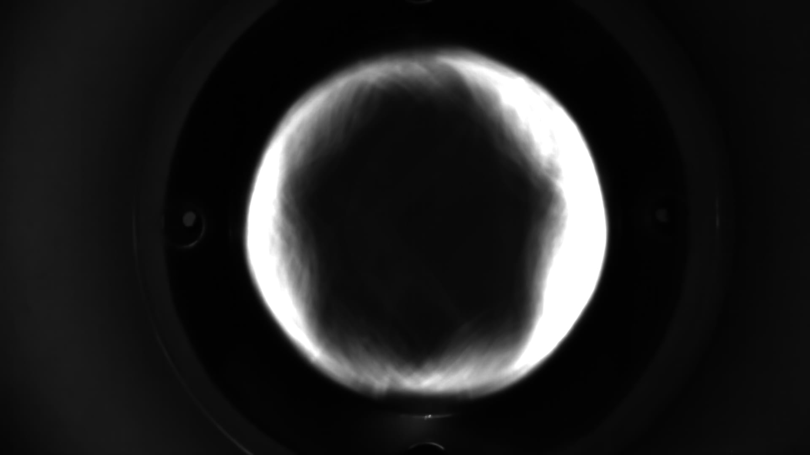
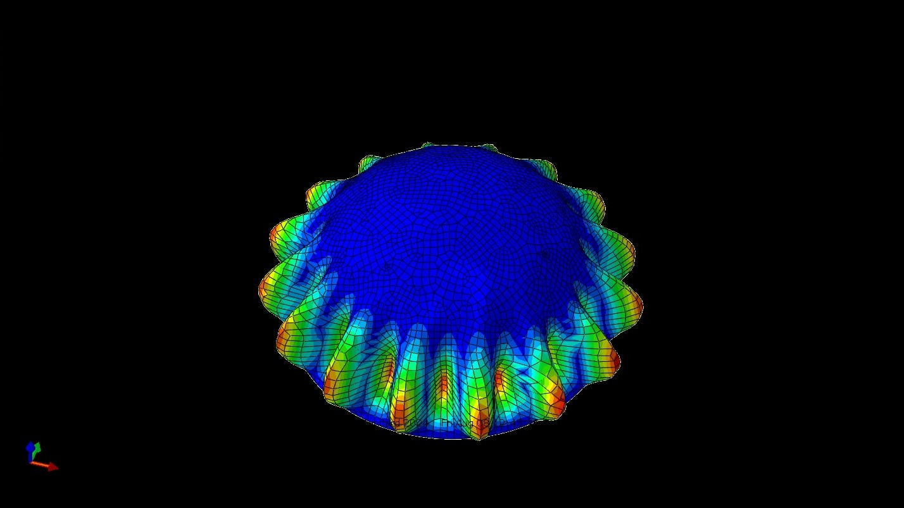

Measured at 121 Hz

Simulated at 121 Hz

<h3 class="text-centered">Conclusion and Future Improvements</h3>

This was the first time I had a research question entirely to myself, and the biggest thing I took away was to check every assumption before building on it. The measured and simulated modes didn't match the way I hoped, but because I had already validated the casting, the material properties, and the speaker, I could narrow the mismatch down to the test setup itself. If I had another summer in the lab, I would start there, with a better way to mount the elastomer to the speaker. I would also build a better enclosure for the pouring process, since the current setup allowed dust to settle, and try different Formlabs resins, since they could greatly improve the accuracy of the half sphere. Shipping times made that infeasible this summer. This summer was extremely fun, and I met some really cool people along the way. Thank you, Dr. Chen, for this amazing opportunity!

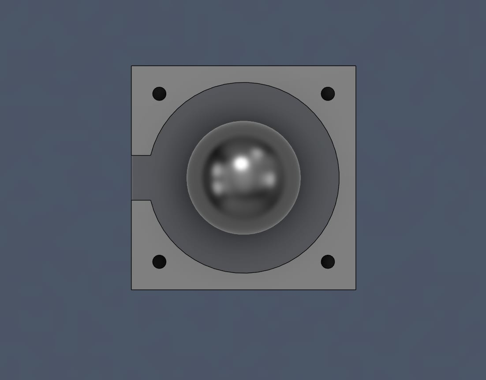
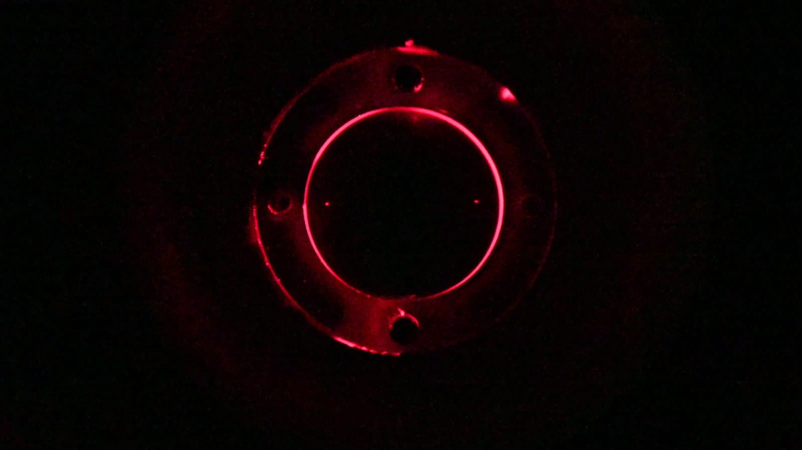
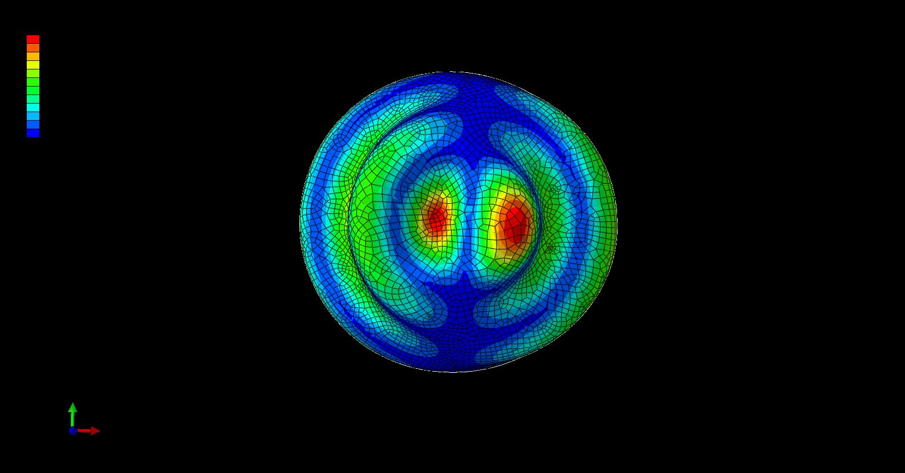
