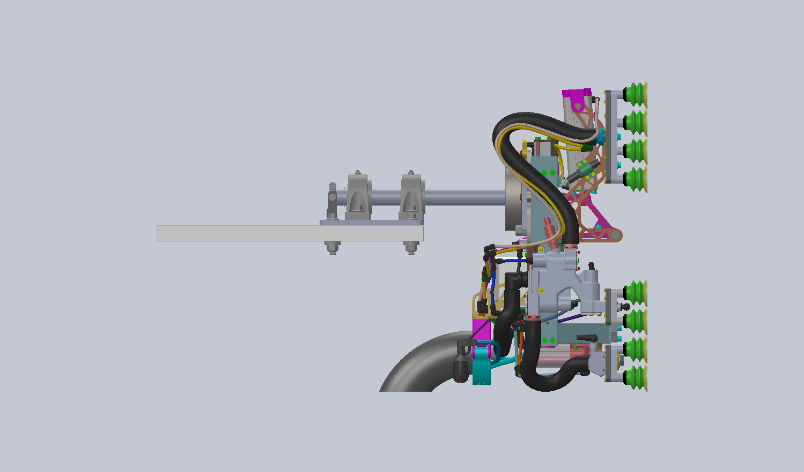
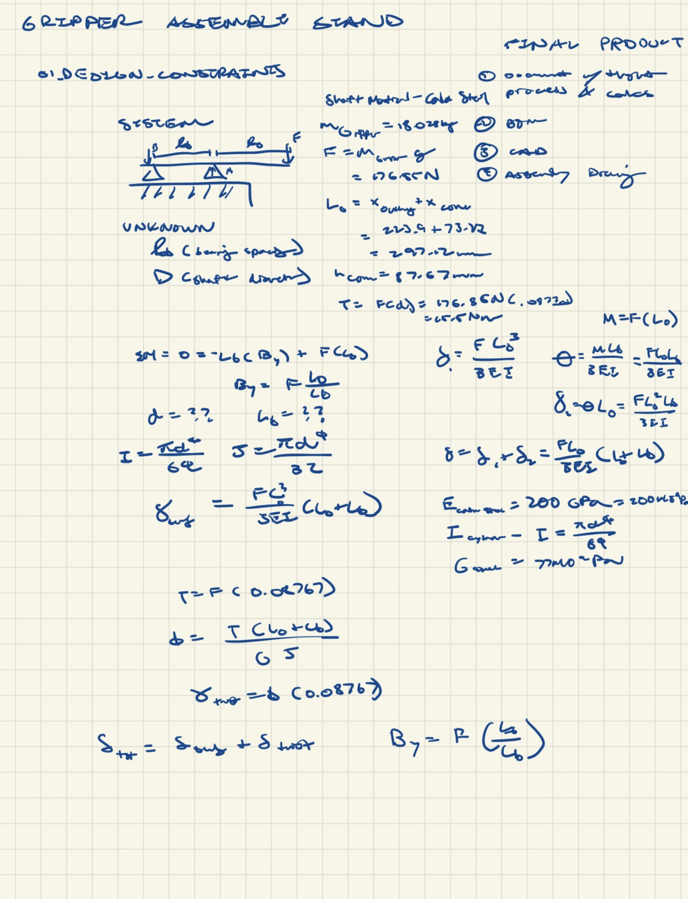
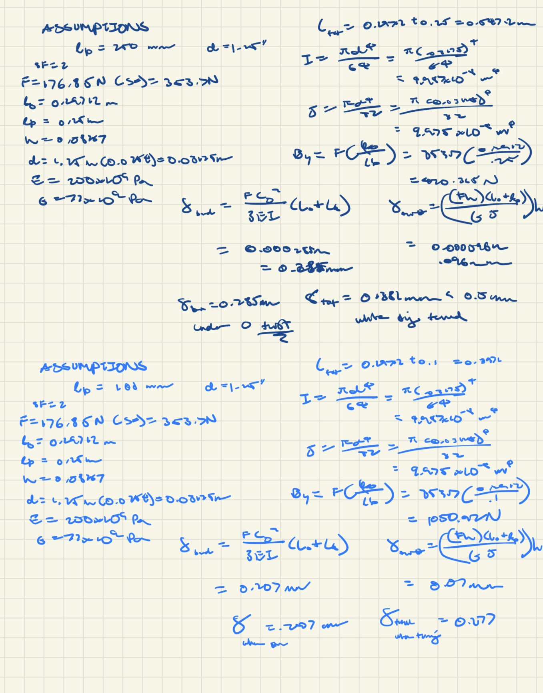
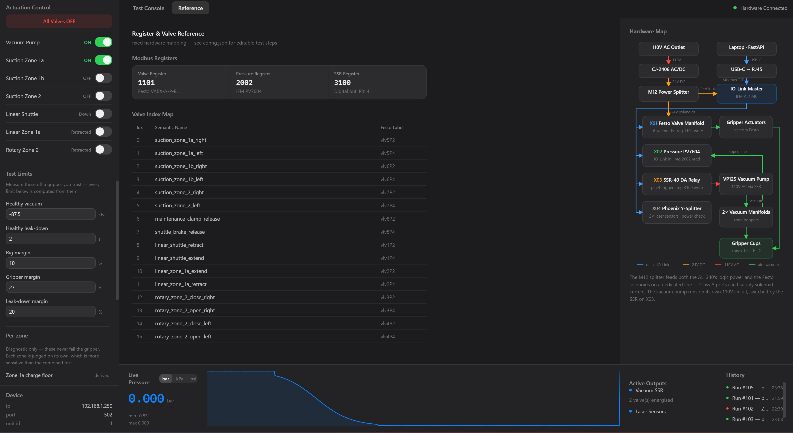
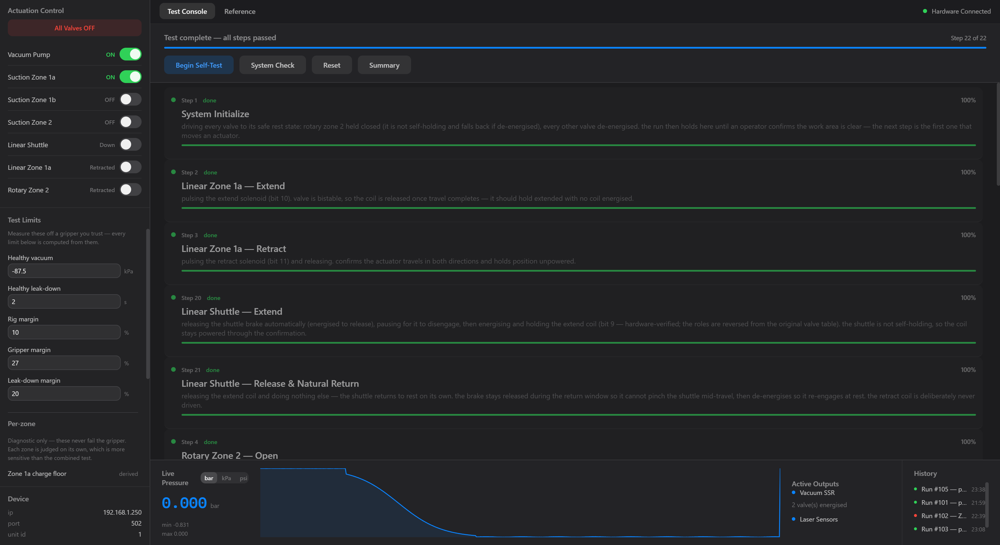
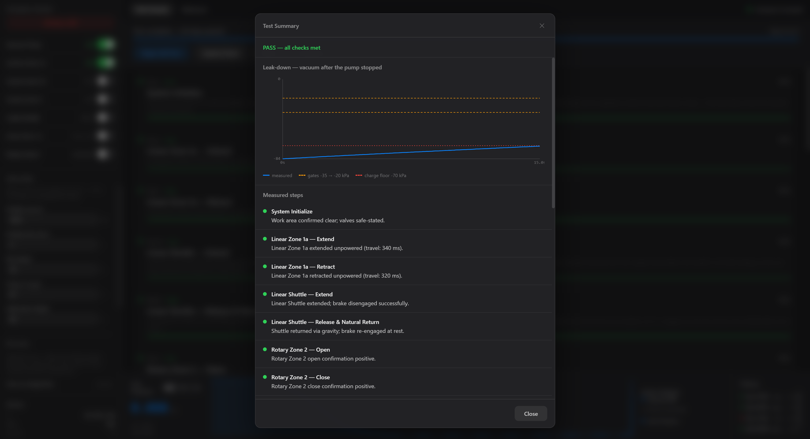
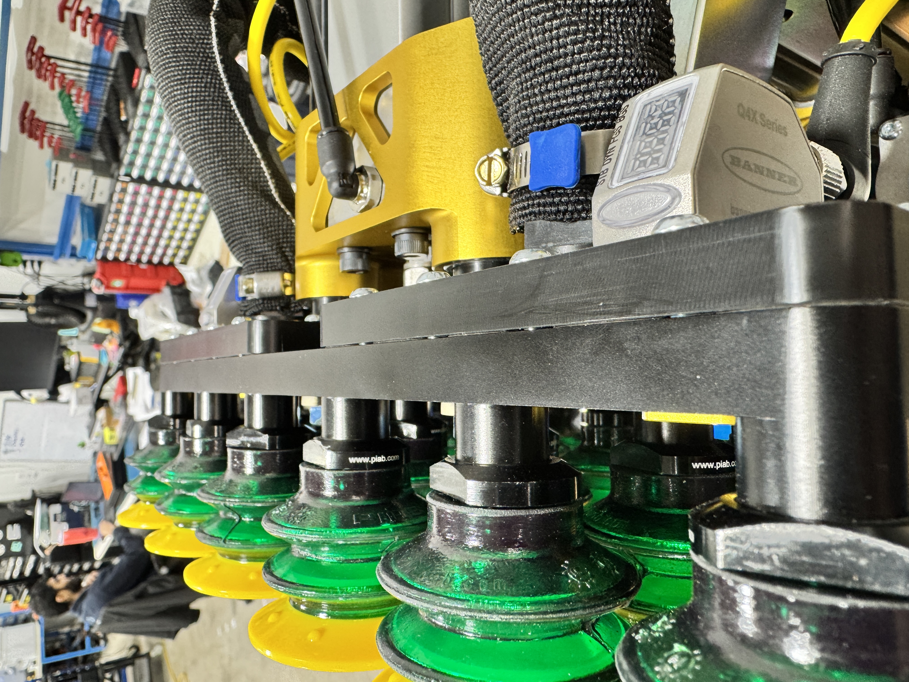

From January to August 2026, I was a robotics engineering intern at 
<a href="https://contoro.com/" target="_blank" rel="noopener">Contoro Robotics</a>, an Austin startup building robots that
unload floor-loaded trailers and shipping containers. During my time there, we were in a late Series A startup, which meant we were ramping up production to prove our capabilities. 

My job was primarily helping with documentation, building final assemblies, and creating retrofits for the field using Solidworks. While I enjoyed getting my hands dirty with building small fixes, I wanted to create a system that would eliminate the tedious guesswork from the manufacturing floor. I proposed and then built an assembly stand which eventually evolved into a fully automated end-of-line test stand for the end-effector.

## The Gripper Test Stand

Every gripper assembly needed to be checked against a known-good reference before it went onto a robot: suction across the full cup array, pneumatic actuation, and electrical integration. 

Without a standard way to do that, each technician improvised a bench setup with analog gauges and manual valves, meaning fit issues and subtle leaks weren't caught until robots were fully assembled or, worse, on the floor at customer sites like the Amazon warehouse in Stockton, California. 

The rest of this page is that stand — what it had to prove, the statics behind holding it, the control hardware, and the app that orchestrates the sequence.

### Defining What to Test

The first job was deciding what the test was for. This is a functionality check, not a performance characterisation: every valve travels in both directions, every suction zone pulls vacuum, and every sensor powers up. It also had to run fast, because a check that takes an afternoon does not get run.

The harder part was what counts as passing. The stand's vacuum pump is far smaller than the one on a robot, so absolute numbers measured here do not transfer. Rather than fixed thresholds, the limits are measured off a gripper that is known good, and every limit is computed from those: a healthy vacuum of **−87.5 kPa**, a healthy leak-down of **2 s**, then separate margins for the rig itself (10%), the gripper (27%) and leak-down (20%). 

### Holding the Gripper

CAD of the cantilevered gripper assembly stand

Before any testing could occur, the 18 kg end effector had to be securely held. I designed this stand originally to make assembly easier — the gripper needs to rotate so both faces are reachable — and it turned out to be exactly what the test stand needed as well.

That makes it a cantilever carrying an **18 kg** end effector on a **224 mm** overhang, with the centre of mass **88 mm** off the shaft axis, so rotating it also applies torque. I designed it as a shaft-and-pillow-block support: a 30 mm S45C shaft riding two **UCP206** pillow block bearings at 100 mm spacing.

Manual statics calculations for the overhanging beam, proving out the bearing reactions and shaft tip deflection.

I worked the statics by hand before committing to hardware. The load sits outboard of both bearings, so the stand behaves as an overhanging beam — the outer bearing takes an upward reaction while the inner one is pulled *down*, which is the part that catches people out.

| Check | Result | Margin |
| --- | --- | --- |
| Outer bearing reaction | 702 N against an 11,300 N static rating | **16×** |
| Inner bearing pull-out | 526 N against the same rating | **21×** |
| Shaft, von Mises at the critical section | 20.6 MPa against 490 MPa yield | **24×** |
| Tip deflection | 0.17 mm against a 0.5 mm requirement | **within** |

The margins look absurd, and that is the actual finding: **the shaft diameter is set by the bearing bore, not by stress.** Stress alone would allow roughly a 15 mm shaft at a safety factor of 2. Once a standard pillow block is the right answer for the rotating joint, its 30 mm bore dictates the shaft, and everything downstream is overbuilt for free.

### The Control Hardware

Everything the stand does runs through one **IFM AL1340 IO-Link master** with four ports:

- **X01** — a **Festo VABX-A-P-EL** valve manifold, 16 solenoids, written at Modbus register 1101. This actuates the gripper.
- **X02** — an **IFM PV7604** pressure transducer on a tapped vacuum line, read at register 2002. This is the measurement the whole test rests on.
- **X03** — an SSR-40 DA relay switching the VP125 vacuum pump.
- **X04** — a Phoenix Y-splitter feeding two laser distance sensors.

Power comes off a 110 V outlet through a CJ-2406 AC/DC supply to 24 V, then an M12 splitter feeding both the master's logic power and the Festo solenoids on a dedicated line. *The master's Class A ports cannot supply solenoid current, which is the kind of thing you find out once and never forget.*

Hardware map mapping Festo labels to human-readable Modbus registers

### The Test App

I wrote the app that drives the sequence: a FastAPI service on the laptop talking Modbus TCP to the master, with a browser console in front of it. The 16 solenoids are mapped to names that mean something (`suction_zone_1a_right`), and the test steps live in a config file rather than in code.

The live test console and the generated leak-down curve summary report

A full run is **22 steps**. After that, the steps are written around how each valve actually behaves. The linear shuttle is not self-holding, so its coil stays powered through the confirmation, its brake is released first and re-engaged at rest. Writing those explicit steps is what caught a discrepancy between the provided valve table and the hardware: two of the shuttle's roles were reversed.

### Why It Mattered

A fraction of a millimeter of gap caused by a misaligned gasket — completely invisible unless looking straight down the seam.

Gripper validation became a short, repeatable sequence with a pass/fail that means the same thing every time, run by whoever is on the bench. That makes manufacturing faster, but the more valuable half is what it catches. Faults like the misaligned gasket pictured above used to reach a robot before anyone noticed; now, they show up instantly as a leak the moment the stand draws vacuum.
