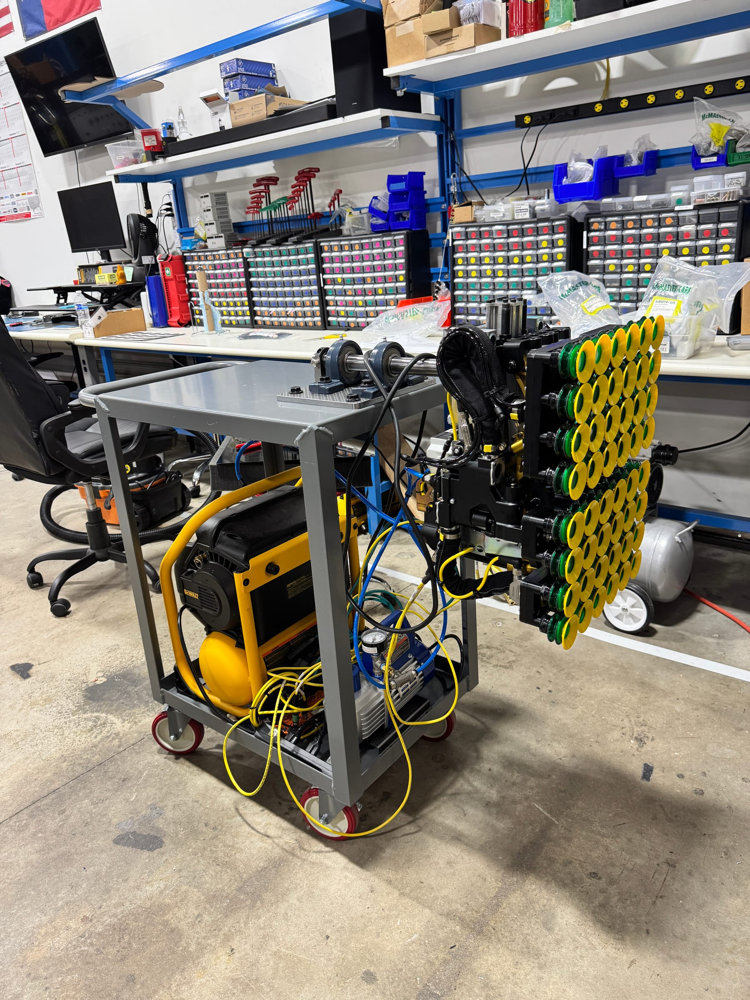
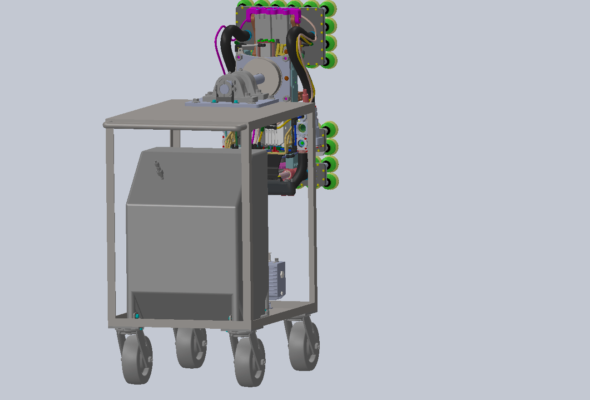
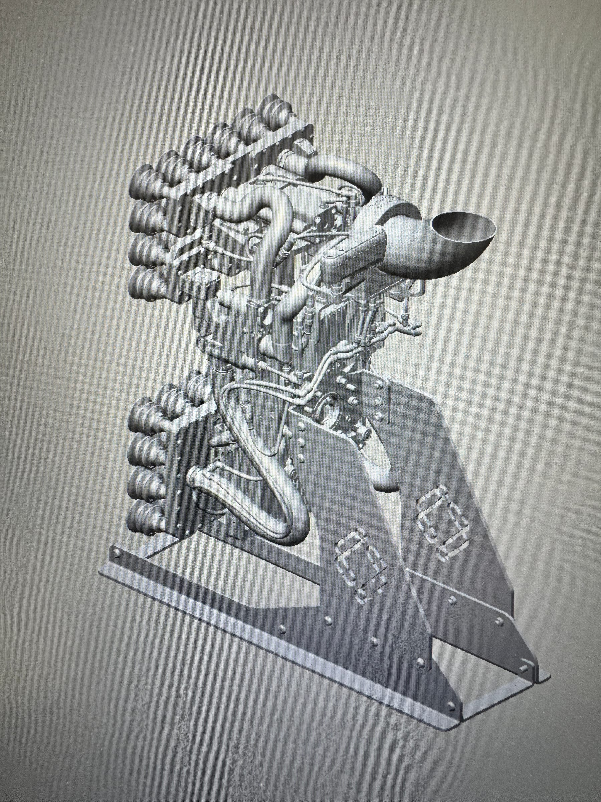
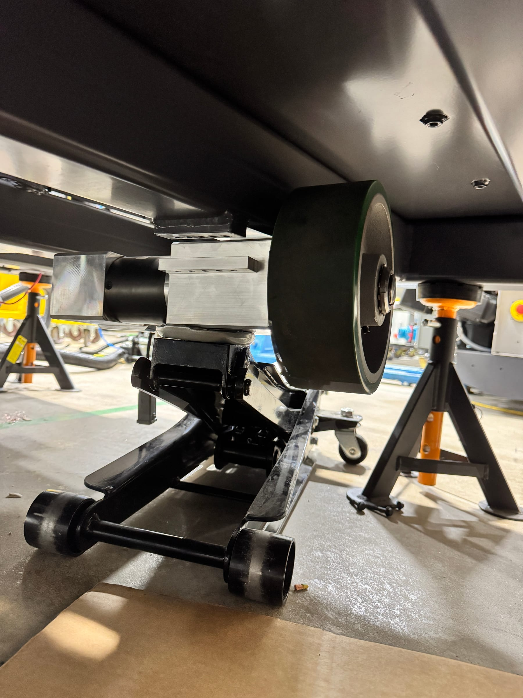
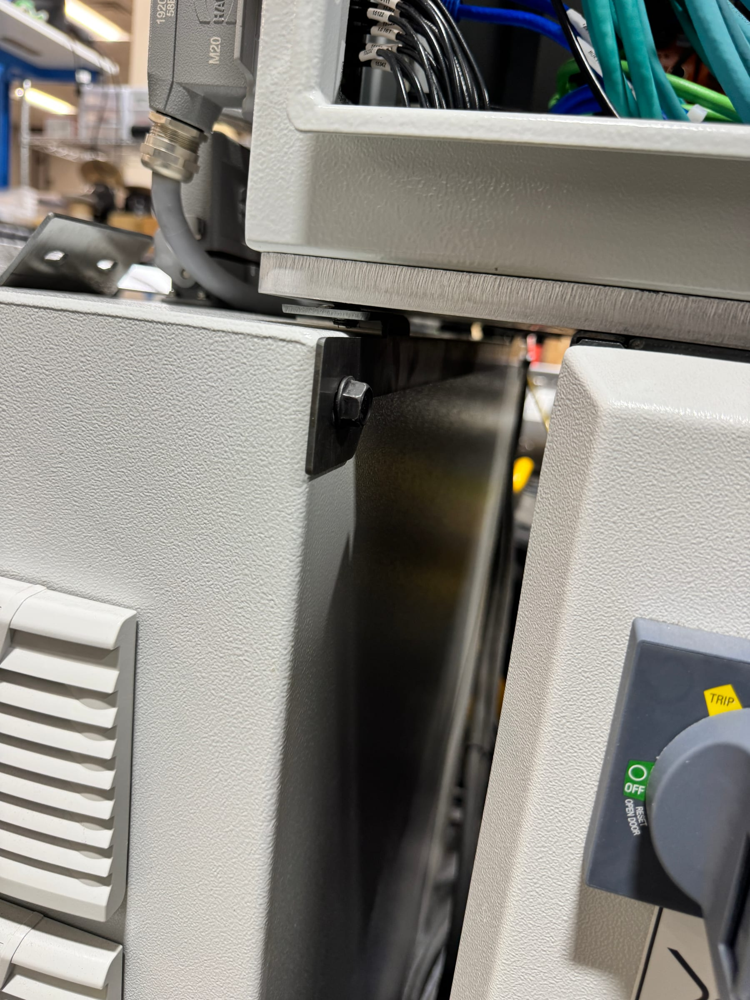
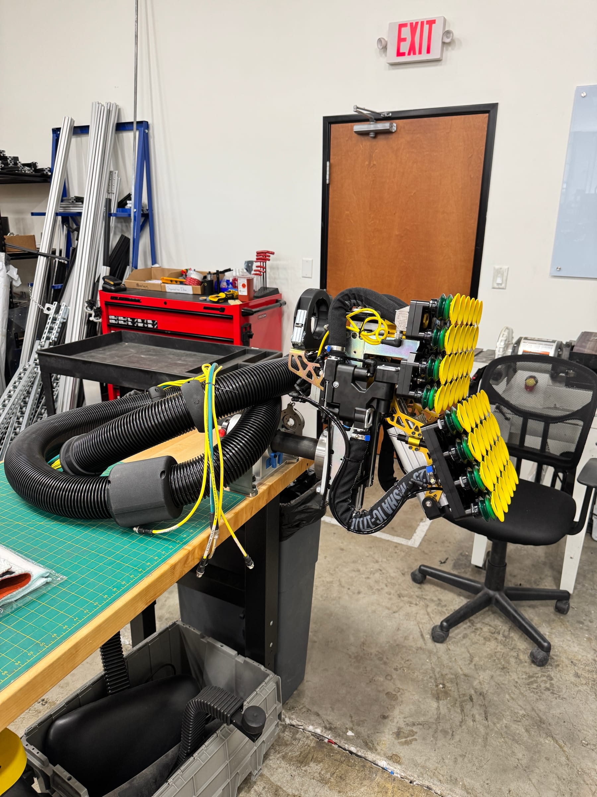

From January to August 2026 I was a robotics engineering intern at
[Contoro Robotics](https://contoro.com/), an Austin startup building robots that
unload floor-loaded trailers and shipping containers. Hardware there moves in
fast generations, which meant a lot of my time went into the tooling and
documentation that let the robots get built and validated the same way twice.

## Outcome

I engineered the end-of-line test stand that every gripper assembly was
validated on before it shipped, turning a setup each technician improvised into
a repeatable check. I designed the cantilevered stand the gripper hangs from
during assembly, sized against bearing load ratings with a **16× margin** and
**0.17 mm** of tip deflection against a 0.5 mm requirement. Alongside that I
released assembly drawings and full BOMs across two gripper hardware revisions,
resolving clearance and mounting fit issues that were causing rework on the
floor, and commissioned **three autonomous mobile robots** at a customer
fulfillment center while retrofitting **four more** up to the current chassis
generation.

## My Role

The test stand and the assembly stand were mine end to end — requirements,
sizing, hand calculations, CAD, sourcing, and build. On the production side I
owned drawing and BOM releases for gripper subsystems and designed the one-off
brackets that unblocked assembly. In the field I worked as part of the
commissioning crew rather than leading it.

## Context and Constraints

An early-stage startup shipping iterative hardware generations. Everything had
to be manufacturable in-house or from catalog parts on a short timeline, and
tooling competed for attention with the robots themselves — so anything I built
had to be obviously worth the time it took.

## End-of-Line Gripper Test Stand

Every gripper assembly needed to be checked against a known-good reference
before it went onto a robot: suction across the full cup array, pneumatic
actuation, and electrical integration. Without a standard way to do that, each
technician improvised a bench setup, which made results hard to compare and easy
to get wrong.

I built the test stand as a rolling cart carrying everything needed to power up
and cycle a complete gripper on demand — an **AL1340 IO-Link master** talking to
**Festo manifolds**, pressure transducers for the vacuum circuit, and the
fixturing to hold a gripper in its working position. The cart is mobile on
purpose: the stand goes to the work rather than the work going to the stand.

The result is that gripper validation became a short, repeatable sequence with a
pass/fail that means the same thing every time, run by whoever is on the bench.

## Cantilevered Gripper Assembly Stand

During assembly and test the gripper has to hang off the edge of a bench, fully
suspended, and rotate between two working positions so both faces are reachable.
That makes it a cantilever carrying an **18 kg** end effector on a **224 mm**
overhang — with the center of mass offset from the shaft axis, so rotating it
also applies torque.

I designed it as a shaft-and-pillow-block support: a 30 mm S45C steel shaft
riding two **UCP206** pillow block bearings at 100 mm spacing, with set screws
locking the shaft in either of its two positions.

### Sizing and Hand Calculations

I worked the statics by hand before committing to hardware. The load sits
outboard of both bearings, so the stand behaves as an overhanging beam — the
outer bearing takes an upward reaction while the inner one is pulled *down*,
which is the part that catches people out and the reason the inner bearing needs
real pull-out capacity rather than just a bolt through a bracket.

| Check | Result | Margin |
| --- | --- | --- |
| Outer bearing reaction | 702 N against an 11,300 N static rating | **16×** |
| Inner bearing pull-out | 526 N against the same rating | **21×** |
| Shaft, von Mises at the critical section | 20.6 MPa against 490 MPa yield | **24×** |
| Tip deflection | 0.17 mm against a 0.5 mm requirement | **within** |

The margins look absurd, and that's the actual finding: **the shaft diameter is
set by the bearing bore, not by stress.** Stress alone would allow roughly a
15 mm shaft at a safety factor of 2. Once a standard pillow block is the right
answer for the rotating joint, its 30 mm bore dictates the shaft, and everything
downstream is overbuilt for free. Knowing which constraint is actually binding
is what let me stop optimizing and buy catalog parts.

## Drawings, BOMs and Brackets

I designed and released electromechanical assembly drawings and full BOMs in
SolidWorks across two gripper hardware revisions, covering junction boxes, power
conduit, motor-driver brackets, and camera towers. Two issues I resolved in that
work — a conveyor-cover clearance problem and an IO-Link mount that didn't fit as
drawn — had been generating rework on every build until they were fixed at the
drawing.

The rest was reactive: when something didn't fit on the floor, I designed the
bracket that fixed it. Stabilization brackets, bracket feet, and a holder for an
enable switch that had nowhere to mount.

## Build and Field Commissioning

I helped build full-scale warehouse unloading robots — camera tower wiring,
junction boxes, gripper end effectors — and then traveled to a customer
fulfillment center to commission three autonomous mobile robots on site, which
meant drive-motor replacement, caster retrofits, and camera-tower wiring done in
a working warehouse rather than a clean shop. While there I also retrofitted four
earlier robots from the previous chassis generation up to current production
spec.

Seeing hardware I'd drawn get installed, fail in small ways, and get fixed on a
warehouse floor changed how I draw it. Fit issues stop being an abstraction once
you're the one on the floor at 6am with the wrong bracket.

## What I'd Change

<!-- TODO Max: the one section I can't write for you, and the research says it
     matters. Prompts:
     - What did you get wrong on the test stand's first revision?
     - The PDR mentions this went to Rev B (bearings changed to UCP206, shaft to
       the Misumi NSFRBF, and the gripper interface redesigned as a clamping
       collar). What drove those changes? That story IS this section.
     - Anything about the drawings you'd do differently now, after seeing the
       robots get built? -->
