From January to August 2026, I was a robotics engineering intern at 
<a href="https://contoro.com/" target="_blank" rel="noopener">Contoro Robotics</a>, an Austin startup building robots that
unload floor-loaded trailers and shipping containers. During my time there, we were a late Series A startup, which meant we were ramping up production to prove our capabilities. 

Under the systems team, my job was to help with documentation, engineer retrofits for the field, and make them in-house with our machinery such as a plasma cutter, sheet metal bender, FDM printers, and mills. Wanting to get my hands dirty with the actual robot, I started helping in the manufacturing space to build final assemblies that were sent out to the field such as camera and sensor wiring, electrical boxes, and, my favorite, the end effector grippers. After spending a few weeks building grippers, I set out to improve the existing assembly stand to expedite the manufacturing process, which eventually evolved into a fully automated end-of-line test stand.

<h2 class="text-centered">The Gripper Test Stand</h2>

The gripper test stand was meant to be a lightweight and mobile setup that we could use to first assemble then test the gripper which we needed to mass-produce as we moved closer to Series B funding. My final design was a mobile cart that holds a finished end effector and runs it through a comprehensive functional test for each valve, suction zone, and sensor. Each aspect of this stand was built from the ground up including the cantilevered assembly stand, the IO-Link control hardware and wiring, and the app that runs the tests and writes the report.

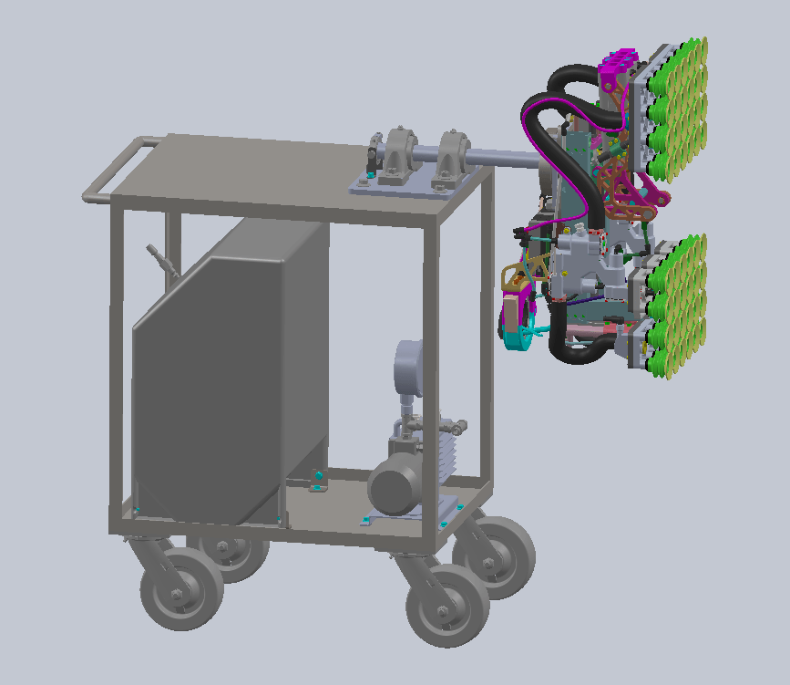
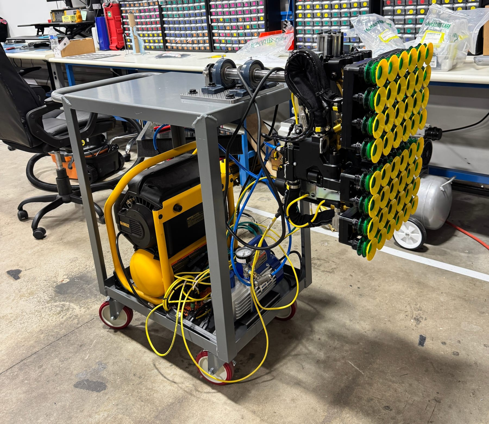

The test stand in SolidWorks

The test stand in real life

<h3 class="text-centered">How It Started</h3>

When I first started working at Contoro, a single gripper took up to three days to fully assemble. While the design was rigid, I had freedom to adjust the manufacturing process so I first set out to improve the existing assembly stand. The existing stand utilized old robotic elbow components from a past humanoid Contoro had manufactured and an overengineered shaft. Since we were planning on quadrupling production before the end of the year, I needed to make the assembly stand cheaper, with off-the-shelf parts. I created a short script via Python that iterated through a few different diameters and lengths for the shaft that were available on Misumi, and implemented a 2x safety factor. After replacing the elbow joints with pillow block bearings and the locking mechanism with a shaft collar, I validated my findings with hand calcs to ensure the stand could hold the 18 kg gripper. 

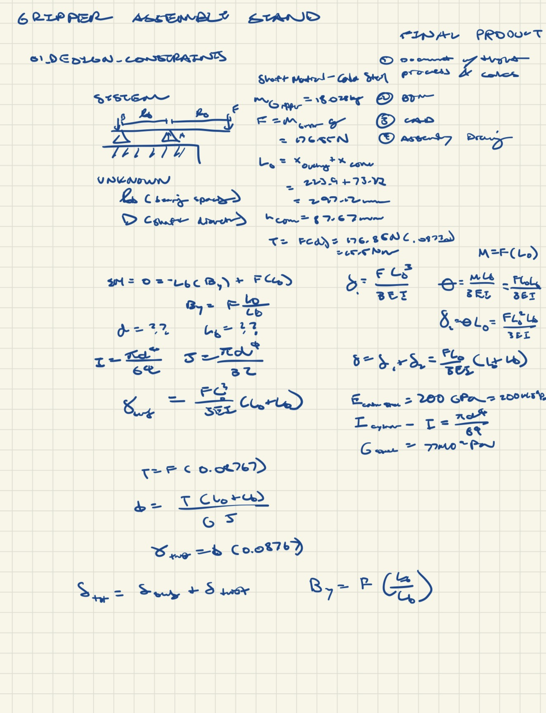
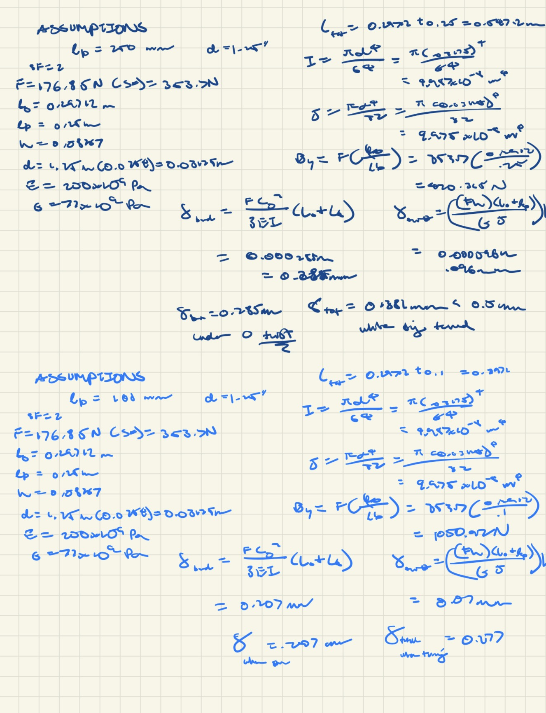

Hand calcs for shaft deflection and bearing loads at two bearing spacings

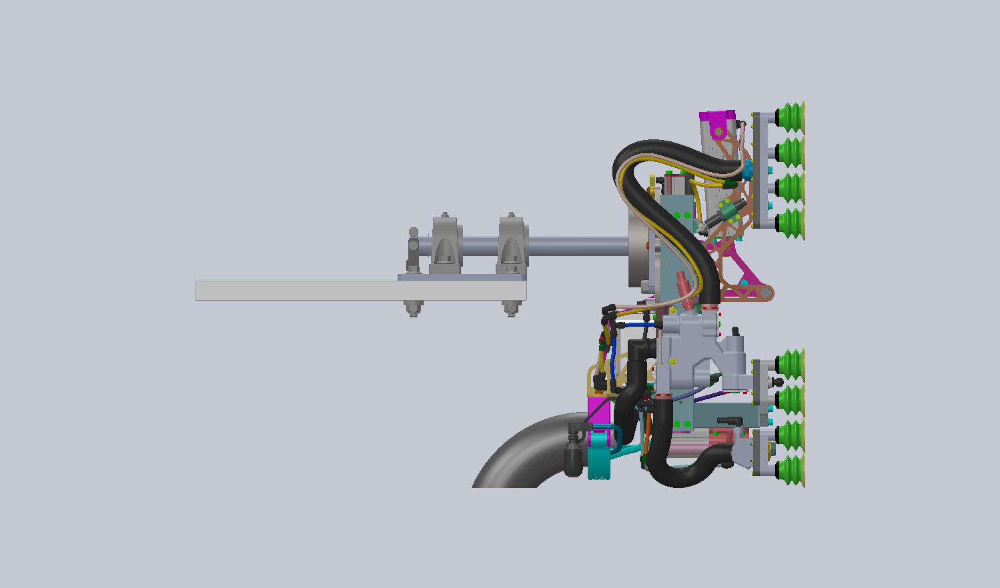

The assembly stand in SolidWorks

Once the stand was in use and I started building grippers on it, a bigger problem emerged. Assembly got faster, but nothing told us whether a finished gripper actually worked until it was bolted onto a robot. In addition, the current Factory Acceptance Test (FAT) tested the gripper only when it was bolted onto the robot making it hard to isolate and fix issues. However, there was one bright side. The gripper assembly stand already held the gripper; now we just needed a way to connect to and communicate with the vacuum and pneumatic ports. 

<h3 class="text-centered">Why We Need This</h3>

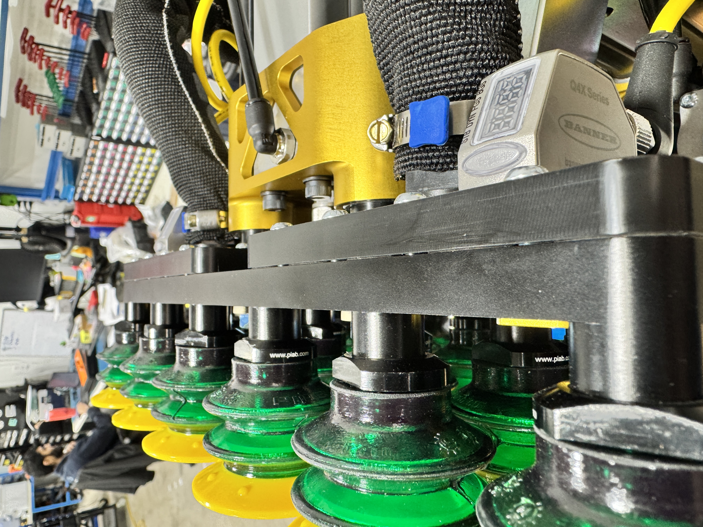

A small misalignment in the gasket sealing the air in a suction zone

On my first gripper build, the gasket became slightly misaligned when I attached both sides of the vacuum zone. The gap was so small that I missed it in the initial inspection, since it was only visible looking straight down the seam. Without a proper way to test the gripper, this problem was only found during the FAT which led to a delay of a few hours in the deployment of this gripper. While I learned to be more meticulous, I also realized there had to be a better way. 

After this problem, I scoured our issue ticket system on Jira, determining what problems the gripper usually ran into when out on the field. The majority of issues lay outside manufacturing's realm such as installation issues and software problems, but I did find a handful of manufacturing issues that stemmed from incorrect pneumatic orientation which led to the manifold incorrectly communicating with the hardware or small vacuum leaks. These defined my testing variables.

<h3 class="text-centered">Defining What to Test</h3>

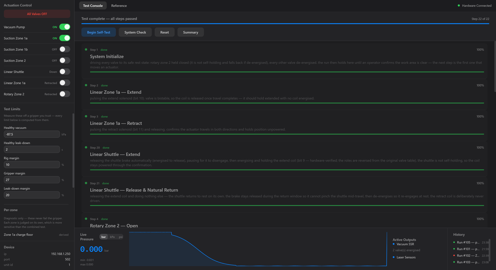

The testing logic in the software

This test stand was only a functionality check to validate the manufacturing side of the process. There were two main functions: actuation and vacuum. The gripper could fold and extend, which was all controlled by a Festo manifold. In addition, it had a pressure transducer to measure vacuum throughout the gripper and a laser distance sensor which would detect the distance of the boxes in the shipping containers. 

There was one main issue with the vacuum. The test stand's vacuum pump was far smaller than the one on a robot due to weight and size constraints, and didn't produce nearly as much vacuum as the one on the robot. To combat this, I gave the vacuum drawdown time to build pressure and took data from three grippers that were known to be good to use as reference. Since the robot held a near-perfect vacuum and variations in my hardware caused a decrease in vacuum over time despite being sealed, I took the slope, averaged it across all my tests on each gripper, and drew a margin of error based on the other good grippers as a baseline for a gripper with a good seal.

<h3 class="text-centered">The Control Hardware</h3>

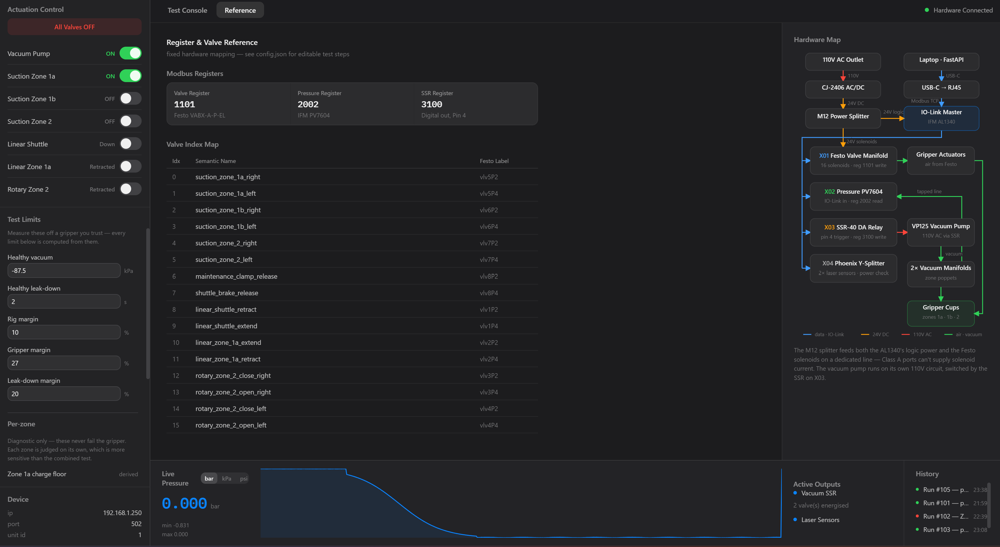

The AL1340's ports and the components on each

Determining and hooking up the hardware was honestly one of the hardest parts of this project for me since I wasn't familiar with these components. However, everyone at Contoro was super nice in helping me understand how everything worked which pushed me to keep working. I started by stripping down the existing robot and determining the few hardware components I really needed which consisted of an IFM AL1340 IO-Link master that could allow my computer to communicate with the gripper, a small vacuum pump, and a compressor. The four ports on the AL1340 were connected as follows:

- 01 — the Festo VABX-A-P-EL valve manifold which controls actuation and which zones receive vacuum.
- 02 — an IFM PV7604 pressure transducer.
- 03 — an SSR-40 DA relay to turn on the VP125 vacuum pump.
- 04 — a Phoenix Y-splitter feeding two laser distance sensors. Due to the lack of ports, I could only check whether the sensors could turn on and off.

The system was powered off a 110 V outlet through a CJ-2406 AC/DC supply to 24 V, then an M12 splitter feeding both the AL1340 and the Festo solenoids.

<h3 class="text-centered">The Test App</h3>

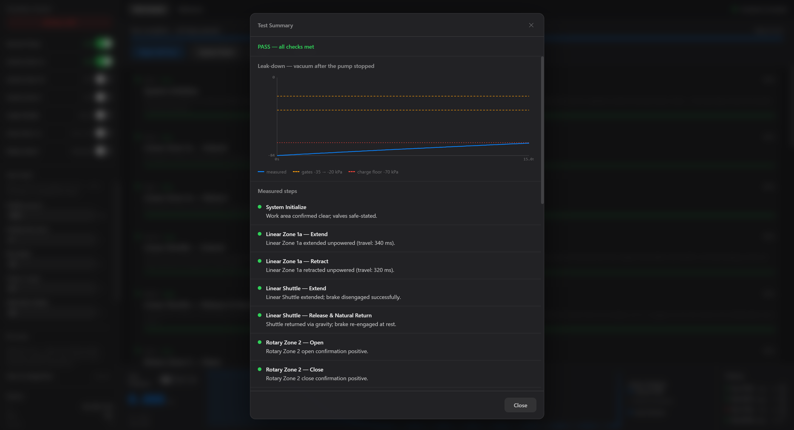

The generated test report

To accompany the test stand, I created an app that drives the test logic and delivers a report for each gripper. My goal was to make this app easy for a non-tech-savvy technician to be able to directly install on their computer, not change any network ports, and be able to immediately interact with the gripper. This app easily became one of the most enjoyable parts of the build mostly because I had little to no knowledge of building an app before this. I really enjoyed working on the UI which took me much more time than I'd like to admit.

A full run is 22 steps, and the steps are written around how each valve actually behaves. The linear shuttle is not self-holding, so its coil stays powered through the confirmation, its brake is released first and re-engaged at rest. Writing those explicit steps is what caught a discrepancy between the provided valve table and the hardware: two of the shuttle's roles were reversed.

<h3 class="text-centered">Conclusion and Future Improvements</h3>

The biggest thing I took away was how much a good test is worth. During the internship I got to visit the Amazon warehouse in Stockton, California, and saw first-hand how frustrating a failure in the field is: fixing anything on a customer's floor is a hassle, and the robot is out of service until it's done. I would much rather catch it at home, which is the whole point of the stand.

I also learned how much of good design happens before any CAD. I was surrounded by strong engineers, and the habit they pushed hardest was defining the parameters properly first: what the part has to hold, what it has to survive, and what counts as done. Deciding what to test before building the test was that lesson in practice.

If I built the assembly stand again, I would change how the gripper attaches to it. Right now a flanged bolt holds the face together through friction alone, which was a constraint of the old gripper. The new gripper design removes that constraint, so I would simplify the attachment to a shaft with two bolt holes and a single front plate. I would also have the shaft custom made, so we could add knurling to the end of it. This will allow for the locking mechanism, which consists of a shaft collar, to be secured by hand with a thumb screw instead of with an Allen wrench.

<h2 class="text-centered">Thank You Contoro!</h2>

From the Friday lunches that helped me see parts of Austin I had never gone to, to the late-night pickleball sessions, Contoro became a phase of my life I'm never going to forget. Almost everything I learned here came from the people around me: the systems team, who trusted an intern with a project that ended up on the production floor, and everyone who stopped what they were doing to satisfy my curiosity. I'm more than grateful I got to be part of the team while it was growing. Special shoutout to my manager, Isaac, who taught me so much about the industry. Also, shoutout to the Operations team who welcomed me and helped me with the testing parameters. I can't wait to see where Contoro is in five years.

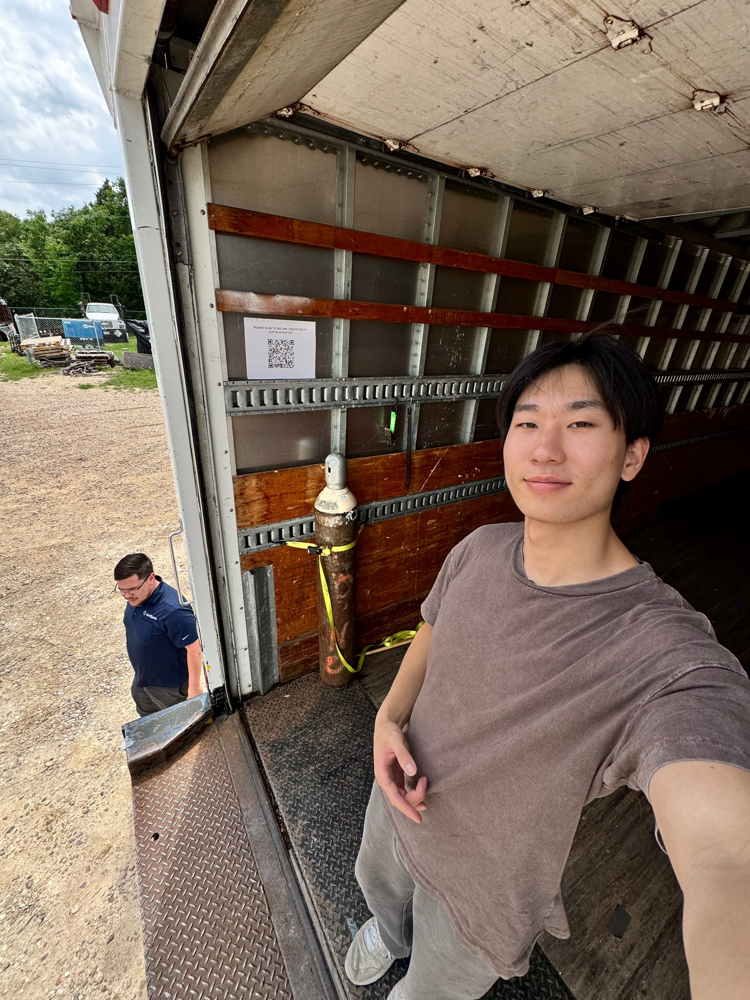
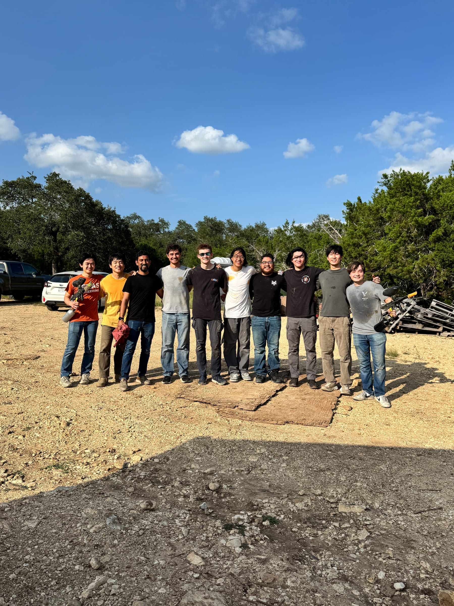
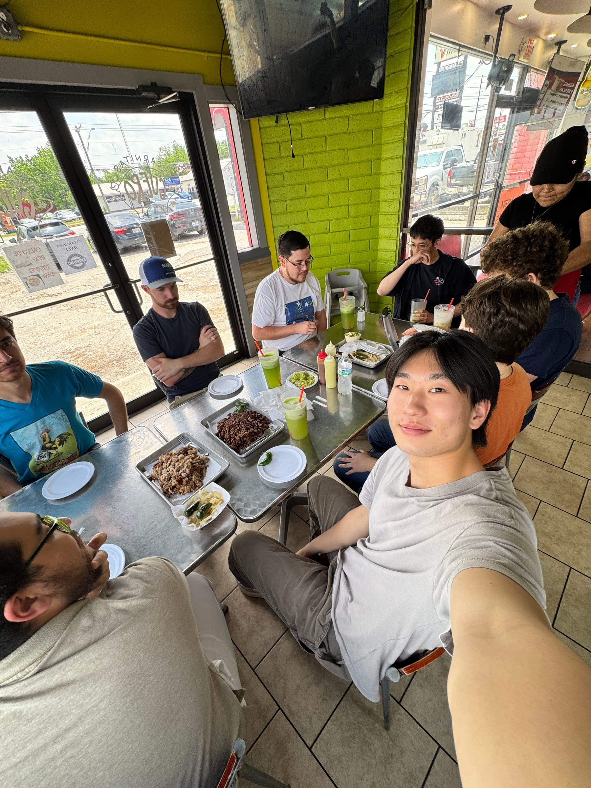
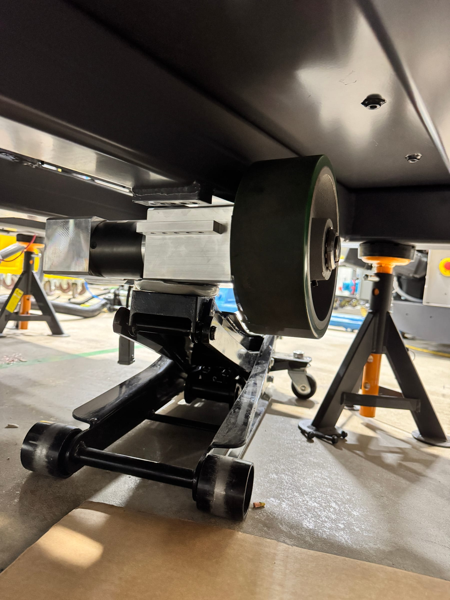
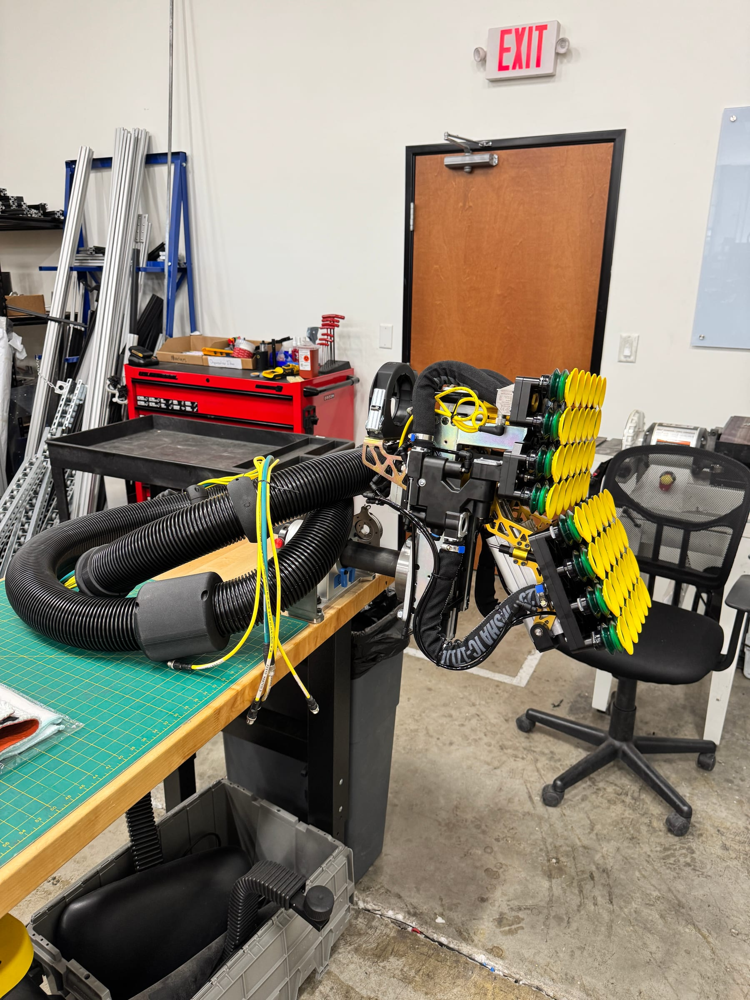
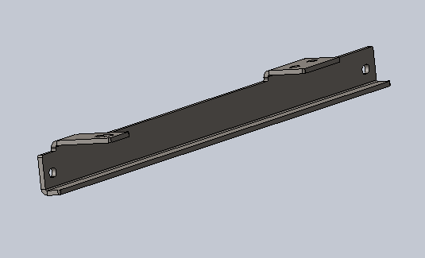
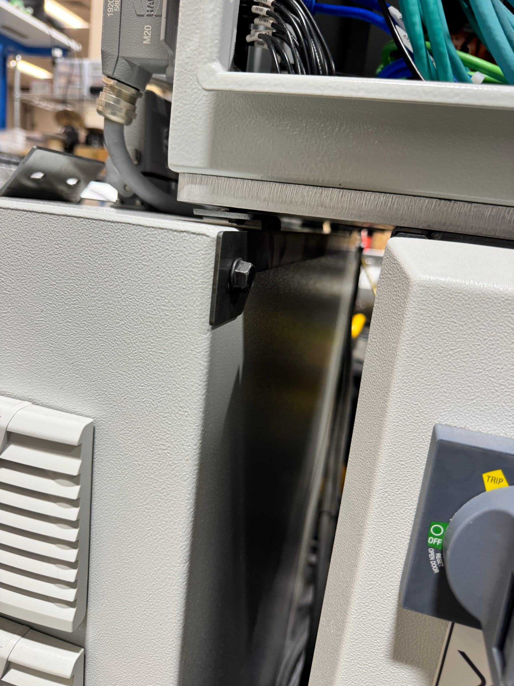
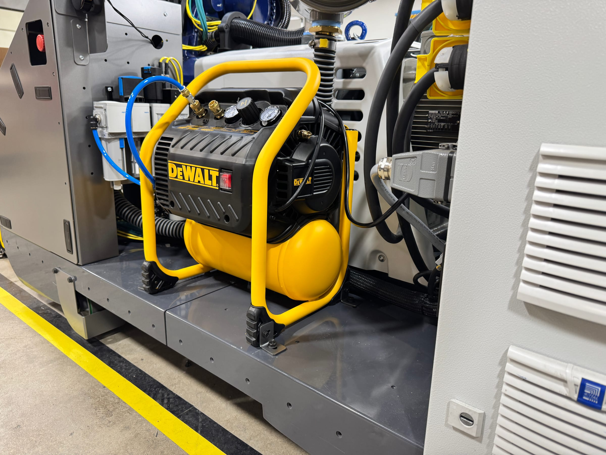
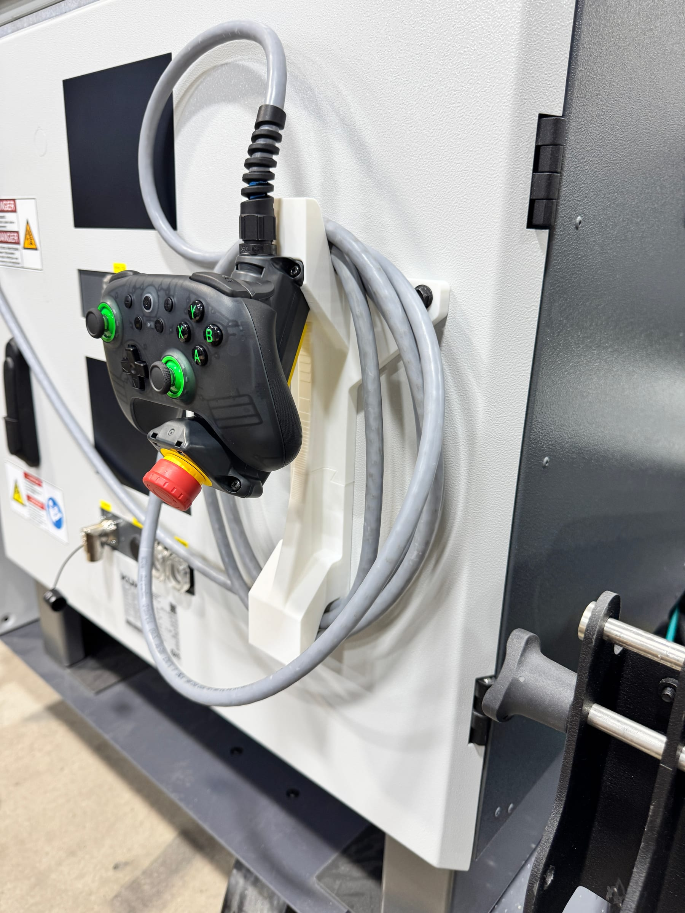
