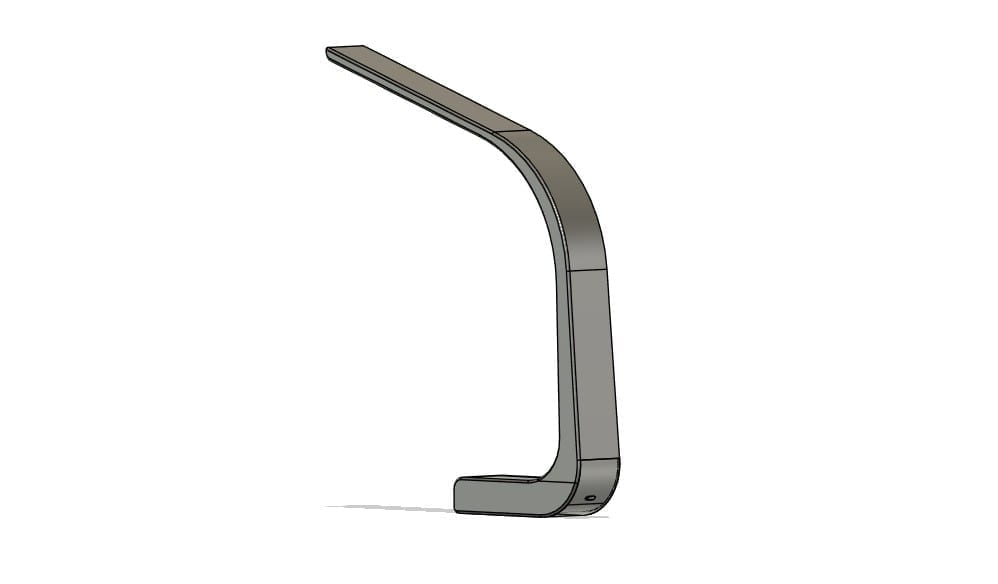

I had an LED desk lamp that worked amazingly until its plastic base cracked from being bent too far. I wanted to keep some of the same features, like the adjustable light, but this time I also wanted to be able to change the color temperature, and to design and make every part of the lamp except the electronics myself. The bigger goal was a lamp with electronics that are easy to replicate, so the same idea could carry into future projects.

The desk lamp in Fusion 360

I wanted to make something similar to my old lamp but without moving parts, so the same issue couldn't happen again. While the design went through quite a few iterations, I decided to spend more time on the electronics, since I hope to reuse them in ideas like a light bar for the top of my monitor or a reading light above my bed. That meant keeping the electronics small, adjustable, and customizable.

So far, this project has taught me a lot about integrating electronics into a print. In my first iteration, I put the batteries in series and used two buck converters (I needed two since the LED strip needs 12 V while the microcontroller needs 5 V), which was a very inefficient use of power, and the current was too low to keep up with the setup. My second iteration puts the batteries in parallel with two voltage boosters, which are also much smaller than the buck converters. Right now, I'm working on making the lamp structurally sound despite having to print it in multiple parts.
