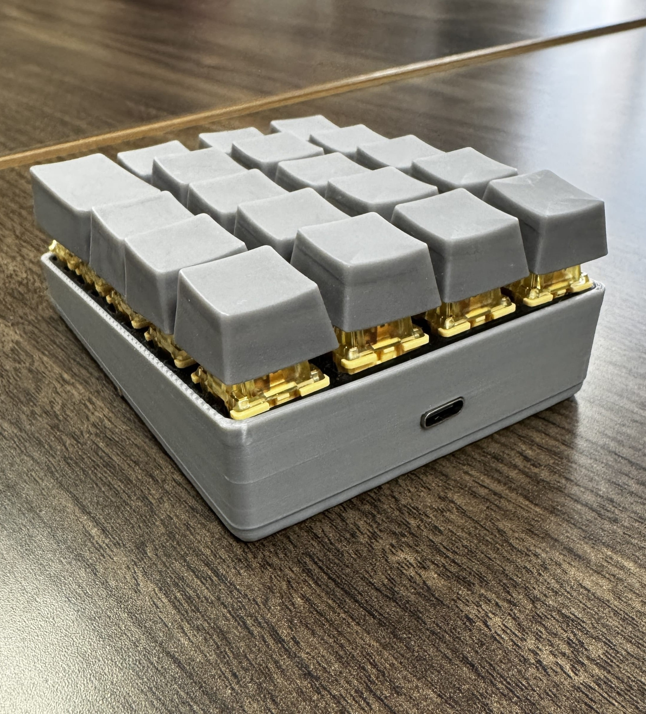
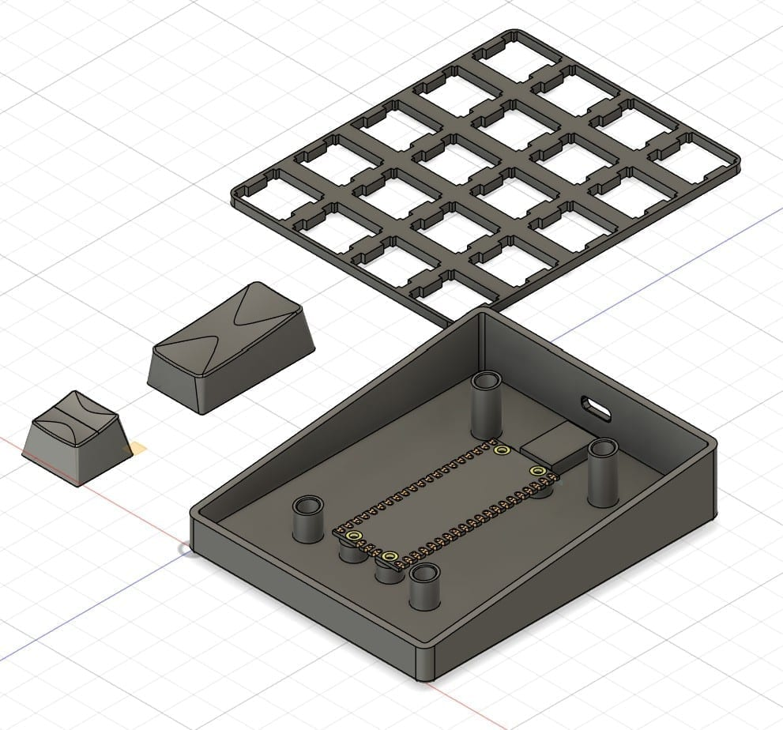

As a new hire at <a href="https://inventionworks.engr.utexas.edu/" target="_blank" rel="noopener">Texas Inventionworks</a>, I was tasked with creating a macropad that could pass two typing tests, one with a predetermined string and one with a surprise string, and compete for the most attractive design. I was extremely excited to start since I had already planned on making a macropad for myself and had sketches ready, which sped up the design process and pushed me to make something I would actually want on my own desk.

The finished macropad, front view

The finished macropad, back view with the USB-C port

<h3 class="text-centered">Design Process</h3>

The plate, keycaps, and body in Fusion 360

We had one month with a progress check halfway through, and my personal goal was to finish the CAD and electronics early so I could spend the rest of the time on aesthetics. This meant iterating through the designs quickly.

I wanted to make something that looked a bit different from what was on the market, with the smallest footprint I could manage and an almost floating effect for the keys. We were given a Raspberry Pi Pico, but I didn't like the idea of a Micro-USB input, so I first designed extra room in the CAD for a Micro-USB to USB-C adapter, which I bought for about a dollar on AliExpress.

For manufacturing, I wanted the plate the switches sit in to be made from PETG so it would be slightly elastic. I also added a small slot so the switches snapped cleanly into place, which made soldering them easier. Each key was SLA printed to capture the geometry on top, where I extruded two parabolas through the top and added a fillet to smooth it out and make it comfortable to press.

Hand-wiring the switches to the Pico

The hardest part of this project was soldering the switches. I had soldered in the past, but the plate had some messy tolerancing due to the inaccuracy of the FDM printer. In addition, it was hard to keep the Pico from moving due to the awkward position. But after an hour, I had it all wired up.

For the competition, we were surprised with a second part: an audience favorite competition. I had overlooked how much people enjoy uniqueness, which led me to lose to more unusual designs despite making something that was probably more practical. If I had another chance at this project, I would spend more time on the manufacturing of the body, and incorporate more unique colors which could have captivated the audience better. However, during the typing contest, I had hardcoded the string into a key which allowed me to win the competition.

