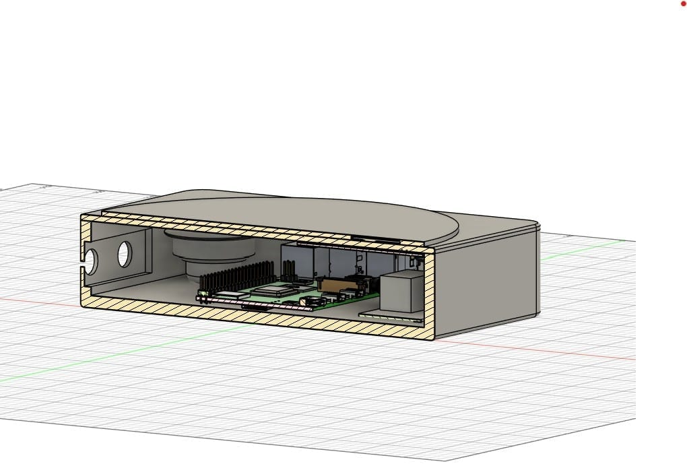
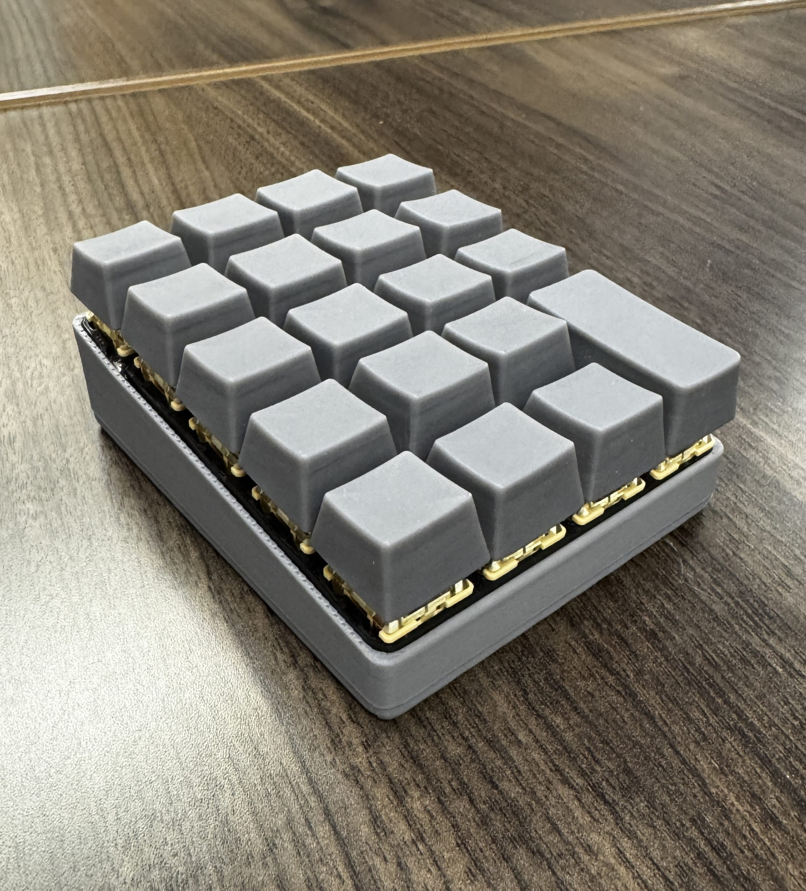
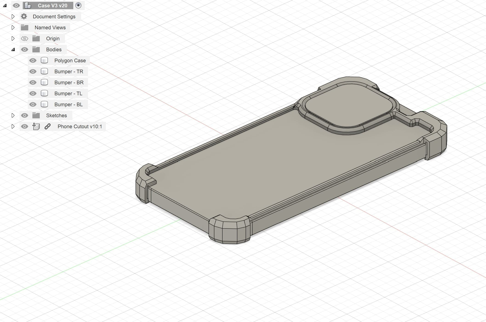
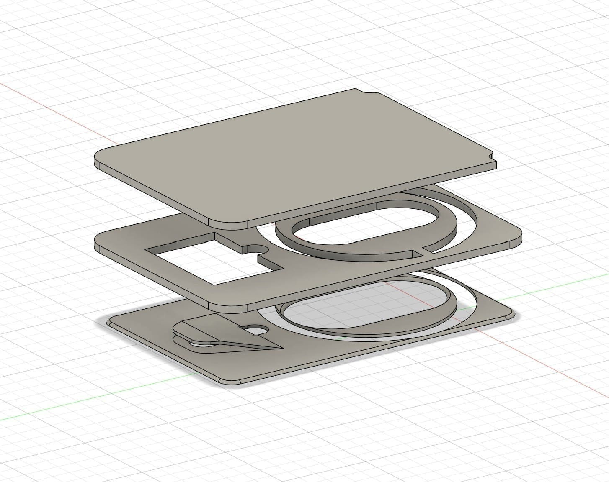
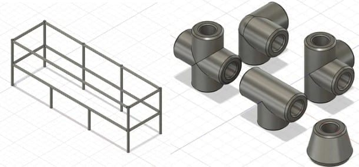
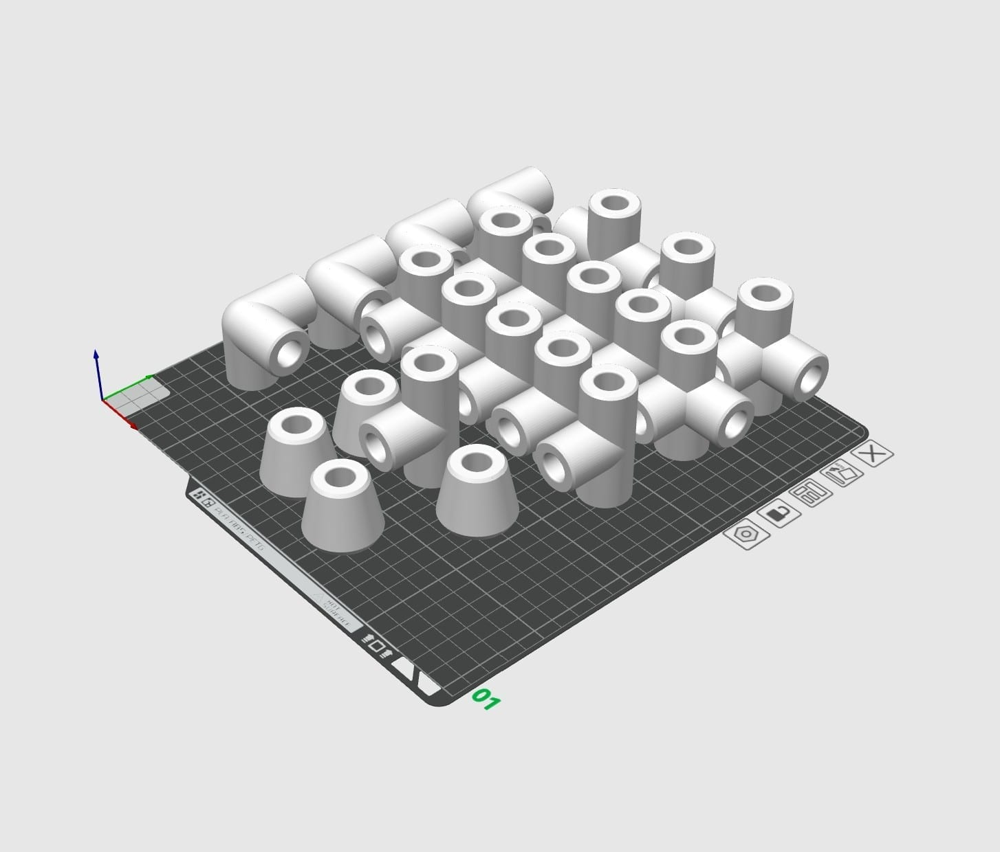

These are the things I build outside of work and lab — a record player for my sister, a keyboard, custom furniture out of the Inventionworks woodshop, and smaller everyday objects. None of them have a deadline or a customer. They exist purely because I wanted them to exist. 

More importantly, they are where I try unfamiliar materials and processes first. 

## The RFID Record Player

In 2021, my sister suffered a severe injury that left her with chronic back pain. I wanted to comfort her the way I know how, which is by making something. Music was clearly helping her, so I set out to make her favorite songs as frictionless to reach as possible.

The constraint: Build a device that plays any of her favorite songs instantly, using only scavenged parts I already owned.

The initial turntable form factor.

I took a functionality-first approach, letting the scavenged components drive the architecture. I used an RFID reader to trigger songs, and repurposed an old Raspberry Pi, a speaker from a water-damaged device, and a battery from a dead power bank. 

The final exterior CAD (left) and the tight internal component packaging (right).

Getting the Raspberry Pi to talk to the Spotify API over Wi-Fi taught me Python. But the real lesson was project management: without a defined timeline, I disappeared down rabbit holes on details that didn't matter. The next version will feature a real mounting strategy (goodbye superglue), actual screw bosses, and external speakers.

## The Floating Macropad

As a new hire at Texas Inventionworks, my first task was building a custom macropad. It was a competition: build a pad capable of passing two typing tests (one predetermined, one surprise) and win the popular vote for the best design.

The final macropad assembly, featuring SLA resin keys and a PETG plate.

I wanted a footprint as small as physically possible, creating an almost floating effect for the keys. The plate is PETG with a tight press fit, securing SLA resin keys that require extreme dimensional accuracy to interface with the switches. 

The outcome? I built something highly practical, but I lost the competition to designs that were far more unusual. It was an early lesson in how much people value novelty over pure utilitarian function.

## 3D Printed Phone Case & Wallet

The problem: design a case that actually shows off the iPhone rather than hiding it, using far less material, without giving up protection.

The bumper-style phone case (left) alongside the magnetic wallet attachment (right).

I stripped down the heavy-duty designs of Mous and Spigen. I wanted the case to print in one piece and snap on for a snug fit. The design uses interconnected PLA bumpers with TPU inserts to absorb impact — PLA deliberately, so that in the worst case the case cracks instead of the phone. 

I've dropped it several times and the phone never cracked. The wallet iteration taught me the limits of 3D printing, though: PETG doesn't hold enough clamping pressure on cards to make removal clean. I'm swapping to spring steel for the next revision.

## The $9 Shoe Rack

After a few months in a new apartment, I had a pile of shoes outside my door. I wanted a rack with no screws or adhesive, modifiable dimensions, easy assembly, and a total cost lower than anything on Amazon. 

Parametric CAD connectors (left) holding cheap birch dowels (right).

I used leftover birch dowels from a previous project and designed custom 3D printed connectors to friction-fit everything together. The PLA connectors cost $4.05 in material. The dowels cost $5.04. The total cost was $9.09 for a custom piece of furniture that completely solved the problem.

## Desk Riser & End Grain Board

Texas Inventionworks has a fully stocked woodshop. I approach woodworking the same way I approach my machine shop work: build things that give students a reason to walk in and learn the tools.

A parametric desk riser CAD (left) and a maple end-grain cutting board (right) built as gifts.

Everything is parametric. The desk riser dimensions are entirely relative, meaning I can re-target the same CAD file to instantly generate cut lists for anyone else's desk.
