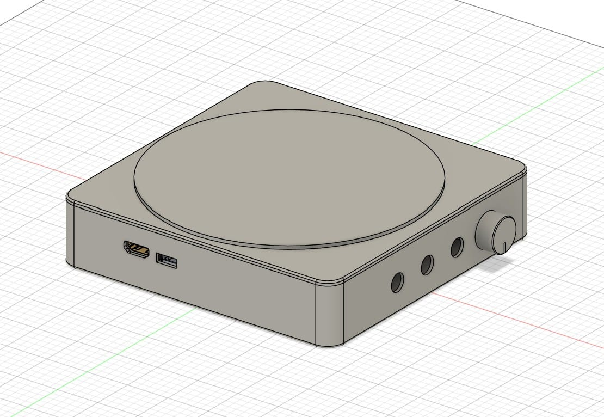
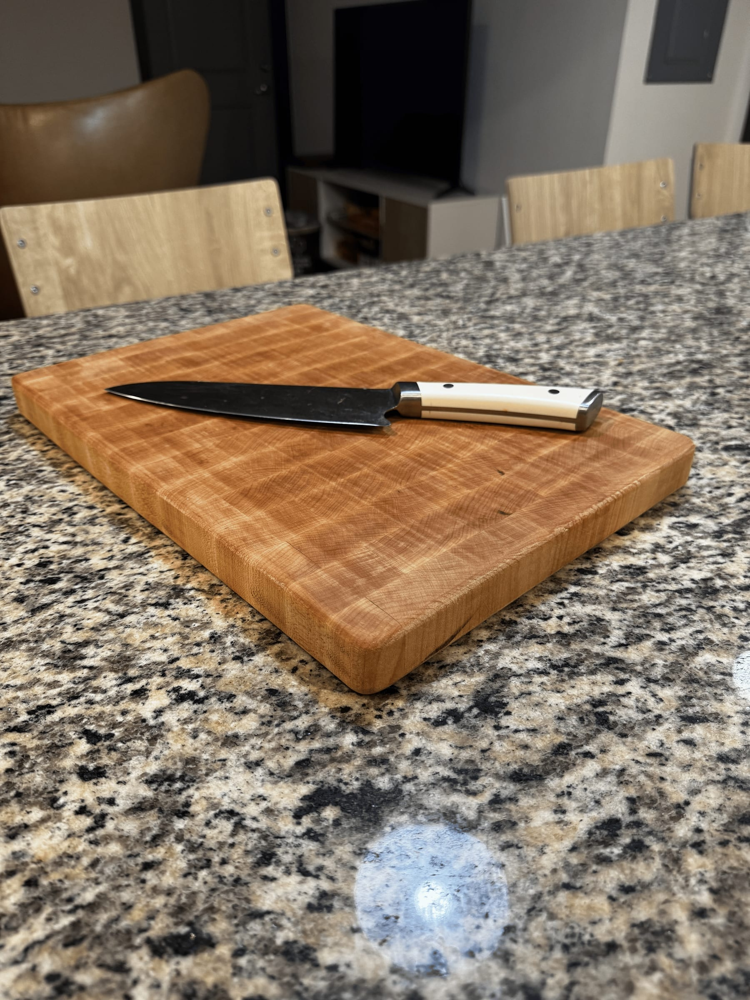
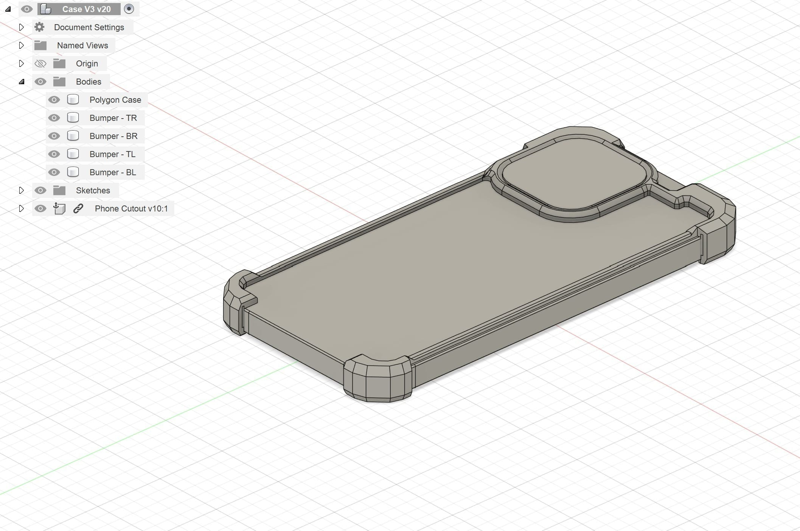
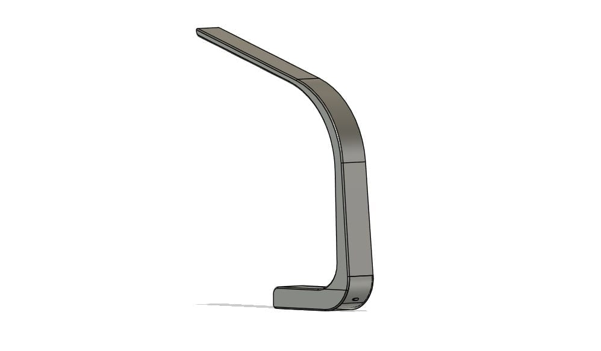
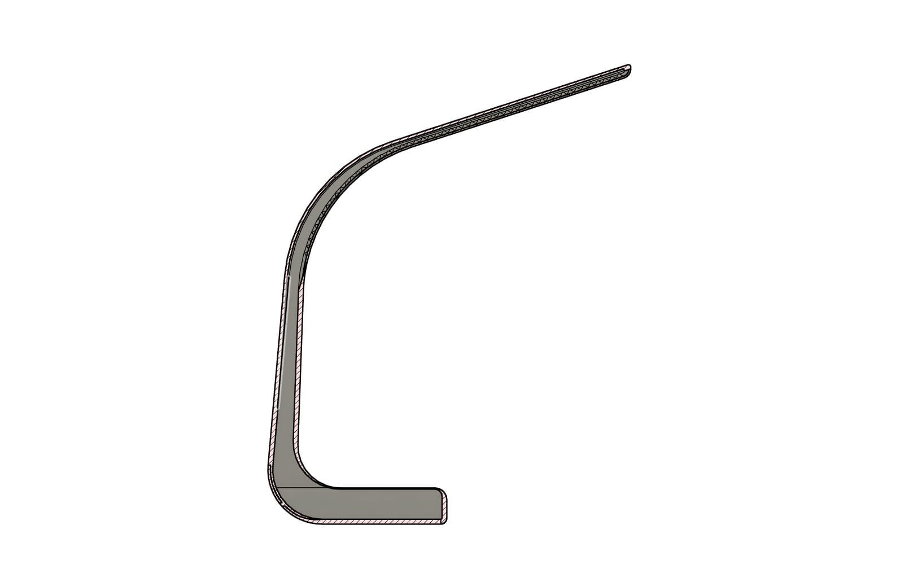
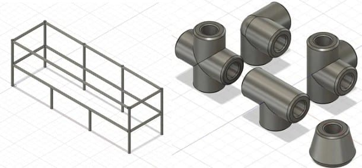
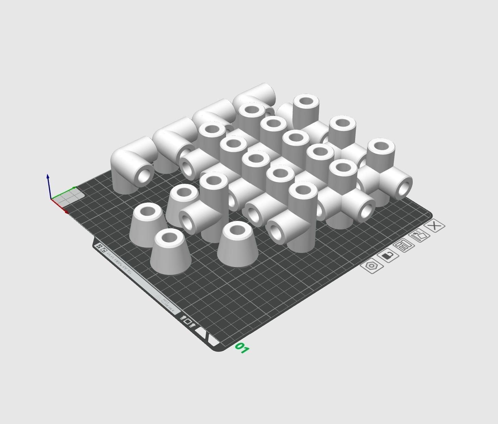

These are the things I've built outside of work and lab: a record player for my
sister, a keyboard, furniture out of the Inventionworks woodshop, and a run of
smaller everyday objects. None of them had a deadline or a customer, which is exactly why they're
where I try unfamiliar materials and processes first. I model most of them in
Fusion 360 and print on a Bambu A1 I bought with the money from my freshman
summer internship.

## Record Player

In 2021 my sister suffered a severe injury that left her with chronic back pain.
I wanted to comfort her the way I know how, which is by making something. Music
was clearly helping, so I set out to make her favorite songs easier to reach.

Research turned up two ideas I liked: a record player, and a speaker that used
RFID to trigger songs. I combined them, and built the result out of parts I
already had — a battery from a dead power bank, drivers from a water-damaged
speaker, and an old Raspberry Pi.

The problem: design a device that plays any of my sister's favorite songs
with as little friction as possible, reusing existing electronics.

### Design Process

The work fell into three phases.

Research and design. Once I'd settled on a turntable form, I looked at both
vintage and modern versions. My manufacturing options were limited, so I took a
functionality-first approach and let the components drive the design rather than
the materials.

Electronics and software. I bought an RFID reader and repurposed an old
Raspberry Pi 2, a speaker, and a battery. I used the Spotify API to reach my
sister's library. The Pi 2 would have been fine for local playback, but needing
Wi-Fi pushed me to a Pi 4. This was the hardest phase and my favorite — it's
where I got interested in Python.

Testing. By far the most time-consuming part. I hadn't worked with
electronics before, so I spent most of it troubleshooting hardware and software
in roughly equal measure.

### Outcome

It works, and it does what I built it for. Along the way I picked up Fusion 360
and Raspberry Pi fluency that carried straight into later projects.

What I'd do differently: as one of my first projects, this mostly taught me
project management. Without a defined timeline I disappeared down rabbit holes on
details that didn't matter and put off the parts that looked intimidating.

Technically, the components need a real mounting strategy — the buttons and knobs
are held with superglue and roughly dimensioned slots, and I'd rather have screw
bosses for the Pi and everything else. I'd add external speakers for sound
quality, and get closer to a real record player with an actual motor and needle.

## Macropad

Summary: As a new hire at Texas Inventionworks, I was tasked with creating a
macropad. I was already planning to build one for personal use and had sketches
ready, which sped up the design process and pushed me to make something I would
actually want on my own desk.

Problem statement: Build a macropad capable of passing two typing tests — one
predetermined string, one surprise string — and win a competition for the most
attractive design.

Timeline: One month, with a progress check at the halfway point. My personal
goal was to finish the CAD and electronics early so the remaining time could go
toward aesthetics.

Design process: I wanted something that looked different from what was on the
market: the smallest footprint I could manage, and an almost floating effect for
the keys. We were given a Raspberry Pi Pico, so I left room in the CAD for a
Micro-USB to USB-C adapter I bought for about a dollar on AliExpress. The plate
is PETG with a tight press fit. The keys are SLA resin, which holds the
dimensional accuracy the key-to-switch connections need. The main body is PLA to
accommodate the heat-set inserts that secure the plate.

What I'd change: I want to shrink the main body further and add more
features. For the competition, I underestimated how much people valued novelty —
I built something more practical and lost to designs that were more unusual.
That tradeoff was worth learning early.

## Woodworking

Texas Inventionworks, UT Austin's makerspace, has a woodshop stocked with a table
saw, miter saw, routing table, jointer, planer, and belt sander, among others.
These projects — the cutting board especially — were built to become
Instructables, the same way I approach my machine shop work: give students a
reason to walk in and use the space.

### End Grain Cutting Board

I have a habit of procrastinating on Mother's and Father's Day gifts, so in 2025
I started early. My parents are practical people, so I made them something they'd
use every day.

Approach: a YouTube video gave me the intuition for why end grain boards are
built the way they are. I kept the design minimal and used maple throughout.
After calculating the strip lengths and thicknesses I'd need, I bought the stock
and started cutting.

### Desk Riser

The problem: my monitor eats desk space I'd rather give to homework, class
notes, or my sketchbook. I also wanted joinery practice before a larger woodshop
project.

Approach: like most of my projects, this started as a sketch, then a pass
through Etsy and Pinterest to settle the final form. I usually lean minimal, but
here I added two shelves for my laptop hub and charging station. The CAD is fully
parametric — every dimension is relative — so I can re-target the same model to
someone else's desk and build one as a gift.

## Phone Case

The problem: design a case that shows off the iPhone rather than hiding it,
using far less material, without giving up protection. And design a MagSafe
wallet using 3D printed parts, magnets, and leather.

Approach: I studied the heavy-duty cases from Mous and Spigen and worked
backwards, stripping them down. I went through Pinterest and Instagram carefully,
partly to confirm nobody had already made what I was picturing and partly to
sanity-check that it would work at all. I wanted the case to print in one piece
and snap on for a snug fit. The design uses interconnected PLA bumpers with TPU
inserts to absorb impact — PLA deliberately, so that in the worst case the case
cracks instead of the phone.

Outcome: I dropped it several times and the phone never cracked. (The screen
protector did, but that can happen inside a full case too.) It reads as a bumper
case but still follows the flow of the iPhone, which is what I was after. My only
real regret is not finishing the wallet in time to carry it on my trip.

What I'd change: the sides were thin, because a MagSafe wallet or charger
still had to seat on the back, and one snapped when it caught on my pocket. The
second iteration adds double railing on the sides, which also protects the front
of the screen. The original TPU corner bumpers never made it into the carried
version — without an enclosed printer the TPU prints failed consistently. I'm
looking at SLA or SLS at Texas Inventionworks for the next one. For the wallet, I
want spring steel sheets; the PETG I printed doesn't hold enough pressure on the
cards to make removal clean.

## Lamp

The problem: my LED desk lamp worked well until the plastic base cracked from
being bent too far. I wanted to keep the adjustable light, add color temperature
control, and design and build every part except the electronics myself.

The real goal was broader: build a lamp whose electronics are easily replicable,
so the same package can drop into future projects — a light bar for the top of my
monitor, a reading bar above my bed. That means a small form factor with easy
adjustability.

Approach: I wanted something close to my old lamp but without moving parts,
since that's exactly what failed. The design went through several iterations, but
I deliberately spent more time on the electronics than the shell.

Progress: this project has taught me most of what I know about integrating
electronics into a print. My first iteration put the batteries in series and used
two buck converters — two because the LED strip wants 12 V and the microcontroller
wants 5 V. That was an inefficient use of power and the current was too low to
keep up. The second iteration puts the batteries in parallel and uses two voltage
boosters, which are also far smaller than the buck converters. Right now I'm
working on making the lamp structurally sound despite printing in multiple parts.

## Shoe Rack

The problem: after a few months in an apartment I had a pile of shoes outside
my door. I wanted a rack with no screws or adhesive, modifiable dimensions, easy
assembly and disassembly for moving, built from materials I already had — and
above all, cheaper than buying one.

I took it up during finals week as a break from studying, aiming to finish before
I left for break.

Approach: in middle and high school I did Odyssey of the Mind, which involved
building skit props, often out of PVC. I had bulk birch dowels left over from [Song
Leather](/projects/song-leather.html), and realized I only needed to design the connectors to hit every one of
my goals — and that 3D printing them would make it cheap. For the look, I wanted
the hybrid of woodworking and 3D printing to be the point, so white connectors
against light birch.

Outcome: the dowels were uneven, so the tolerances had to leave room without
needing epoxy or CA glue. I printed at 10% infill but with 3 wall loops for
press-fit strength. The print used about 450 g of PLA at $8.99/kg bulk from
Kingroon — $4.05. Checking my old order, 25 dowels cost $21, so $0.84 each; the
4-foot rack takes 6, or $5.04.

Total: $9.09. Comparable racks on Amazon average around $23, and those are
metal. I'll call that a success.

What I'd change: a finishing oil on the dowels would help the tolerances,
since the wood expands as it absorbs oil. I'd also add a hole through the
connectors so the rack can be screwed down if I ever land somewhere permanent —
and screwing into the wood would let it expand into a better fit.
