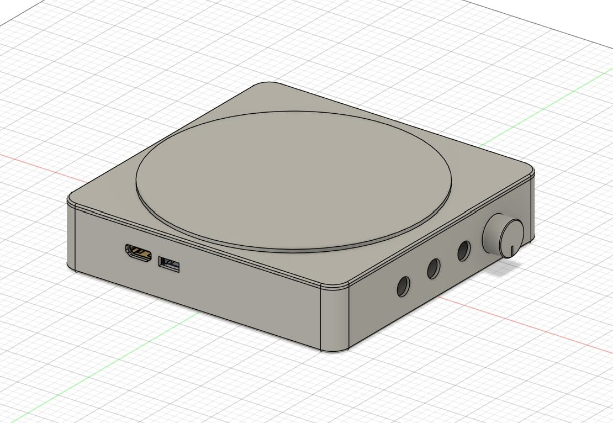
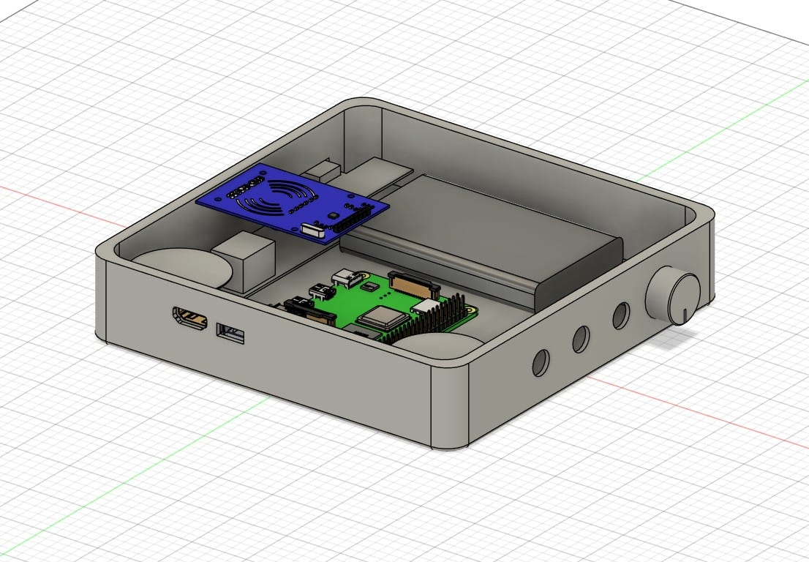
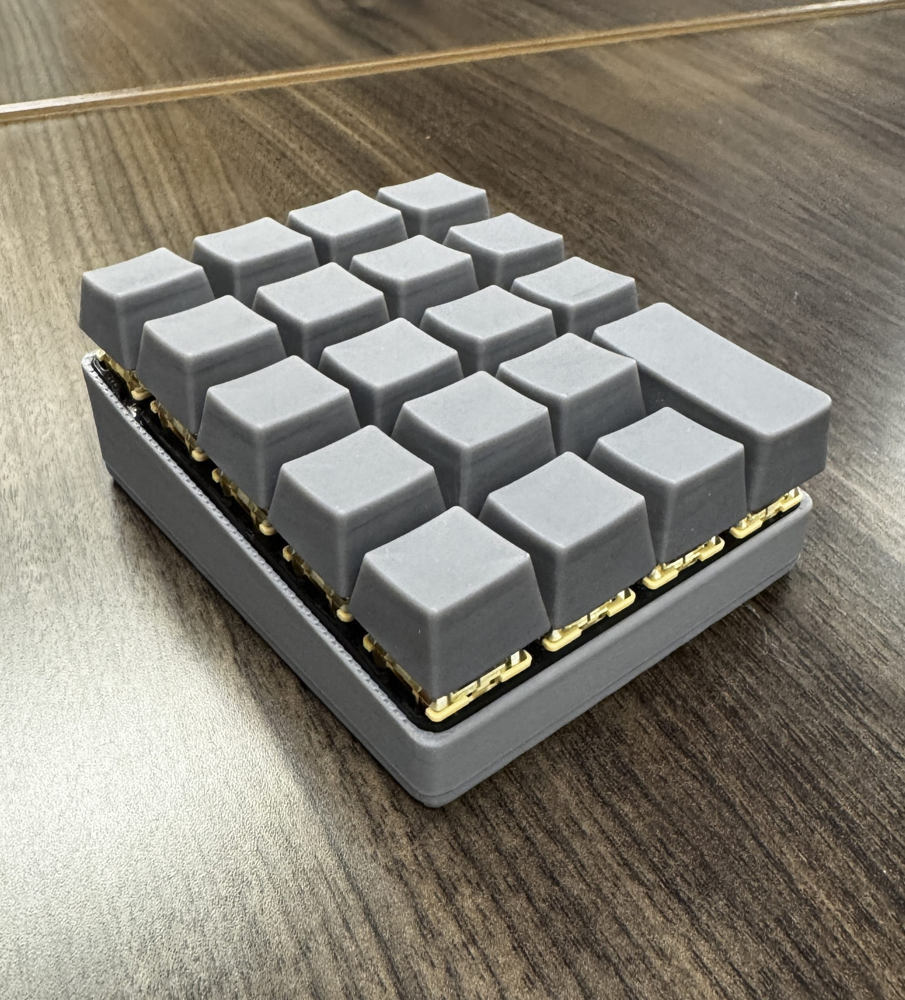
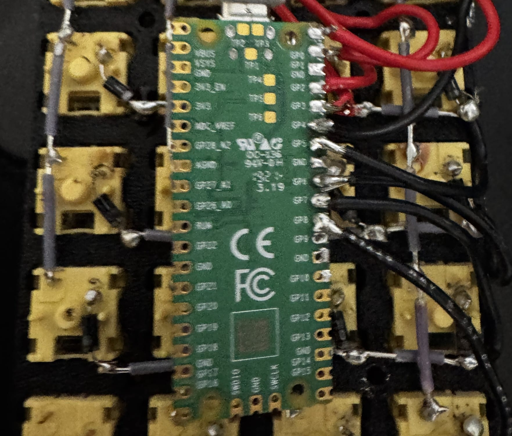
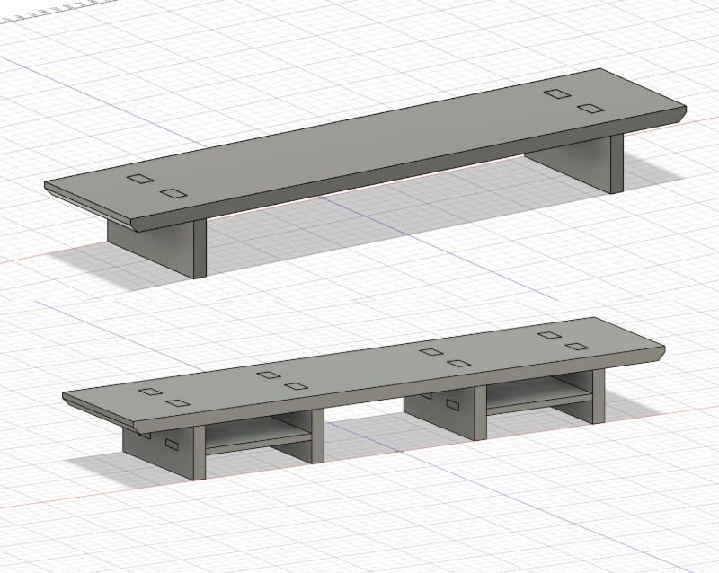
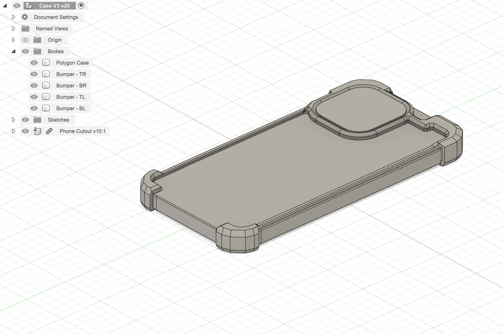
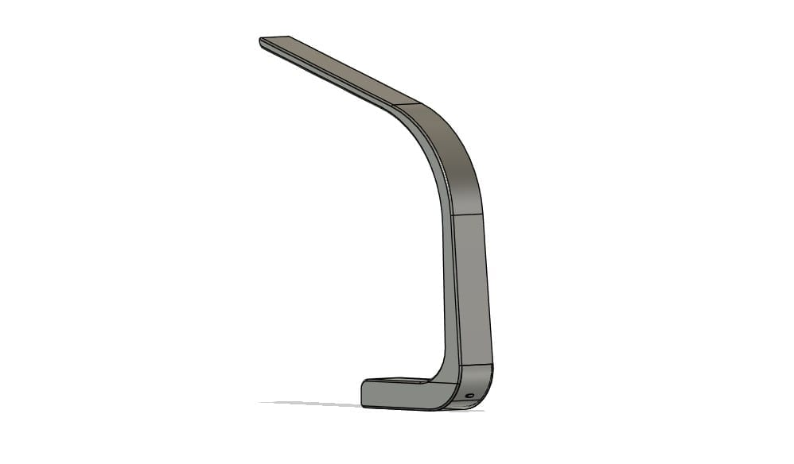
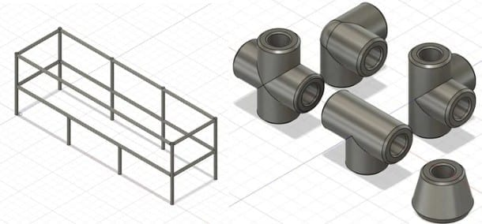
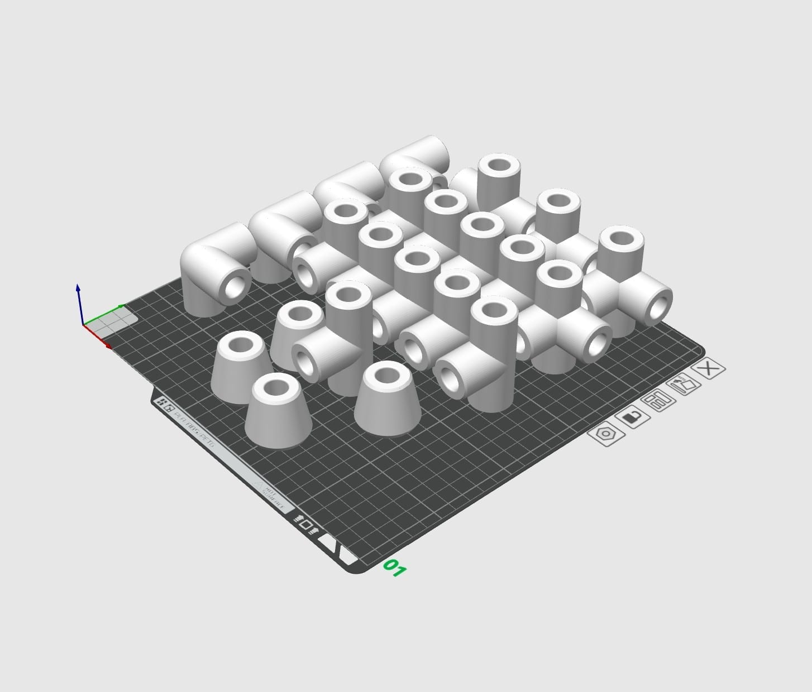

These are personal projects I made for my own use, so they have a much smaller scope than my other work. They also include some of my earliest work, from a record player for my sister to a keyboard and a handful of everyday objects. Since none of them had a deadline or a customer, they're where I try out unfamiliar materials and processes first.

I generally use Fusion 360 for most of my projects and 3D print my designs on a Bambu A1, which I bought thanks to my first job. I hope you enjoy them!

<h2 class="text-centered">The RFID Record Player</h2>

In 2021, my sister suffered a severe injury that left her with chronic back pain. I decided to comfort her the way I know best, which is by making something. Seeing how much music comforted her, I wanted to make her favorite songs as easy to reach as possible. After doing some research, I came across two ideas I liked: a record player and a speaker that used RFID to play songs. I decided to combine them using parts I already had, including a battery from an old power bank, drivers from a damaged speaker, and an old Raspberry Pi.

The record player in Fusion 360

The finished record player

<h3 class="text-centered">Design Process</h3>

The internal layout in CAD

Once I settled on a turntable, I looked into both vintage and modern record players. I was also able to find a tutorial on how to set everything up on YouTube; however, it was outdated since Spotify has since updated its API.

For the electronics, I bought an RFID reader and repurposed an old speaker, a battery, and a Raspberry Pi 2 my dad had bought me many years prior. My goal for this project was to take old components and give them a new life. This is also a fancy way to say I didn't have the funds to purchase new electronics. On the software side, I decided to use the Spotify API so I could reach my sister's favorite songs. Unfortunately, I ran into my first roadblock when I learned the Pi 2 didn't support Wi-Fi, which meant upgrading to a Pi 4. Luckily, I had just started my first job, so I spent the summer's savings on a new printer and a new Pi.

The first print, with the electronics inside

Testing was by far the most time-consuming part. Since I hadn't worked with electronics before, I spent most of it troubleshooting errors in both my software and my hardware.

The finished record player did exactly what I built it for, which was getting my sister her music. Along the way, I also got familiar with Fusion 360 and the Raspberry Pi, which helped me a lot in later projects. As one of my first projects, it taught me a lot about project management too. Without a defined timeline, I would fall into rabbit holes on details that didn't matter and procrastinate on the parts that seemed daunting.

For a second iteration, I would add a real way to mount the components to the main body. The buttons and knobs are held in with superglue and roughly dimensioned slots, so I would add screw holes for the Pi and everything else. I would also add external speakers for better sound and make it closer to a real record player, with an actual motor and needle.

<h2 class="text-centered">The Macropad</h2>

As a new hire at <a href="https://inventionworks.engr.utexas.edu/" target="_blank" rel="noopener">Texas Inventionworks</a>, I was tasked with creating a macropad that could pass two typing tests, one with a predetermined string and one with a surprise string, and compete for the most attractive design. I was extremely excited to start since I had already planned on making a macropad for myself and had sketches ready, which sped up the design process and pushed me to make something I would actually want on my own desk.

The finished macropad, front view

The finished macropad, back view with the USB-C port

<h3 class="text-centered">Design Process</h3>

The plate, keycaps, and body in Fusion 360

We had one month with a progress check halfway through, and my personal goal was to finish the CAD and electronics early so I could spend the rest of the time on aesthetics. This meant iterating through the designs quickly.

I wanted to make something that looked a bit different from what was on the market, with the smallest footprint I could manage and an almost floating effect for the keys. We were given a Raspberry Pi Pico, but I didn't like the idea of a Micro-USB input, so I first designed extra room in the CAD for a Micro-USB to USB-C adapter, which I bought for about a dollar on AliExpress.

For manufacturing, I wanted the plate the switches sit in to be made from PETG so it would be slightly elastic. I also added a small slot so the switches snapped cleanly into place, which made soldering them easier. Each key was SLA printed to capture the geometry on top, where I extruded two parabolas through the top and added a fillet to smooth it out and make it comfortable to press.

Hand-wiring the switches to the Pico

The hardest part of this project was soldering the switches. I had soldered in the past, but the plate had some messy tolerancing due to the inaccuracy of the FDM printer. In addition, it was hard to keep the Pico from moving due to the awkward position. But after an hour, I had it all wired up.

For the competition, we were surprised with a second part: an audience favorite competition. I had overlooked how much people enjoy uniqueness, which led me to lose to more unusual designs despite making something that was probably more practical. If I had another chance at this project, I would spend more time on the manufacturing of the body, and incorporate more unique colors which could have captivated the audience better. However, during the typing contest, I had hardcoded the string into a key which allowed me to win the competition.

<h2 class="text-centered">The Desk Riser</h2>

The desk riser in Fusion 360

My monitor takes up a large part of my desk, space I would much rather give to homework, class notes, or my sketchbook of ideas. I also wanted to practice some joinery to build my confidence before a bigger woodshop project.

Like most of my other projects, this one started with a sketch, then I scrolled through Etsy and Pinterest to settle on a final design. Although I usually like more minimal designs, I decided to add two shelves for my laptop hub and charging station to better accommodate my desk.

This project came out surprisingly smoothly, despite moving very slowly. Working as the woodshop lead gave me a lot of extra time in the shop that I could put toward this project.

<h2 class="text-centered">3D Printed Phone Case</h2>

I wanted to design a phone case that shows off the iPhone's looks without compromising on protection, using far less material than a typical case. I also wanted to design a MagSafe wallet to go with it, using 3D printed parts, magnets, and leather, all before my trip to visit my family overseas.

The phone case in Fusion 360

For this project, I looked at the top phone case brands, including Mous and Spigen. For inspiration, I leaned toward heavier-duty cases, which I would then strip down. I also went through Pinterest and Instagram extensively to make sure, one, that no one had already made my design, and two, that it would actually work. I wanted the case to be one print that snaps on for a snug fit. The design uses interconnected PLA bumpers with TPU inserts to absorb impact, and I decided to go with PLA so that in the worst case, the case would crack instead of the phone.

I dropped it a few times, and my phone never cracked (although the screen protector did, which could have happened even with a full case on), so I accomplished my initial goal. Even though it resembles a bumper case, I think the design still looks pretty unique and follows the flow of the iPhone. My only regret is not finishing the wallet in time to carry it on my trip.

The finished case

Since the sides were thin so a MagSafe wallet or charger could still fit on the back, one snapped when it caught on the corner of my pocket during the trip. I'm currently working on a second iteration with double railing on the sides, which also protects the front of the screen. My first model also had TPU bumpers in the corners, but since I didn't have an enclosed printer, the TPU prints kept failing, so I'm looking at SLA or even SLS at Texas Inventionworks for the next one.

For the MagSafe wallet, I hope to use a spring steel clip that keeps constant pressure on the cards, a trick Apple's MagSafe wallets use, since the PETG I printed didn't hold enough pressure. The clip sits inside the wallet and pushes the cards toward the front, so even as you take cards out, the spring keeps pressing on the outermost card and it doesn't fall out when the wallet is held upside down.

<h2 class="text-centered">The Desk Lamp</h2>

I had an LED desk lamp that worked amazingly until its plastic base cracked from being bent too far. I wanted to keep some of the same features, like the adjustable light, but this time I also wanted to be able to change the color temperature, and to design and make every part of the lamp except the electronics myself. The bigger goal was a lamp with electronics that are easy to replicate, so the same idea could carry into future projects.

The desk lamp in Fusion 360

I wanted to make something similar to my old lamp but without moving parts, so the same issue couldn't happen again. While the design went through quite a few iterations, I decided to spend more time on the electronics, since I hope to reuse them in ideas like a light bar for the top of my monitor or a reading light above my bed. That meant keeping the electronics small, adjustable, and customizable.

So far, this project has taught me a lot about integrating electronics into a print. In my first iteration, I put the batteries in series and used two buck converters (I needed two since the LED strip needs 12 V while the microcontroller needs 5 V), which was a very inefficient use of power, and the current was too low to keep up with the setup. My second iteration puts the batteries in parallel with two voltage boosters, which are also much smaller than the buck converters. Right now, I'm working on making the lamp structurally sound despite having to print it in multiple parts.

<h2 class="text-centered">The $9 Shoe Rack</h2>

In my first few months living in an apartment, I had a pile of shoes sitting outside my door. I wanted a shoe rack that wouldn't need screws or adhesive, could be modified to fit any apartment, was easy to assemble and take apart for moving, and reused old materials. Most importantly, it had to be a lot cheaper than buying one. I took this project on during finals week to give myself a break from studying, and I wanted to finish it before I left for break.

The rack and its connectors in Fusion 360

In middle and high school, I did Odyssey of the Mind, and part of it was building props for a skit, which sometimes meant using PVC pipes. Since I had bulk birch dowels left over from [Song Leather](/projects/song-leather.html), I realized I just needed to design the connectors to hit all of my goals, and 3D printing them would keep it cheap. For the look, I wanted to show off the mix of woodworking and 3D printing, so I used white connectors to complement the light birch.

<h3 class="text-centered">Results and Improvements</h3>

The connectors, fresh off the printer

The dowels were fairly uneven, so my tolerances had to leave enough room without needing epoxy or CA glue. I printed at 10% infill but with 3 wall loops for press-fit strength. In total, the print used around 450 g of PLA, which at $8.99/kg from Kingroon came to $4.05. Looking back at my old order, I paid $21 for 25 dowels, so the 6 dowels in my 4-foot rack cost $5.04. That's $9.09 in total, compared to around $23 for metal racks of the same size on Amazon, so I consider this project a success.

In the future, I think adding a finishing oil to the dowels would help with the tolerances, since the wood expands as it absorbs the oil. I could also add a hole in each connector in case I find a more permanent place to live, and screwing into the wood would let it expand for a better fit.