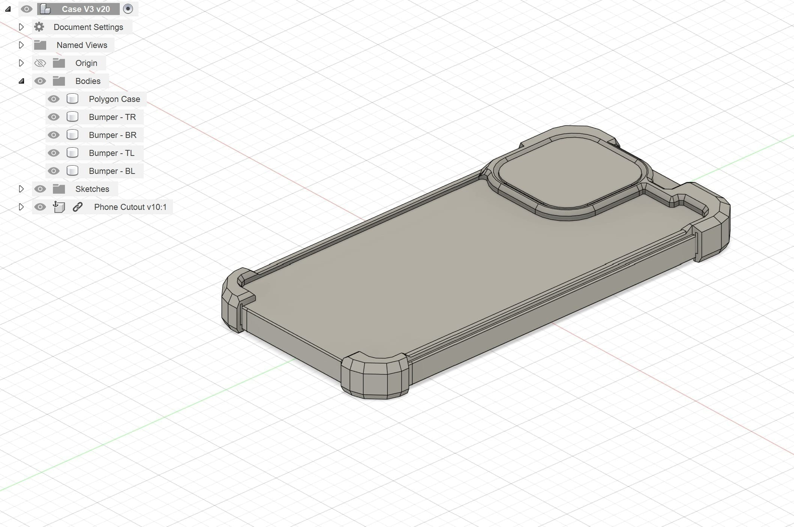
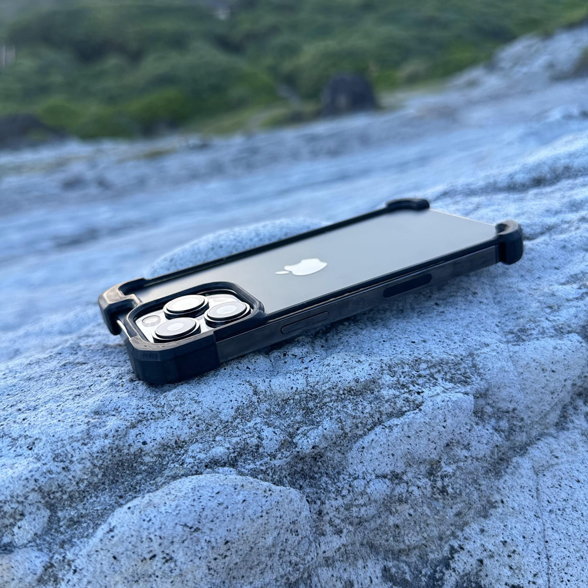

I wanted to design a phone case that shows off the iPhone's looks without compromising on protection, using far less material than a typical case. I also wanted to design a MagSafe wallet to go with it, using 3D printed parts, magnets, and leather, all before my trip to visit my family overseas.

The phone case in Fusion 360

For this project, I looked at the top phone case brands, including Mous and Spigen. For inspiration, I leaned toward heavier-duty cases, which I would then strip down. I also went through Pinterest and Instagram extensively to make sure, one, that no one had already made my design, and two, that it would actually work. I wanted the case to be one print that snaps on for a snug fit. The design uses interconnected PLA bumpers with TPU inserts to absorb impact, and I decided to go with PLA so that in the worst case, the case would crack instead of the phone.

I dropped it a few times, and my phone never cracked (although the screen protector did, which could have happened even with a full case on), so I accomplished my initial goal. Even though it resembles a bumper case, I think the design still looks pretty unique and follows the flow of the iPhone. My only regret is not finishing the wallet in time to carry it on my trip.

The finished case

Since the sides were thin so a MagSafe wallet or charger could still fit on the back, one snapped when it caught on the corner of my pocket during the trip. I'm currently working on a second iteration with double railing on the sides, which also protects the front of the screen. My first model also had TPU bumpers in the corners, but since I didn't have an enclosed printer, the TPU prints kept failing, so I'm looking at SLA or even SLS at Texas Inventionworks for the next one.

For the MagSafe wallet, I hope to use a spring steel clip that keeps constant pressure on the cards, a trick Apple's MagSafe wallets use, since the PETG I printed didn't hold enough pressure. The clip sits inside the wallet and pushes the cards toward the front, so even as you take cards out, the spring keeps pressing on the outermost card and it doesn't fall out when the wallet is held upside down.
