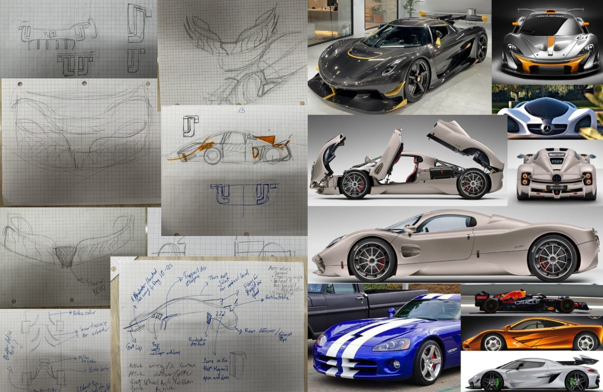
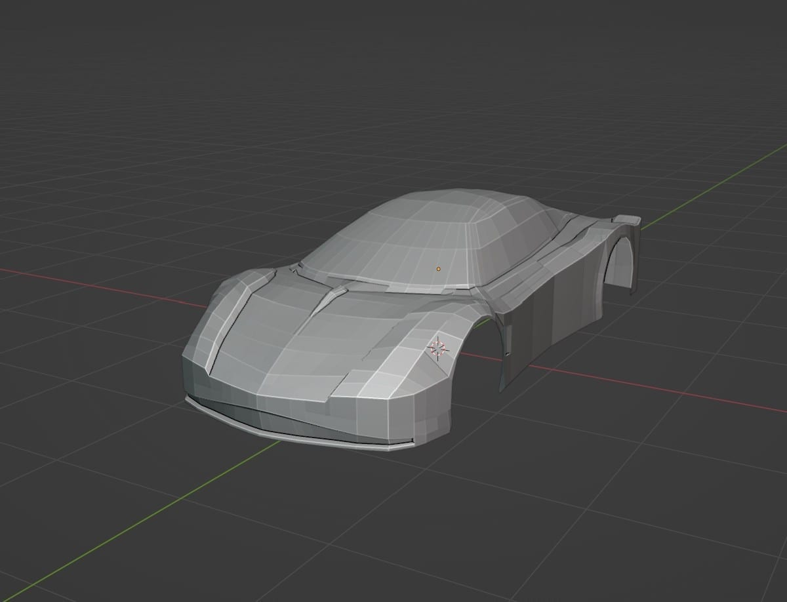
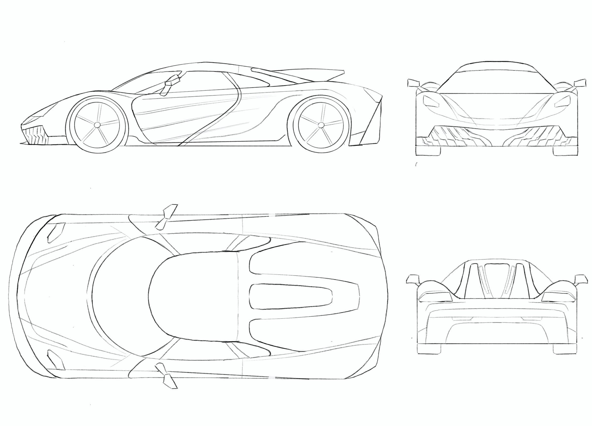
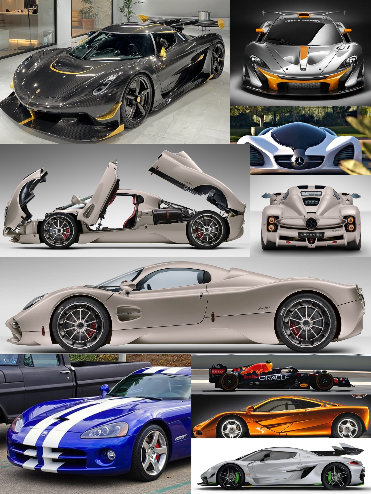
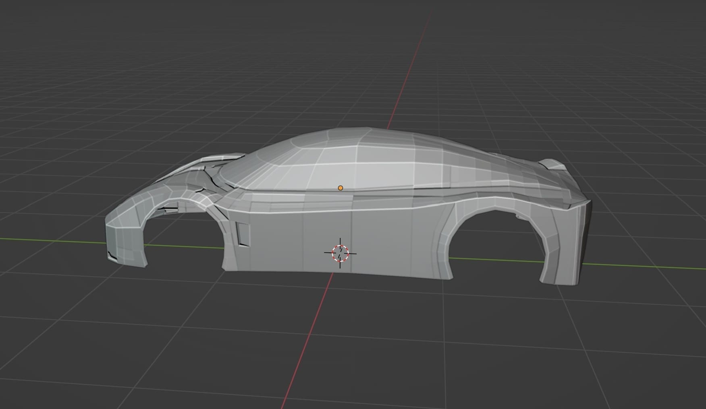

Project PL-8 was an absurdly ambitious student organization dedicated to creating the first student-built two-seater hypercar. 

As a shell engineer, my job was to lead the design of the outer composite panels and integrate them directly with the chassis structure. We were a two-person team chasing two conflicting goals at once: design a hypercar shell that actually looked like a hypercar, but make it simple enough that college students could realistically manufacture it in a composite layup.

## The Design Challenge

The problem: Surface a two-seater supercar accounting for aerodynamics, interior airflow, and strict constraints on basalt-fiber composite manufacturability, all while making it look fast.

Early inspiration collages and sketch passes exploring the visual language.

We started on paper. My sketches drew heavily on the sleekness of the Porsche 911, with aggressive aerodynamic elements pulled from the Koenigsegg Jesko. For the engineering of the actual body panel breakups, we studied the Pagani Utopia. We had zero budget for real airflow testing or CFD at this stage, so I used the known silhouette of an F1 car as a proxy for reasoning about downforce and drag.

## From Concept to CAD

My teammate and I modeled our separate visions of the car and then merged the strongest elements of each. I had never touched Blender before this project, but automotive surfacing requires a level of organic modeling that traditional parametric CAD (like SolidWorks or Inventor) struggles with natively. So I learned it on the fly. 

The final 7-panel body breakup modeled in Blender (left) and exported as engineering drawings (right) for the composite layup molds.

We ultimately split the body into seven panels and modeled them individually. The hardest part wasn't the surfacing, it was the integration: continuously removing geometry that was too complex for a basalt-fiber resin infusion, while constantly shifting the overall shape to accommodate the underlying metal chassis and powertrain. 

## The Outcome

The final CAD render (left) next to our physical scale validation model (right).

We didn't hit all of our goals, and we were badly understaffed for the sheer scope of building a hypercar from scratch. But it remains one of the most educational projects I've ever tackled. It forced me to learn Blender deeply—a tool I use constantly now—and taught me how severely manufacturing realities dictate aesthetic design. 

If we were to pick it up again, the shell design would be meaningfully optimized with FEA and real CFD rather than proxy reasoning. We'd also immediately manufacture a few panels at a reduced scale to get real data on whether the design is actually as manufacturable as we assumed it was.
