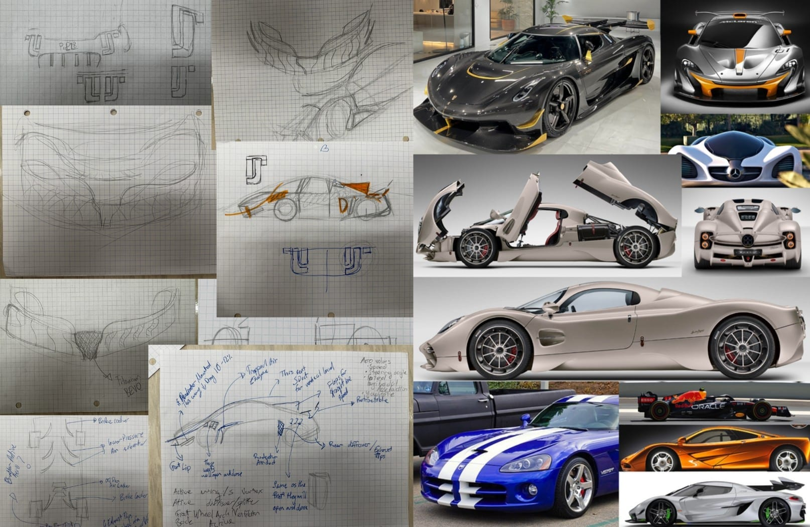

As a shell engineer for PL-8, I led the design of the outer shell panels and
their integration with the chassis structure. Our team of two was chasing two
goals at once: a shell that could actually be manufactured as a composite, and a
car that looked like something people would want to see, with elements of our
school mascot worked in. The models also fed key chains and small display pieces
for kids at events, and renders for marketing.

**The problem:** design shell panels for a two-seater supercar while accounting
for overall aerodynamics, interior airflow, and basalt-fiber composite
manufacturability.

## Design Process

We started by sketching multiple versions of the car. I built inspiration
collages to design against. My sketches drew heavily on the sleekness of the
Porsche 911, with elements of the Koenigsegg Jesko for the hypercar read, while
the body panel engineering leaned on the Pagani Utopia. With no way to run
airflow tests, I used the silhouette of an F1 car as a proxy for reasoning about
it.

My teammate and I then modeled our cars separately and merged the strongest parts
of each. We split the body into seven panels and modeled them individually,
continuously removing geometry too complex for a composite layup — we were
planning resin infusion with basalt fiber. The overall shape kept shifting to
accommodate the metal chassis and the powertrain team's engine.

## Outcome

We didn't hit all of our goals, and we were badly understaffed for the scope. It
was still one of the most enjoyable and educational projects I've worked on. I'd
never touched Blender before this, and the project gave me a reason to learn it
properly — I've used it constantly since.

**What's next:** the shell design could be meaningfully optimized with FEA and
CFD rather than proxy reasoning. We'd also manufacture a few panels at reduced
scale first, to get real data on whether the design is as manufacturable as we
think it is.
