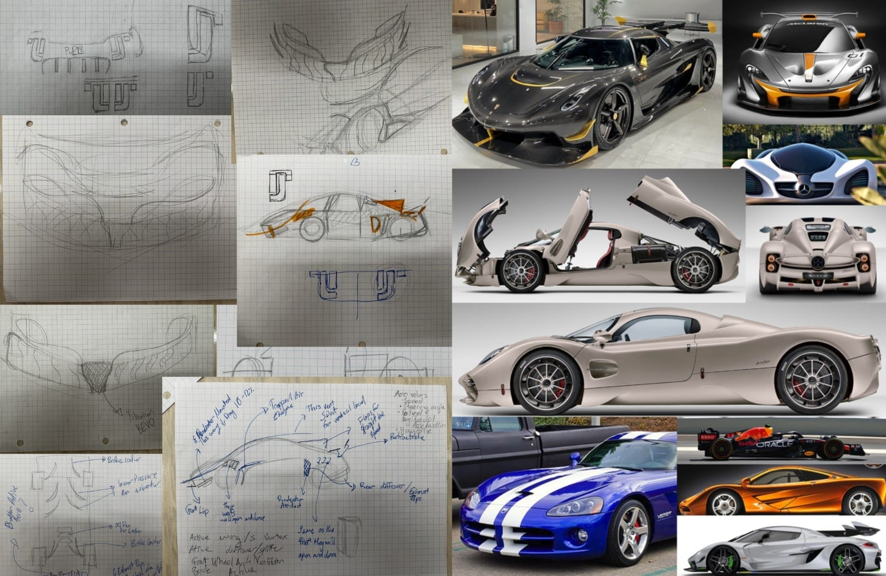
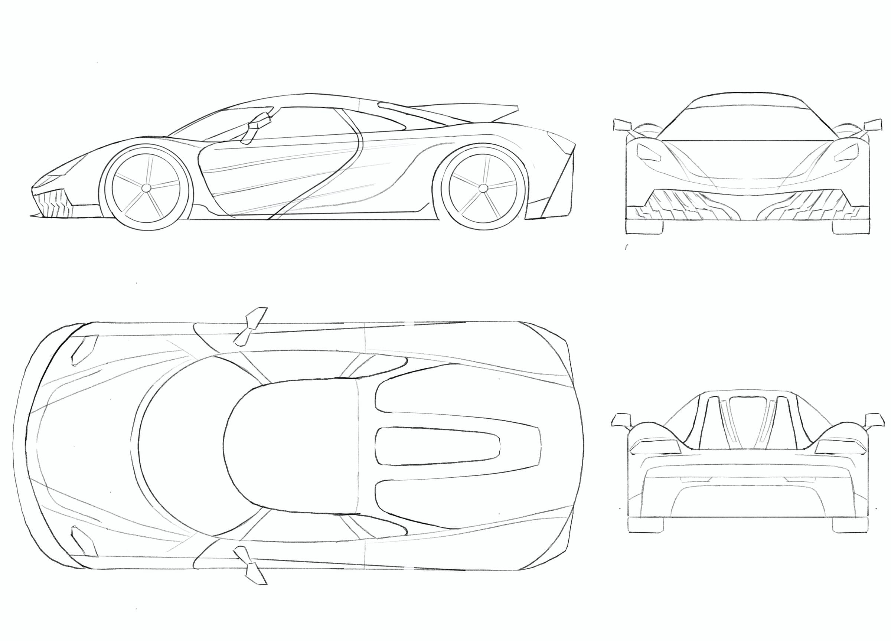
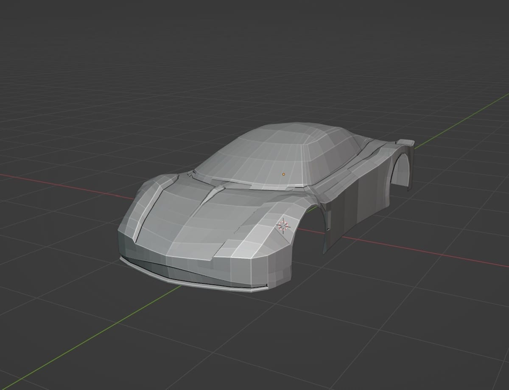

From August 2024 to January 2025, I was a shell engineer for Project PL-8, a student organization working to build the first student-built two-seater hypercar. On a shell team of just two, I led the design of the car's outer shell panels and how they integrated with the chassis, working closely with the chassis and powertrain teams.

We were chasing two goals at once: a shell that could actually be manufactured as a basalt fiber composite, and a car that people would want to look at, with elements of our school mascot worked in. Our models also ended up being used for key chains and small models we gave to kids at events, and were rendered for marketing.

<h2 class="text-centered">Designing the Shell</h2>

Early sketches alongside the inspiration collages

The problem we were solving was designing shell panels for a two-seater supercar while considering overall aerodynamics, interior airflow, and how manufacturable the panels would be as a basalt fiber composite.

We started by sketching multiple versions of the car. To help myself design, I also made a few collages for inspiration that I could design against. As a fun side project, I created a Pinterest collage creator that takes a link to a public Pinterest board, downloads all the images, and turns them into a collage of overlapping images. This made collecting inspiration and visualizing the car much easier.

My sketches were heavily inspired by the sleekness of the Porsche 911, with elements from the Koenigsegg Jesko that added to the hypercar look. The overall engineering and body panel design took after the Pagani Utopia, which showed up all over my sketches. Since the design was preliminary, the airflow considerations were done intuitively.

<h3 class="text-centered">From Sketch to CAD</h3>

Line drawings of the car from the side, top, front, and rear

From there, my teammate and I modeled our cars separately, then combined the aspects we thought were the best from each design into one car. I had no experience with Blender before this project, but automotive surfacing needs a lot more freeform modeling than parametric CAD can handle, so I learned it as I went. I was extremely motivated to learn it since I knew I would want it for my own projects later on, and I've used it constantly since.

An early version of the body in Blender

Once we had a combined design, we split the body into seven panels and modeled each one individually. Throughout the process, we made sure to eliminate any geometry that was too complex for a composite layup, since we were planning to use resin infusion with basalt fiber for the outer shell. We also constantly tweaked the overall shape to make room for the metal chassis and the powertrain team's engine, which was honestly the hardest part of the job.

<h3 class="text-centered">Conclusion and Future Improvements</h3>

While we didn't achieve all of our goals, and we were extremely understaffed for the scope of building a hypercar, this was still one of the most fun and educational projects I've worked on. It also showed me how much manufacturing ends up shaping a design that starts out being all about looks.

If I had spent more time at PL-8, I would have optimized the shell with FEA and CFD instead of relying on intuition, although this would have taken much longer. I would also have practiced manufacturing a few panels at a smaller scale first, to get real data on whether our design was as manufacturable as we thought it was.

Although I didn't achieve as much in PL-8 as I was hoping, it sparked my love for design, since this project allowed for a lot of creativity. Thank you to the PL-8 team for letting me be a part of such an ambitious project!

