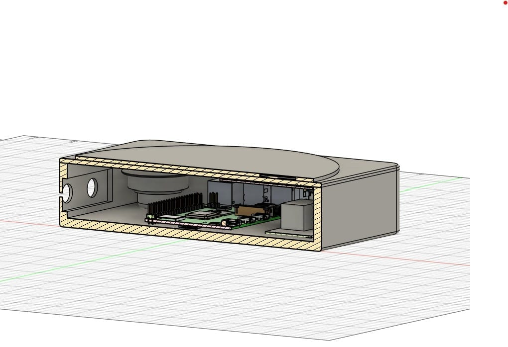
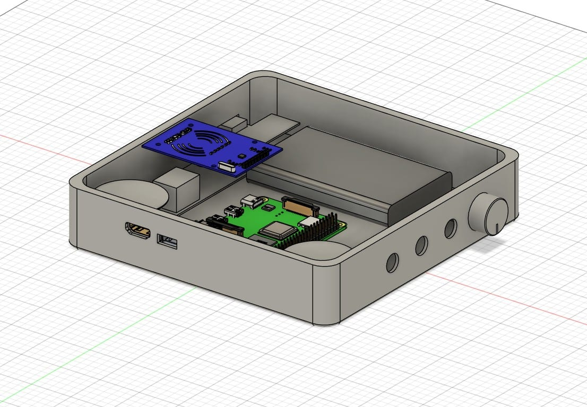

In 2021 my sister suffered a severe injury that left her with chronic back pain.
I wanted to comfort her the way I know how, which is by making something. Music
was clearly helping, so I set out to make her favorite songs easier to reach.

Research turned up two ideas I liked: a record player, and a speaker that used
RFID to trigger songs. I combined them, and built the result out of parts I
already had — a battery from a dead power bank, drivers from a water-damaged
speaker, and an old Raspberry Pi.

**The problem:** design a device that plays any of my sister's favorite songs
with as little friction as possible, reusing existing electronics.

## Design Process

The work fell into three phases.

**Research and design.** Once I'd settled on a turntable form, I looked at both
vintage and modern versions. My manufacturing options were limited, so I took a
functionality-first approach and let the components drive the design rather than
the materials.

**Electronics and software.** I bought an RFID reader and repurposed an old
Raspberry Pi 2, a speaker, and a battery. I used the Spotify API to reach my
sister's library. The Pi 2 would have been fine for local playback, but needing
Wi-Fi pushed me to a Pi 4. This was the hardest phase and my favorite — it's
where I got interested in Python.

**Testing.** By far the most time-consuming part. I hadn't worked with
electronics before, so I spent most of it troubleshooting hardware and software
in roughly equal measure.

## Outcome

It works, and it does what I built it for. Along the way I picked up Fusion 360
and Raspberry Pi fluency that carried straight into later projects.

**What I'd do differently:** as one of my first projects, this mostly taught me
project management. Without a defined timeline I disappeared down rabbit holes on
details that didn't matter and put off the parts that looked intimidating.

Technically, the components need a real mounting strategy — the buttons and knobs
are held with superglue and roughly dimensioned slots, and I'd rather have screw
bosses for the Pi and everything else. I'd add external speakers for sound
quality, and get closer to a real record player with an actual motor and needle.
