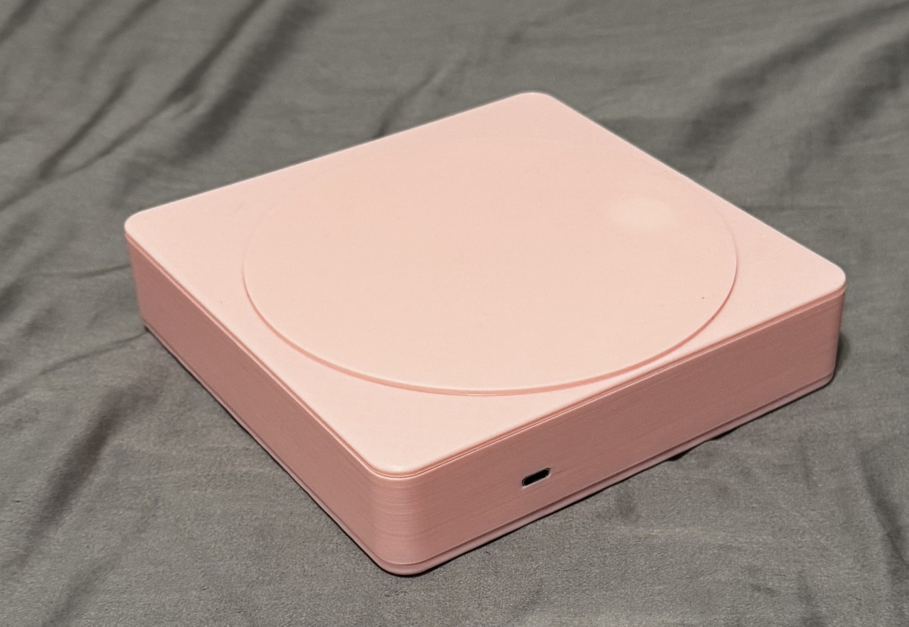
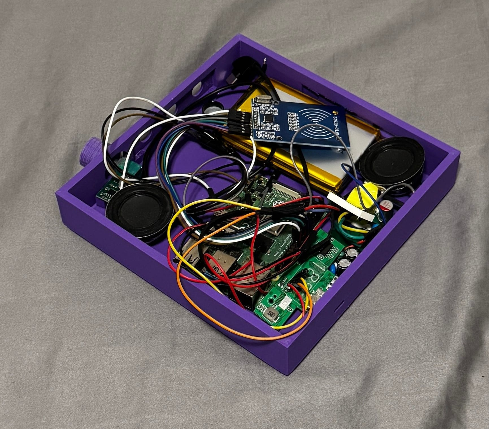

In 2021, my sister suffered a severe injury that left her with chronic back pain. I decided to comfort her the way I know best, which is by making something. Seeing how much music comforted her, I wanted to make her favorite songs as easy to reach as possible. After doing some research, I came across two ideas I liked: a record player and a speaker that used RFID to play songs. I decided to combine them using parts I already had, including a battery from an old power bank, drivers from a damaged speaker, and an old Raspberry Pi.

The record player in Fusion 360

The finished record player

<h3 class="text-centered">Design Process</h3>

The internal layout in CAD

Once I settled on a turntable, I looked into both vintage and modern record players. I was also able to find a tutorial on how to set everything up on YouTube; however, it was outdated since Spotify has since updated its API.

For the electronics, I bought an RFID reader and repurposed an old speaker, a battery, and a Raspberry Pi 2 my dad had bought me many years prior. My goal for this project was to take old components and give them a new life. This is also a fancy way to say I didn't have the funds to purchase new electronics. On the software side, I decided to use the Spotify API so I could reach my sister's favorite songs. Unfortunately, I ran into my first roadblock when I learned the Pi 2 didn't support Wi-Fi, which meant upgrading to a Pi 4. Luckily, I had just started my first job, so I spent the summer's savings on a new printer and a new Pi.

The first print, with the electronics inside

Testing was by far the most time-consuming part. Since I hadn't worked with electronics before, I spent most of it troubleshooting errors in both my software and my hardware.

The finished record player did exactly what I built it for, which was getting my sister her music. Along the way, I also got familiar with Fusion 360 and the Raspberry Pi, which helped me a lot in later projects. As one of my first projects, it taught me a lot about project management too. Without a defined timeline, I would fall into rabbit holes on details that didn't matter and procrastinate on the parts that seemed daunting.

For a second iteration, I would add a real way to mount the components to the main body. The buttons and knobs are held in with superglue and roughly dimensioned slots, so I would add screw holes for the Pi and everything else. I would also add external speakers for better sound and make it closer to a real record player, with an actual motor and needle.
