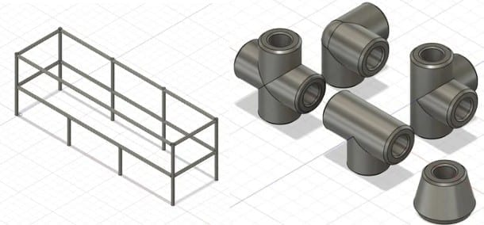
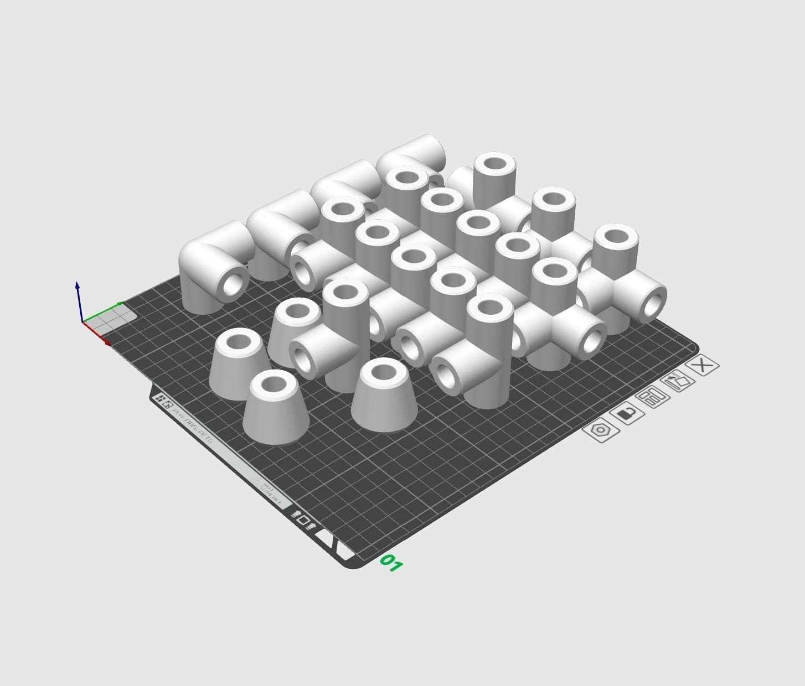

In my first few months living in an apartment, I had a pile of shoes sitting outside my door. I wanted a shoe rack that wouldn't need screws or adhesive, could be modified to fit any apartment, was easy to assemble and take apart for moving, and reused old materials. Most importantly, it had to be a lot cheaper than buying one. I took this project on during finals week to give myself a break from studying, and I wanted to finish it before I left for break.

The rack and its connectors in Fusion 360

In middle and high school, I did Odyssey of the Mind, and part of it was building props for a skit, which sometimes meant using PVC pipes. Since I had bulk birch dowels left over from [Song Leather](/projects/song-leather.html), I realized I just needed to design the connectors to hit all of my goals, and 3D printing them would keep it cheap. For the look, I wanted to show off the mix of woodworking and 3D printing, so I used white connectors to complement the light birch.

<h3 class="text-centered">Results and Improvements</h3>

The connectors, fresh off the printer

The dowels were fairly uneven, so my tolerances had to leave enough room without needing epoxy or CA glue. I printed at 10% infill but with 3 wall loops for press-fit strength. In total, the print used around 450 g of PLA, which at $8.99/kg from Kingroon came to $4.05. Looking back at my old order, I paid $21 for 25 dowels, so the 6 dowels in my 4-foot rack cost $5.04. That's $9.09 in total, compared to around $23 for metal racks of the same size on Amazon, so I consider this project a success.

In the future, I think adding a finishing oil to the dowels would help with the tolerances, since the wood expands as it absorbs the oil. I could also add a hole in each connector in case I find a more permanent place to live, and screwing into the wood would let it expand for a better fit.
