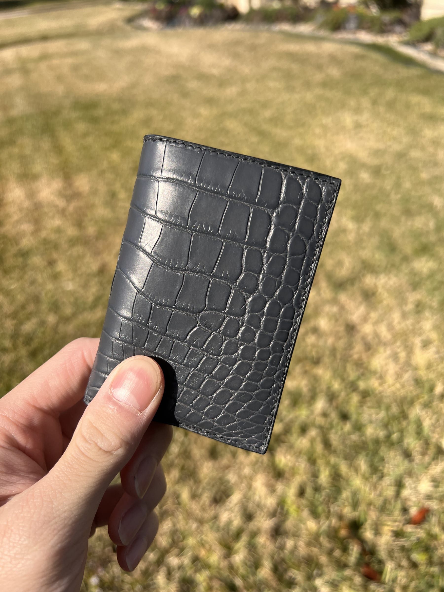
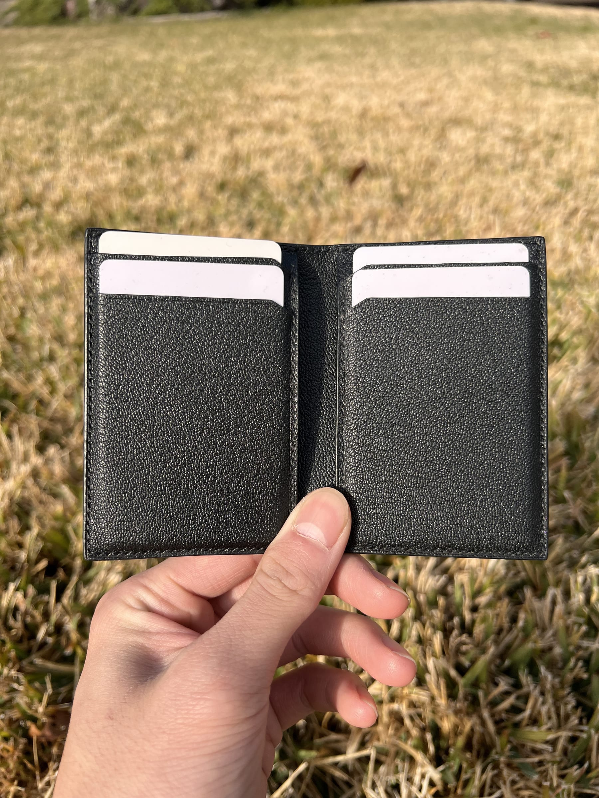
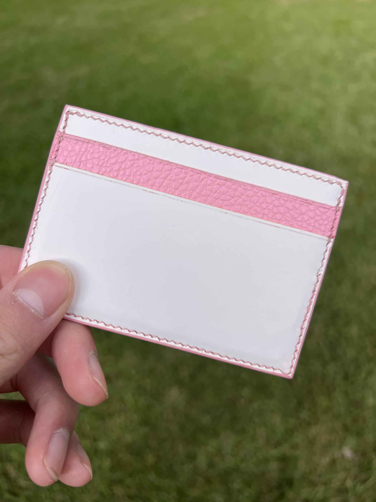
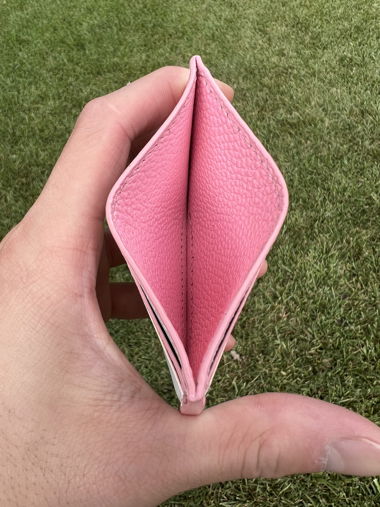

Song Leather started at the end of 2020. Quarantine had just begun, and I was looking for a project that would force me to learn end-to-end design. The goal was simple: create something real, and learn marketing and product design by running an actual business rather than reading about one.

I started with wood carving, then noticed a gap in the market for simple, sustainable tool covers. From there, I moved into leatherworking, designing an original line of minimalist wallets and belts. 

When my sister made a TikTok of the process that unexpectedly went viral, orders arrived faster than I could fill them. 

## The Design Process

Initial ideation sketches moving away from the traditional bifold.

Research told me I needed a visible element of uniqueness — something that read instantly as handmade — so I explicitly moved away from the traditional bifold. I designed the first wallet around four strict constraints: 
1. Manufacturing efficiency (to keep prices low)
2. Structural integrity (so it wouldn't warp)
3. Card accessibility (frictionless extraction)
4. Ergonomics (it had to feel good in the pocket)

A batch of wallet bodies mid-production on the bench.

Once I had a direction, I prototyped iteratively in paper, then converted each pattern to a digital vector file so it could be printed and cut with perfect consistency. I carried the first leather prototype myself for months, adjusting the pattern as problems surfaced, long before ever putting it on the site.

## The Outcome

A sample of the final production collection.

The business taught me a hard lesson: **you must think about scalability and manufacturability before setting brand values.**

That gap showed up immediately in the first wave of orders. Because each wallet or bag took days (sometimes weeks) of manual labor, I simply couldn't keep up with demand. I had to limit availability, intentionally turning away sales I had already earned because my manufacturing process couldn't scale.

Bespoke pieces created later as gifts.

These days, I scale the business differently. I make pieces almost exclusively as gifts for friends and family. I hit exactly what I originally set out to do—gaining real, unfiltered experience in product design, marketing, and the harsh realities of small-batch manufacturing.
