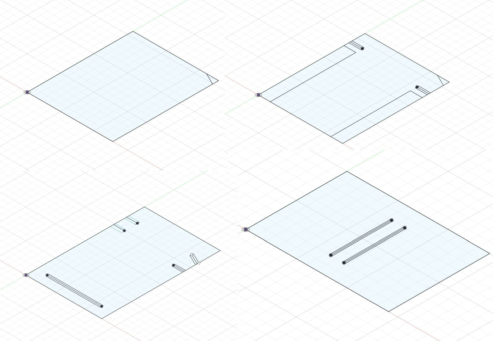
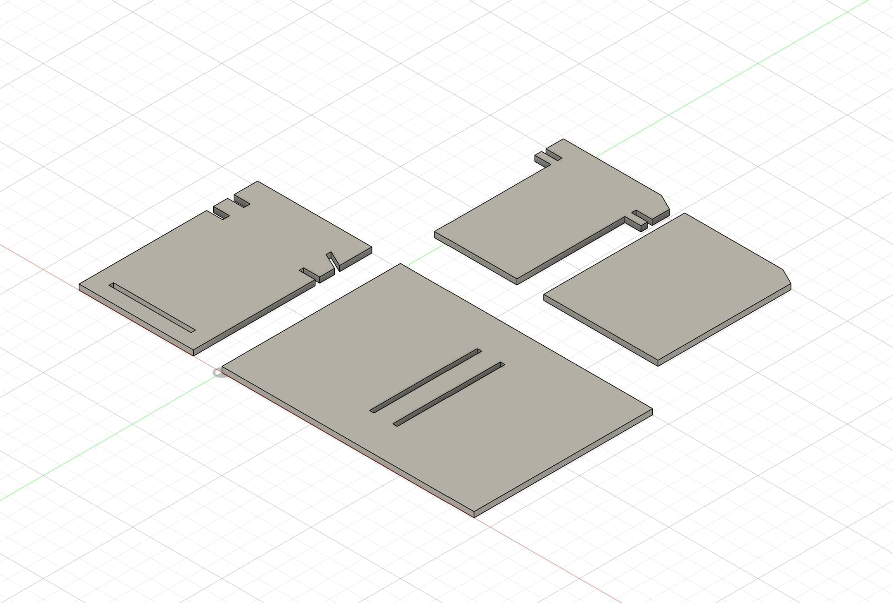

Song Leather started at the end of 2020. Quarantine had just begun and I was
looking for a project that would teach me design. I started with branches that
came down in a storm in our backyard, turning them into spoons, butter knives,
and forks. As I got into better tools, I noticed a gap in the market for simple,
sustainable, largely universal tool covers — and from there moved into
leatherworking, making wallets and belts.

My sister made a video of the work that went viral, and the orders arrived faster
than I could fill them. Each wallet or bag took days, sometimes weeks. I scaled
back. These days I make pieces almost exclusively as gifts for friends and family.

**The goal:** create something real, and learn marketing and product design by
running an actual business rather than reading about one.

## Design Process

Research told me I needed a visible element of uniqueness — something that read
as handmade — so I moved away from the traditional bifold. I designed around four
constraints: manufacturing efficiency, structural integrity, card accessibility,
and ergonomics.

Once I had a direction, I prototyped iteratively in paper, then converted each
pattern to a digital file so it could be printed and cut consistently. Then I
carried the wallet myself for a few months, adjusting the design as problems
surfaced, before putting it on the site.

## What I'd Do Differently

Think about scalability and manufacturability *before* setting brand values. That
gap showed up immediately in the first wave of orders — I couldn't keep up, so I
limited availability, which cost me sales I'd already earned.

I'd also choose a less contentious material. Misconceptions about leather, mostly
rooted in the illegal poaching of exotic animals, color how people see leather
goods generally, even when the sourcing is sustainable.

**Where it landed:** I hit what I set out to do — real experience in product
design and marketing, and a platform to talk about sustainability.
