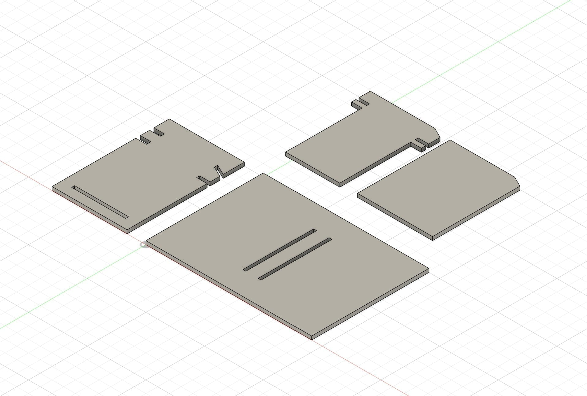
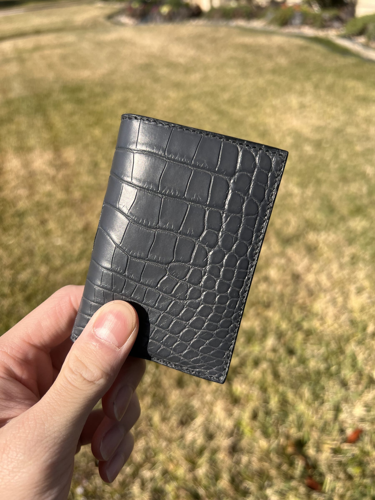
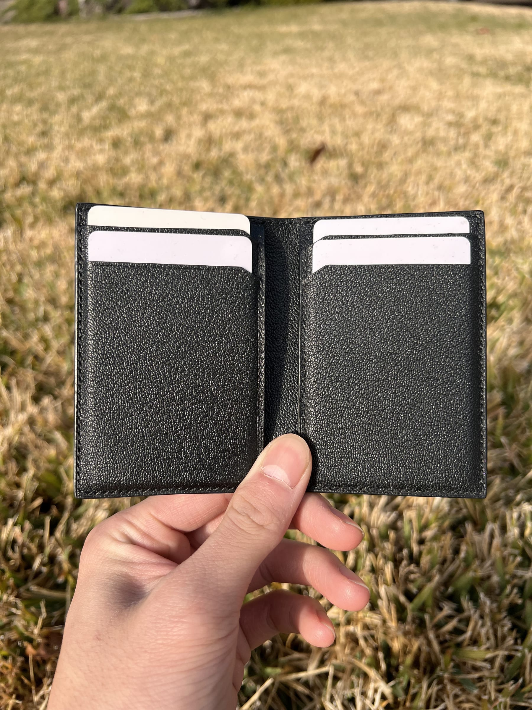
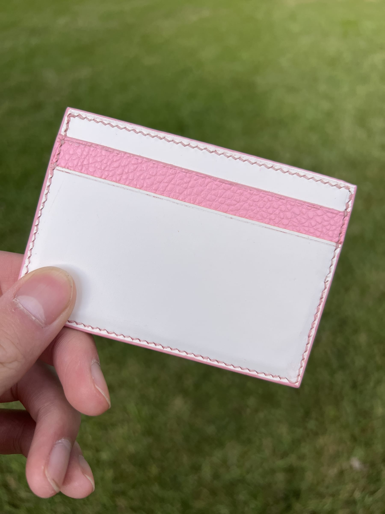
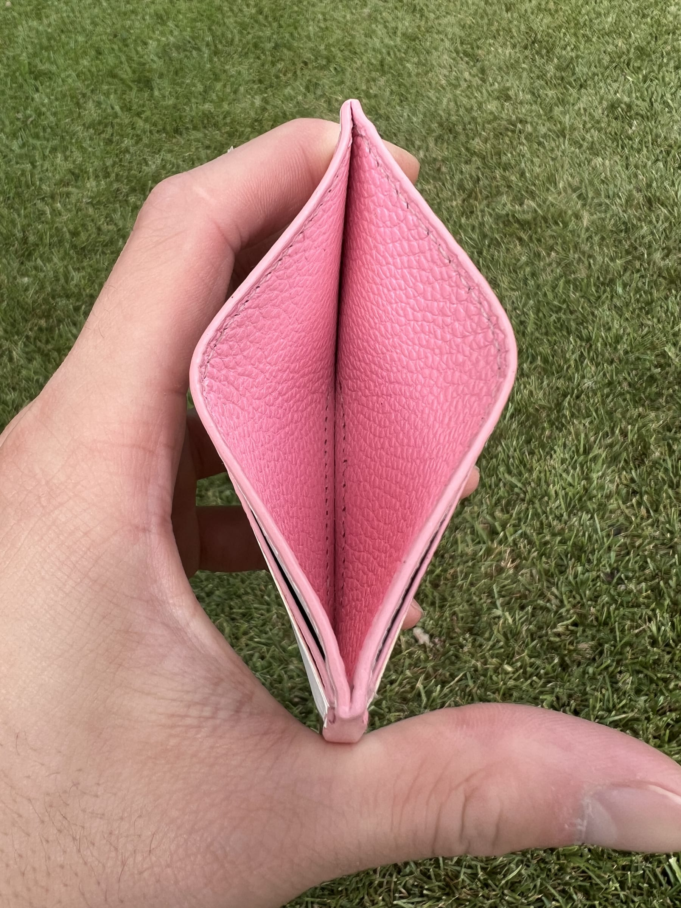
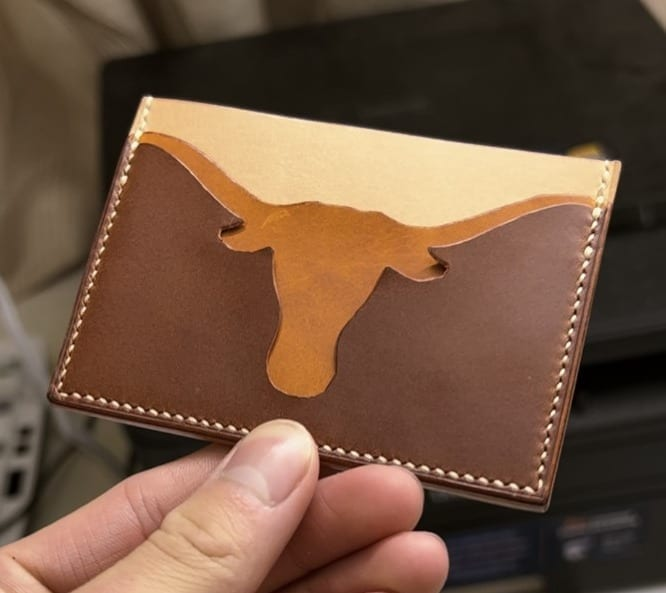
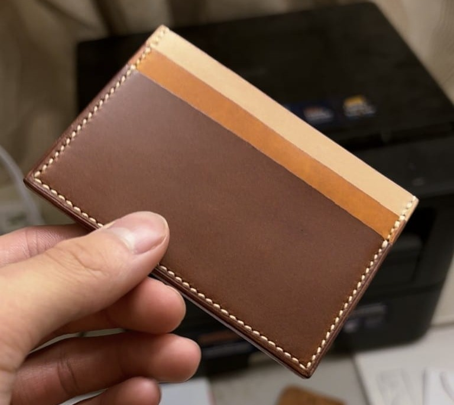

<a href="https://sites.google.com/view/songleather" target="_blank" rel="noopener"><svg class="org-mark" viewBox="0 0 24 24" fill="none" stroke="currentColor" stroke-width="2" stroke-linejoin="miter" stroke-linecap="square" aria-hidden="true"><path d="M3.5 5.5 20.5 18.5V5.5L3.5 18.5Z"></path></svg>Song Leather</a> is a small business I started at the end of 2020. It started as a small green woodworking business with a few branches that blew down in a storm in my backyard. Not wanting to see them turn into waste, I decided to pull out a knife I had been gifted when I was in Cub Scouts and carve utensils like spoons and butter knives. As I worked on improving my tools, I discovered a large gap in the market for simple, cheap, and custom knives. It was also industry standard for each knife I sold to come with a leather cover, so I designed a simple cover that could fit any knife for ease of manufacturing. From there, I got into leatherworking, which eventually evolved into making leather wallets.

My goal was to create real-world impact on the sustainability movement of the time and gain experience with marketing and product design by actually running a small business. Along the way, I was fortunate enough to have an amazing sister who made me a TikTok video in exchange for making her a tote, which brought in millions of views and an abundance of orders. Since each wallet and bag took me a few days, and sometimes weeks, to make, I began to scale down a little. More recently, I've exclusively made gifts for friends and family.

<h2 class="text-centered">Designing the Wallets</h2>

The wallet patterns in Fusion 360, later converted to DXF files for laser cutting

My design language has always been to make something as small and functional as possible. A lot of wallets on the market have unnecessary extra space in each pocket and are made from cheap plastic-coated leather, two problems I wanted to eliminate. I set out to design simple wallets that I would carry and test for months at a time before releasing. I also decided to do some market research to see what people really needed.

Based on my research, I realized I needed an element of uniqueness to show off the handmade aspect of my wallets, so I strayed away from the traditional bifold. I designed around three things: manufacturing efficiency, card accessibility, and overall aesthetics.

Once I came up with a general design, I prototyped it over and over with cardstock models. During this time, I had just joined Yearbook at Bellaire High School which gave me access to Adobe InDesign. There, I created 2D patterns, which I printed and pasted onto cardboard to trace onto the leather to further expedite my manufacturing process. Once I started university, I moved on to laser cutting patterns from acrylic or 3D printing them on my own printer for the designs I want to sell.

<h3 class="text-centered">Conclusion and Future Improvements</h3>

I was able to accomplish my early goals of gaining experience with product design and marketing, and I got a platform to share my message on sustainability. Running the business myself also showed me how quickly a handmade process runs out of room once the orders start coming in.

If I started over, I would think about scalability and manufacturability before establishing my brand values. This became apparent during the first wave of orders, which led me to limit availability and ended up costing me sales. I would also choose a less controversial material than leather. Many misconceptions about leather, mostly tied to the illegal poaching of exotic animals, affected how my wallets were perceived, which even came up in a few of my Instagram comments, despite the leather being sourced responsibly.

<h2 class="text-centered"><a href="https://sites.google.com/view/songleather" target="_blank" rel="noopener">My Work</a></h2>

A bifold in grey textured leather

The bifold, open

A card holder made as a gift

The card holder from above

A card holder with a Longhorn inlay

The back of the Longhorn card holder
