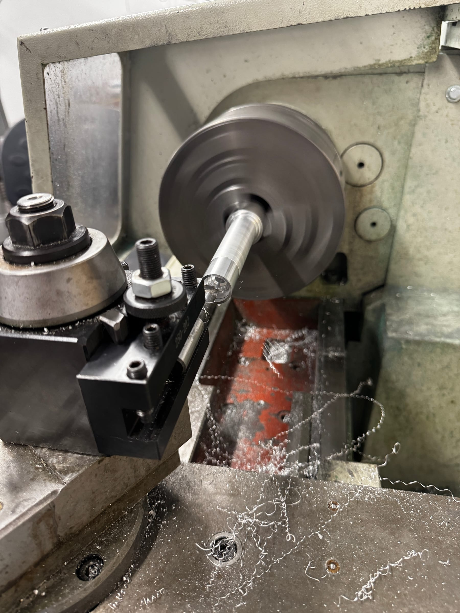
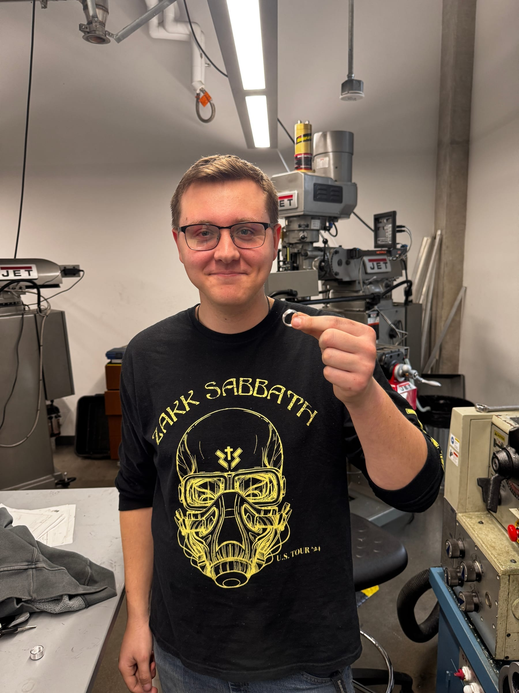
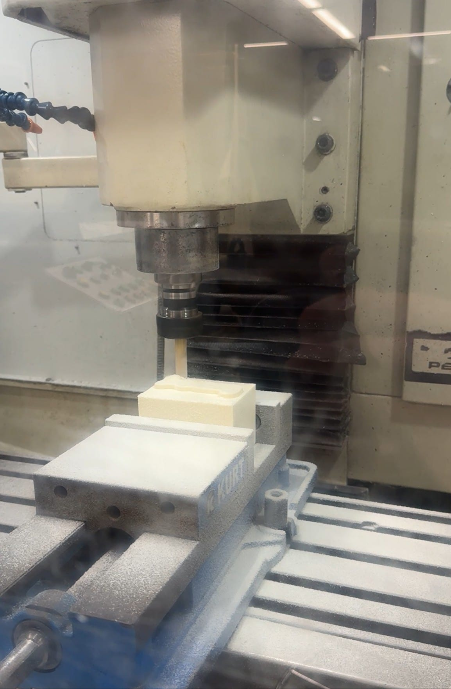
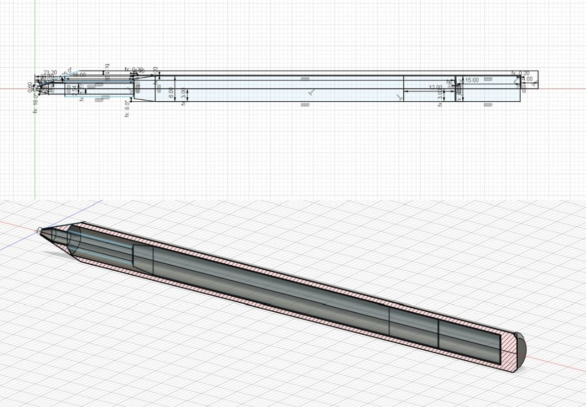

During the 2024–25 school year, I was the Woodshop Lead and a core member of the Machine Shop Team at Texas Inventionworks (TIW), UT Austin's premier makerspace. 

My job was twofold: keeping heavy machinery running safely across a massive student body, and running hands-on curriculum that taught uninitiated students how to cut metal without hurting themselves or destroying expensive tooling.

## The Training Curriculum

One of my weekly hands-on training sessions with the manual mill.

I ran multiple two-hour training sessions each week on the manual mill and the manual lathe. The sessions were hands-on and aggressively built around fundamentals — machining intuition first, safety throughout. On the lathe, students machined an aluminum ring to a tight tolerance. On the mill, they cut a dog tag.

Teaching the same operations weekly changed how I operate machines myself. Having to explain *why* a cut chatters out loud forces you to actually understand the physics of it.

## The Bolt Action Pen

The structural problem with any university machine shop: getting students through the door. 

Most engineering students are intimidated by the machines. To solve this, I designed a project purely to lower the barrier to entry and get students talking to our staff. 

Cutting the aluminum stock on the lathe (left) and the resulting finished surface (right).

The complex bolt-channel cutting operation (left) and the final assembled pen (right).

I engineered a custom bolt-action pen and authored an exhaustive Instructables guide covering the entire manufacturing process, from raw stock selection through final assembly. The goal was to pair real precision machining technique with documentation approachable enough that a literal first-timer could follow it and walk out with something they wanted to keep.
