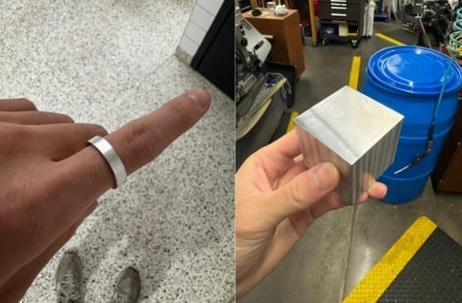

During the 2024–25 school year I was on the Machine Shop Team at Texas
Inventionworks, UT Austin's makerspace, manufacturing both personal and
work projects on manual mills, manual lathes, and CNC machines.

## Machine Shop Trainings

I ran multiple two-hour training sessions each week on the manual mill and the
manual lathe. The sessions are hands-on and built around fundamentals —
machining intuition first, safety throughout. On the lathe, students machine an
aluminum ring to a tolerance. On the mill, they cut a dog tag.

Teaching the same operations weekly changed how I machine. Explaining why a cut
chatters forces you to actually understand it.

## Bolt Action Pen

**The problem:** get more students through the door of the machine shop and
talking to the professional and student staff.

I'm writing an Instructables guide for manufacturing a custom bolt action pen,
covering the full process from raw stock selection through final assembly. The
goal is to pair real precision machining technique with documentation
approachable enough that a first-timer can follow it and finish with something
they want to keep.
