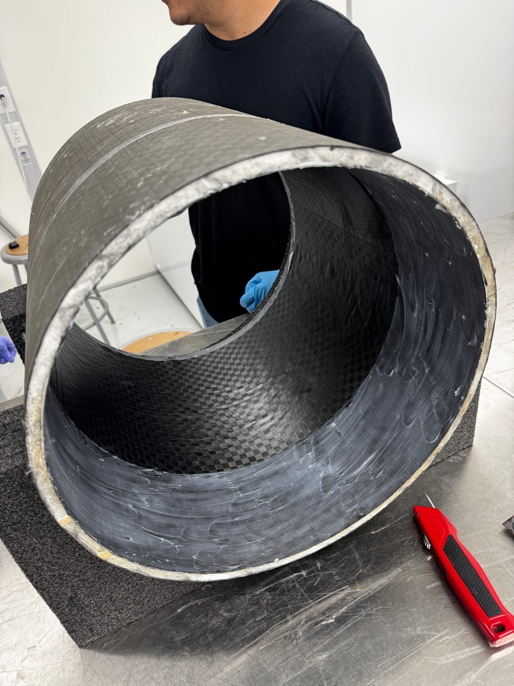
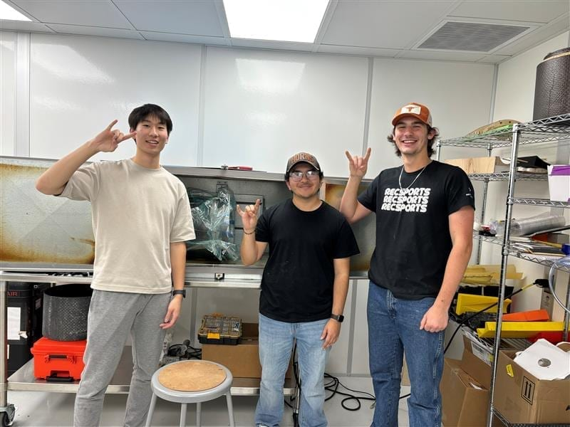
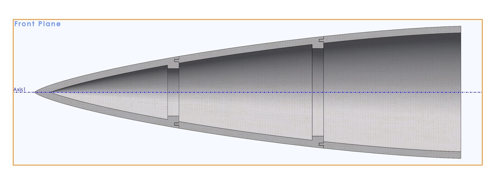
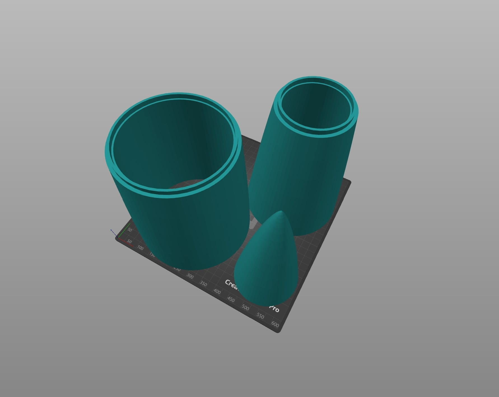
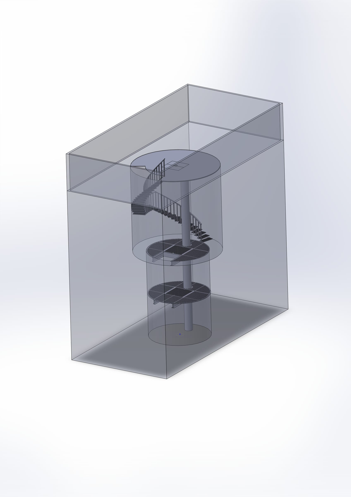

Since Fall 2024, I've been a structures and manufacturing engineer at the Texas Rocket Engineering Lab (TREL). I joined the Halcyon division right as the team moved out of design and into physical manufacturing for the Mark 1 rocket. 

My work focused heavily on composite layups for the skirts, raceway mounts, and nose cone, before pivoting to heavy structural engineering for the Orbital Test Stand.

## Carbon Fiber Manufacturing

Waxing the mandrels (left) and vacuum bagging the carbon fiber rocket skirt (right).

I laid up carbon fiber and fiberglass parts using both prepregs and wet layups. One of my first real jobs was cutting the critical access ports for the fluid lines passing through the carbon fiber skirt. 

The stakes were high: one bad cut and you ruin a multi-thousand dollar composite part. With no proper ventilation in the facility, I spent hours in the Texas sun with a drill and a rotary tool, carefully working through layers of carbon fiber. It was my favorite work that semester — getting my hands dirty and holding the hardware made the stakes feel real.

## The Nose Cone Mold

The problem: design a 4-foot rocket nose cone mold around an existing geometry, accounting for composite resin shrinkage and vacuum bagging realities. And do it all in one month before production started.

The full CAD assembly of the nose cone mold (left) and the slice plan for 3D printing (right).

I engineered a three-piece split mold design in CAD so the cured tip could be released without fighting a vacuum. We chose ABS for its ability to smooth perfectly with isopropyl alcohol. 

What actually happened? The plan fell apart. ITAR restrictions locked us out of the university's large-format printers. Budget constraints forced us onto cheap PLA. A donated, aging Gigabot printer burned its extruder out the week we needed it. Ultimately, we had to pivot entirely and do the layup on a deformed legacy nose cone smoothed with expanding foam.

I was disappointed, but I learned a brutal engineering lesson: **Always confirm the entire manufacturing pipeline before finishing the design.** Having a perfect CAD model means nothing if the supply chain or machine access doesn't exist.

## The Orbital Test Stand

In Spring 2025, I moved to the Orbital Test Stand division to build a 30-foot deep hot-fire engine test stand at the J. J. Pickle Research Campus.

The fully dimensioned site CAD (left) matching the physical hole during a site survey (right).

Other teams were completely blocked on systems integration because no master CAD of the physical environment existed. Working off a handful of photos, rough dimensions, and a mandate to build it "as fast as possible," I created the master 3D model of "The Hole." I modeled the site down to the exact metal grating patterns, ensuring structural teams could definitively check their clearances.

Finally, a teammate and I engineered an automated calculator for concrete bolt analysis. We took the ACI 318 governing formulas and built an extensive tool to calculate final bolt diameter, required embedment, plate thickness, and bolt count given any dynamic load, factoring in a strict 4x safety margin for the 10,000+ lbf engine tests.
