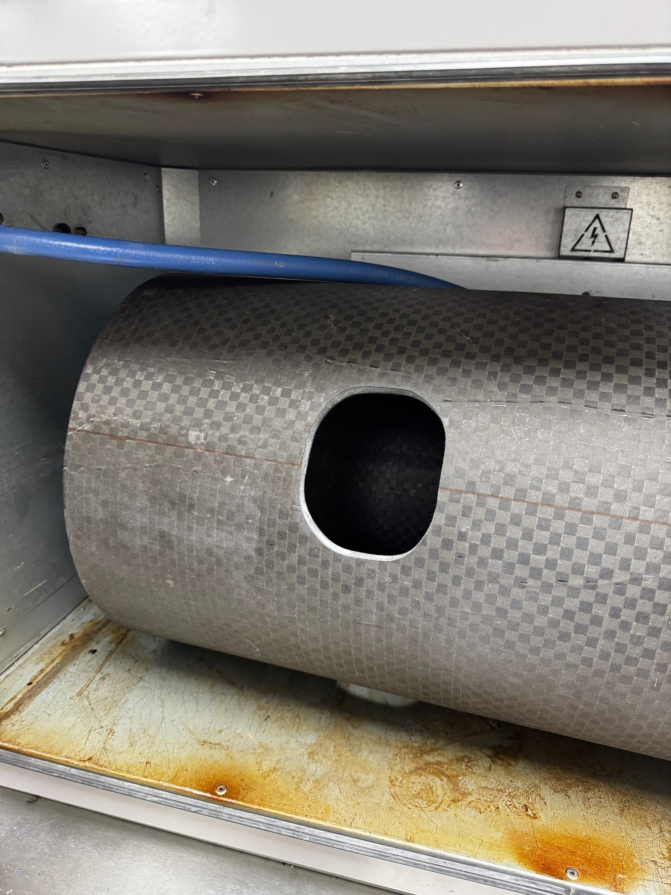

Since Fall 2024 I've been a structures and manufacturing engineer on TREL's
Halcyon division. I joined right as the team moved out of design and into
manufacturing the Mark 1 rocket — skirts, raceway mounts for the fluid lines
running off the COPV tanks, skirt couplers, and the nose cone.

## Composites Manufacturing

I cut, prepped, and laid up carbon fiber and fiberglass parts using both
prepregs and wet layups. One of my first tasks was working out how to cut the
access ports the fluid lines pass through. Our facility had no proper
ventilation, so the job meant hours in the sun with a drill and rotary tool,
working through layers of carbon fiber with very little margin for error.

It was my favorite work that semester. Getting my hands dirty was the first time
the contribution felt real.

## Nose Cone Mold

**The problem:** design a 4-foot rocket nose cone mold around an existing rocket
geometry, accounting for composite properties and layup method. I had one month
before production needed to start.

**Approach:** I'd been following Easy Composites on YouTube, and their sled
videos convinced me to split the mold into separate parts so the tip could be
removed — otherwise releasing the part would fight a vacuum. I chose ABS because
it smooths with isopropyl alcohol. Print bed limits meant breaking the mold
horizontally into three sections, joined with slots that release when the mold
comes off. Layup parameters mattered, but print quality at the seams mattered
more, so that's where I spent the attention.

**What actually happened:** almost none of it went to plan. TREL handles
ITAR-restricted information, which ruled out the large-format printers at Texas
Inventionworks — after I'd spent weeks coordinating with staff to reserve one and
source ABS filament. Budget then forced us onto PLA the team already had. TREL
had been donated an aging large-format Gigabot FDM printer, and I got it printing
a clean test cube after years of it sitting idle, but the extruder burned out a
part before we could print the cone. Between that and the schedule, we ended up
doing a layup on an old deformed nose cone smoothed with expanding foam.

I was disappointed. I also learned more in that month than in any other.

**What I'd do differently:** confirm the manufacturing path before finishing the
design. Communication channels made that hard to pin down early, so the real
lesson is simpler — have a backup plan from the start.
