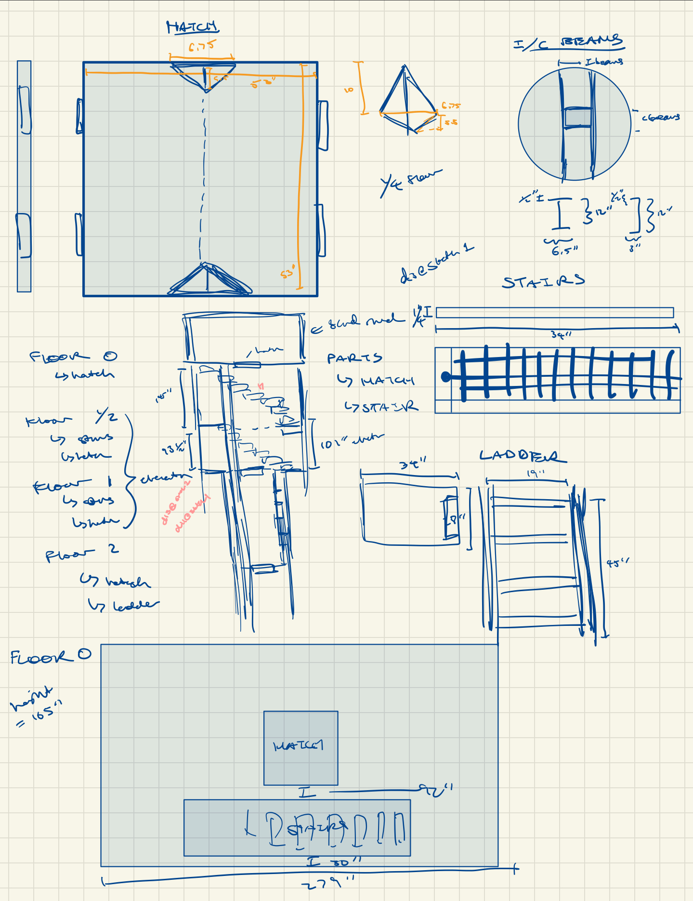
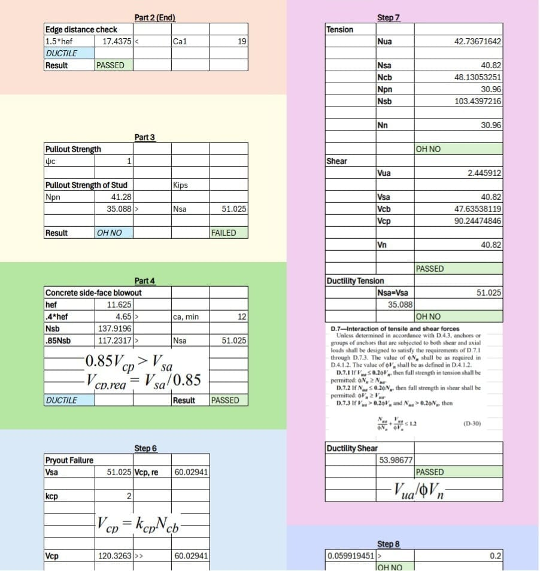
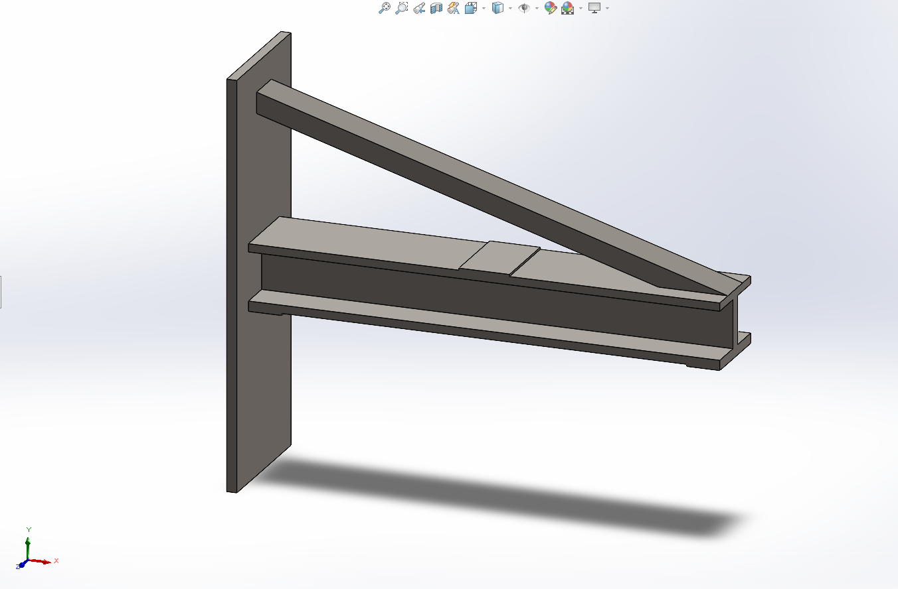

In Spring 2025, as the Mark 1 neared launch, I moved to TREL's Orbital Test Stand
division. We're building a launch and testing station at the J. J. Pickle
Research Campus — a stand that sits inside a 30-foot hole in the ground with
multiple levels and concrete walls. My work covered site modeling, support
anchoring analysis, and pressure transducer brackets for fluid monitoring during
engine tests.

## Site Modeling

**The problem:** build a life-size CAD model of the site — which I took to calling
the Hole — so every structures team could drop their parts into one assembly and
check integration. It also became the backbone of our presentations, including
the Preliminary Design Review.

I had a handful of photos, some video, and rough dimensions for most of it. The
timeline was "as fast as possible," because other teams were blocked on it.

**Approach:** I broke everything in the hole into a list and assigned each item to
the presentation it needed to be ready for. I started with the overall site and
the shed sitting on top, then worked down floor by floor, modeling the stairs and
the metal grating pattern so renders would read as real.

**What I'd do differently:** I initially positioned each part individually instead
of using assembly mates, reasoning that one wrong part wouldn't drag others out
of place. That backfired — every change became slow. The full assembly also took
a long time to render because of the grating geometry, so next time I'd either
drop the grating detail or keep it as a solid body.

## Concrete Bolt Analysis Calculator

**The problem:** the primary support structure carrying the rocket and engines
during testing anchors into the concrete walls. Given horizontal and vertical
loads that were still changing, determine what type of bolts to use and how many.

A teammate and I were handed a paper with the governing formulas and asked to
work out final bolt diameter, length, required concrete embedment, plate
thickness, and count — then model a support structure from our results. We were
given two weeks and finished in one.

**Approach:** we split the work along our strengths. I built the initial
calculations and the spreadsheet; my teammate reformatted and validated every
formula. I then extended it with optimal bolt spacing and checks validating
strength at a 4× safety factor, plus a written guide explaining how to use the
calculator and where each formula comes from.

With the calculator done, we analyzed beam types suited to the environment,
settled on an I-beam, and modeled the support structures in SolidWorks.

