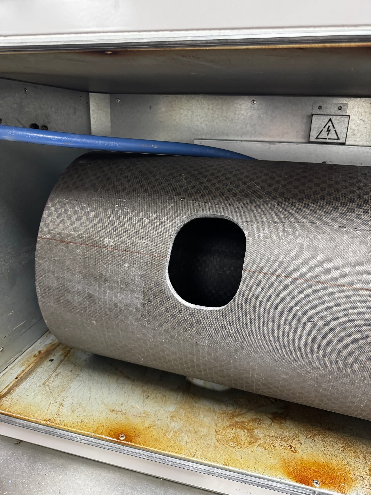
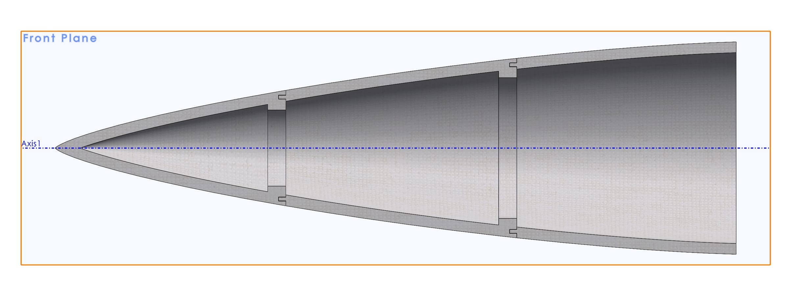

Since Fall 2024 I've been a structures and manufacturing engineer on TREL's
Halcyon division. I joined right as the team moved out of design and into
manufacturing the Mark 1 rocket — skirts, raceway mounts for the fluid lines
running off the COPV tanks, skirt couplers, and the nose cone.

## Composites Manufacturing

I cut, prepped, and laid up carbon fiber and fiberglass parts using both
prepregs and wet layups. One of my first tasks was working out how to cut the
access ports the fluid lines pass through. Our facility had no proper
ventilation, so the job meant hours in the sun with a drill and rotary tool,
working through layers of carbon fiber with very little margin for error.

It was my favorite work that semester. Getting my hands dirty was the first time
the contribution felt real.

## Nose Cone Mold

**The problem:** design a 4-foot rocket nose cone mold around an existing rocket
geometry, accounting for composite properties and layup method. I had one month
before production needed to start.

**Approach:** I'd been following Easy Composites on YouTube, and their sled
videos convinced me to split the mold into separate parts so the tip could be
removed — otherwise releasing the part would fight a vacuum. I chose ABS because
it smooths with isopropyl alcohol. Print bed limits meant breaking the mold
horizontally into three sections, joined with slots that release when the mold
comes off. Layup parameters mattered, but print quality at the seams mattered
more, so that's where I spent the attention.

**What actually happened:** almost none of it went to plan. TREL handles
ITAR-restricted information, which ruled out the large-format printers at Texas
Inventionworks — after I'd spent weeks coordinating with staff to reserve one and
source ABS filament. Budget then forced us onto PLA the team already had. TREL
had been donated an aging large-format Gigabot FDM printer, and I got it printing
a clean test cube after years of it sitting idle, but the extruder burned out a
part before we could print the cone. Between that and the schedule, we ended up
doing a layup on an old deformed nose cone smoothed with expanding foam.

I was disappointed. I also learned more in that month than in any other.

**What I'd do differently:** confirm the manufacturing path before finishing the
design. Communication channels made that hard to pin down early, so the real
lesson is simpler — have a backup plan from the start.

In Spring 2025, as the Mark 1 neared launch, I moved to TREL's Orbital Test Stand
division. We're building a launch and testing station at the J. J. Pickle
Research Campus — a stand that sits inside a 30-foot hole in the ground with
multiple levels and concrete walls. My work covered site modeling, support
anchoring analysis, and pressure transducer brackets for fluid monitoring during
engine tests.

## Site Modeling

**The problem:** build a life-size CAD model of the site — which I took to calling
the Hole — so every structures team could drop their parts into one assembly and
check integration. It also became the backbone of our presentations, including
the Preliminary Design Review.

I had a handful of photos, some video, and rough dimensions for most of it. The
timeline was "as fast as possible," because other teams were blocked on it.

**Approach:** I broke everything in the hole into a list and assigned each item to
the presentation it needed to be ready for. I started with the overall site and
the shed sitting on top, then worked down floor by floor, modeling the stairs and
the metal grating pattern so renders would read as real.

**What I'd do differently:** I initially positioned each part individually instead
of using assembly mates, reasoning that one wrong part wouldn't drag others out
of place. That backfired — every change became slow. The full assembly also took
a long time to render because of the grating geometry, so next time I'd either
drop the grating detail or keep it as a solid body.

## Concrete Bolt Analysis Calculator

**The problem:** the primary support structure carrying the rocket and engines
during testing anchors into the concrete walls. Given horizontal and vertical
loads that were still changing, determine what type of bolts to use and how many.

A teammate and I were handed a paper with the governing formulas and asked to
work out final bolt diameter, length, required concrete embedment, plate
thickness, and count — then model a support structure from our results. We were
given two weeks and finished in one.

**Approach:** we split the work along our strengths. I built the initial
calculations and the spreadsheet; my teammate reformatted and validated every
formula. I then extended it with optimal bolt spacing and checks validating
strength at a 4× safety factor, plus a written guide explaining how to use the
calculator and where each formula comes from.

With the calculator done, we analyzed beam types suited to the environment,
settled on an I-beam, and modeled the support structures in SolidWorks.

