From Fall 2024 to Fall 2025, I was a structures engineer at the <a href="https://texasrocketlab.ae.utexas.edu/" target="_blank" rel="noopener"><svg class="org-mark" viewBox="0 0 24 24" fill="none" stroke="currentColor" stroke-width="1.7" stroke-linecap="round" stroke-linejoin="round" aria-hidden="true"><path d="M12 2.5c2.4 2.3 3.8 5.5 3.8 8.9v3.4L12 18l-3.8-3.2v-3.4c0-3.4 1.4-6.6 3.8-8.9z"></path><circle cx="12" cy="9.4" r="1.5"></circle><path d="M8.2 12.6 5.4 15l.9 3.3M15.8 12.6l2.8 2.4-.9 3.3M12 18.4v3"></path></svg>Texas Rocket Engineering Lab (TREL)</a>. I joined the Halcyon division right as the team moved out of design and into manufacturing the Mark 1, a liquid bipropellant rocket, and spent my first year laying up composite parts for its body and designing the mold for its nose cone at the J. J. Pickle Research Campus.

In Spring 2025, as the Mark 1 neared launch, I moved to the Orbital Test Stand division, where we built a hot-fire engine test stand inside a 30-foot hole. I worked on a few smaller tasks, such as creating a calculator that sizes the bolts anchoring the stand to its concrete walls based on a paper, designing a bracket for the pressure transducers, and modeling a one-to-one replica of the site that every other team integrated their parts against.

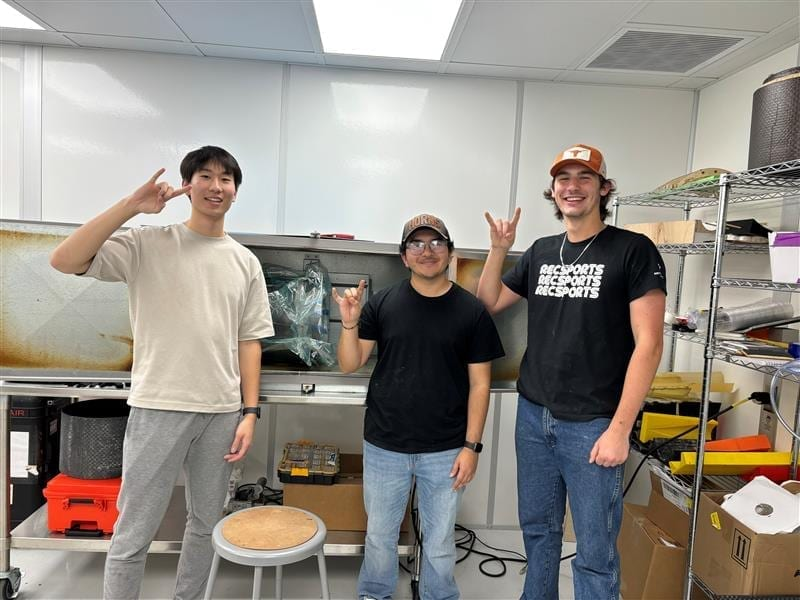
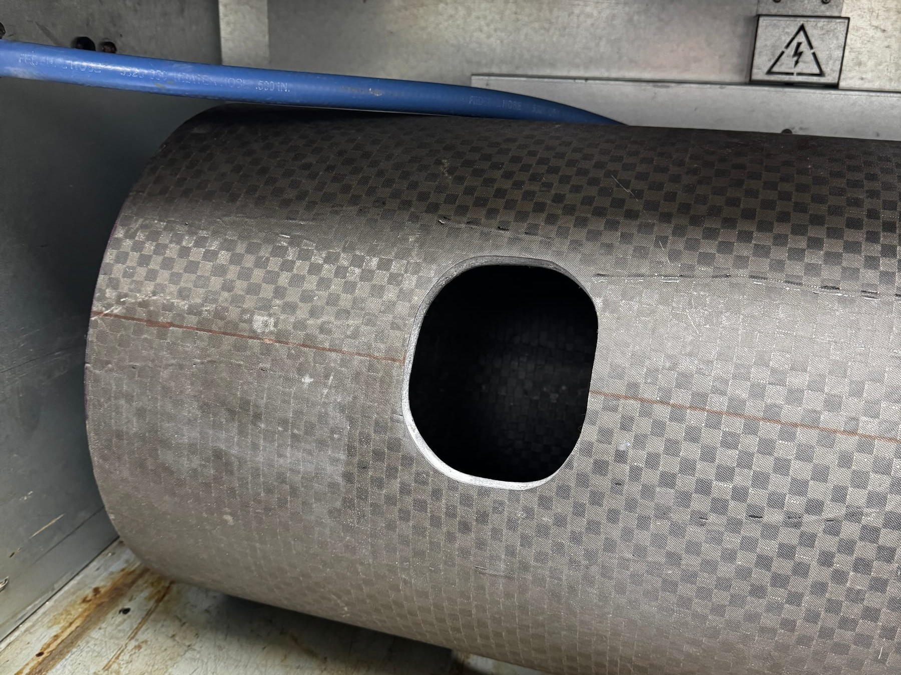
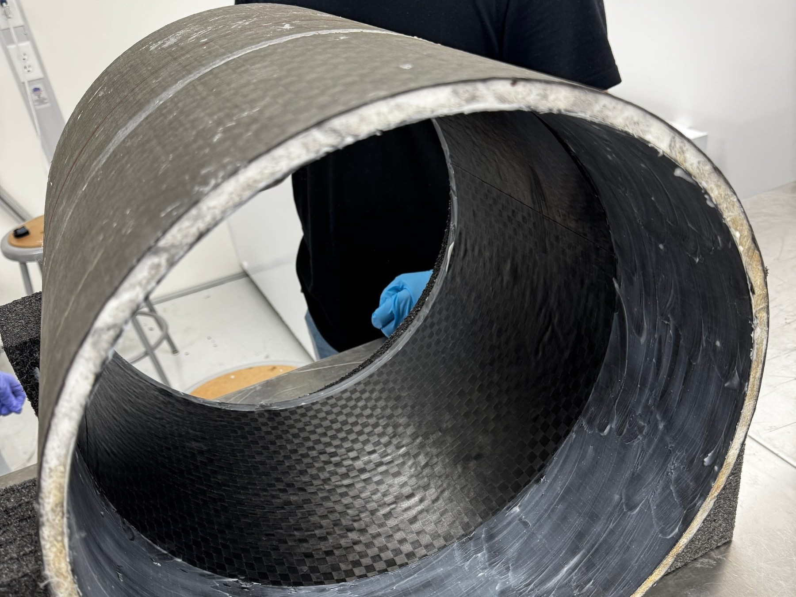

Part of the composites team

An access port cut through a finished skirt

Waxing the inside of a skirt

<h2 class="text-centered">Composites Manufacturing</h2>

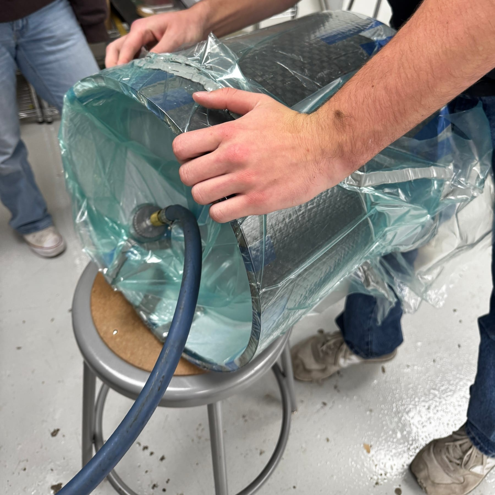

Vacuum bagging a carbon fiber rocket skirt

When I joined, our goal was to finish manufacturing the rocket's skirts, the raceway mounts for the fluid lines running off the COPV tanks, the skirt couplers, and the nose cone. Most of my time went into the composites themselves, cutting, prepping, and laying up carbon fiber and fiberglass. It was surreal to work with up to six figures in carbon fiber to build the body of the rocket, and even more surreal to work with other students who had worked in the industry. The first few skirts we made underwent tests, passing up to 9,600 lbf of axial force.

I laid up parts with both prepregs and wet layups, then vacuum bagged them to cure. One of my first real tasks was figuring out how to cut the access ports the fluid lines pass through. I decided to use a drill, a jigsaw, and a rotary tool. Since our facility didn't have proper ventilation, I spent hours out in the sun working through layer after layer of carbon fiber with very little margin for error, since one bad cut would ruin a week of work.

<h3 class="text-centered">The Nose Cone Mold</h3>

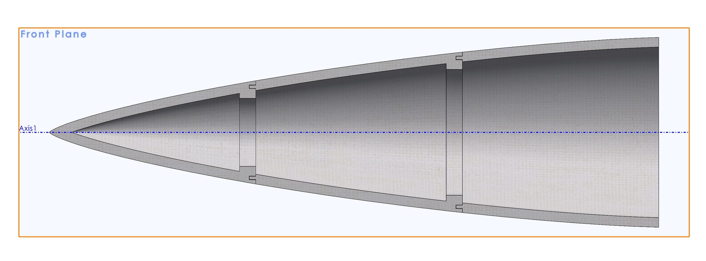

The 48-inch nose cone mold in SolidWorks, split into three sections

My second side task was designing the mold for the 4-foot fiberglass nose cone, built around the rocket's existing geometry and our layup method. I was really excited about this one since it was crucial to the final rocket and let me use everything I'd been picking up about composites, but I only had a month before production needed to start.

I'd been following Easy Composites on YouTube for a while, and their sled videos convinced me to split the mold so the tip could come off on its own. Otherwise, pulling the cured part off would mean fighting a vacuum. I also decided to split the mold horizontally into three sections, joined with slots that release when the mold comes off. I decided that 3D printing would be best since we had an old large-format FDM printer at the facility. I also decided to go with ABS so I could smooth it with acetone in a vapor chamber.

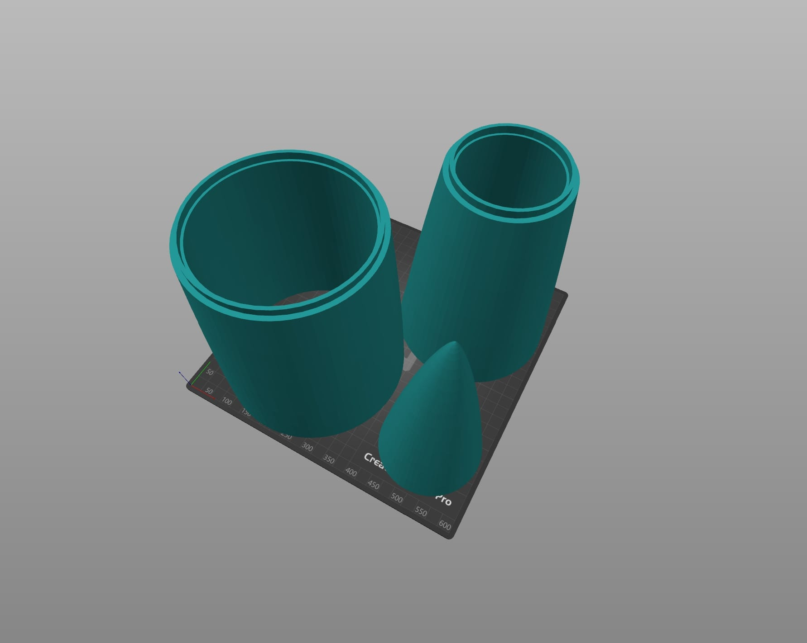

The mold sections laid out for printing

The first part of the plan included reaching out to Texas Inventionworks, the university makerspace I work at. However, after weeks of coordinating with the professional staff, I found out that ITAR restrictions prevented me from using TIW's facility. This led me to resort to our plan B. Years before, TREL had also been donated an old large-format Gigabot printer. After a week of fixing firmware, calibrating the nozzle and leveling the bed, I got it printing a clean test cube, but the extruder burned out a part before we could print the cone. In addition, I found out that due to our limited budget, we had to resort to using old PLA the team had stored away, but this filament was extremely wet and brittle. Between that and the schedule, we ended up doing the layup on an old, deformed nose cone smoothed out with expanding foam.

While I was extremely disappointed, I still got satisfaction from the finished nose cone, which, although imperfect, turned out much better than I could have hoped for. I learned to always have a plan B in case things don't go my way.

<h2 class="text-centered">The Orbital Test Stand</h2>

The Orbital Test Stand is a launch and testing station for TREL's engines at the J. J. Pickle Research Campus. The stand sits inside a 30-foot hole in the ground with multiple levels and concrete walls, and as a structures engineer, my work covered modeling the site and analyzing how the stand's supports anchor into it.

<h3 class="text-centered">Modeling the Hole</h3>

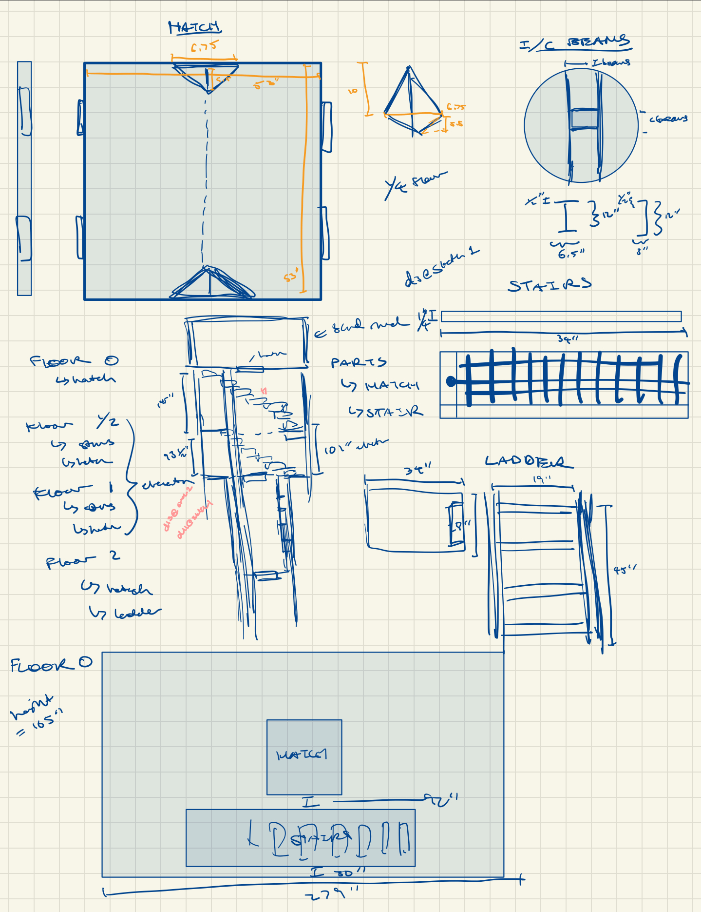
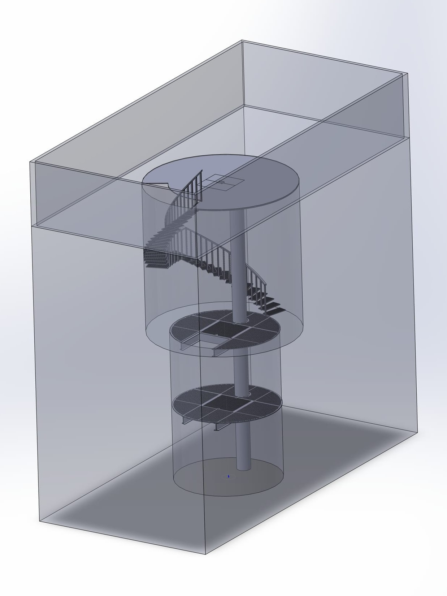

Hand drawings of the floor plan

Full site model

Every structures team needed somewhere to drop their parts in and check that everything fit, so my first job was a life-size CAD model of the site, which I endearingly named the Hole. All I had to go off of were a few photos, some video, and rough dimensions for most of it, and since other teams were blocked until it existed, the timeline was as fast as possible.

I broke everything in the Hole into a list and gave each item a deadline based on the presentation it needed to be ready for. I started with the overall site and the shed sitting on top of it, then worked down floor by floor, modeling the stairs and the metal grating pattern so the renders would look real. The finished assembly has over 30 components, from the steel grate flooring to the I-beams, brackets, and anchors, and it became the backbone of our presentations, including the Preliminary Design Review.

<h3 class="text-centered">Concrete Bolt Analysis Calculator</h3>

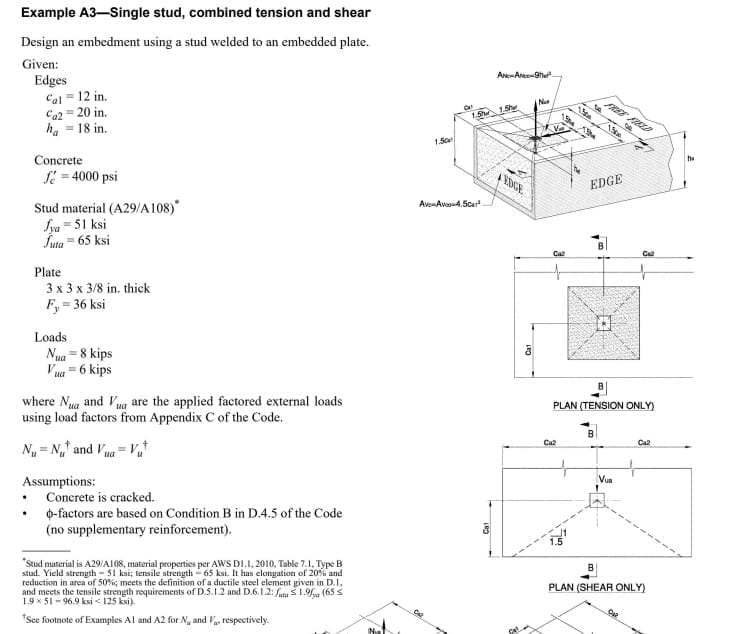
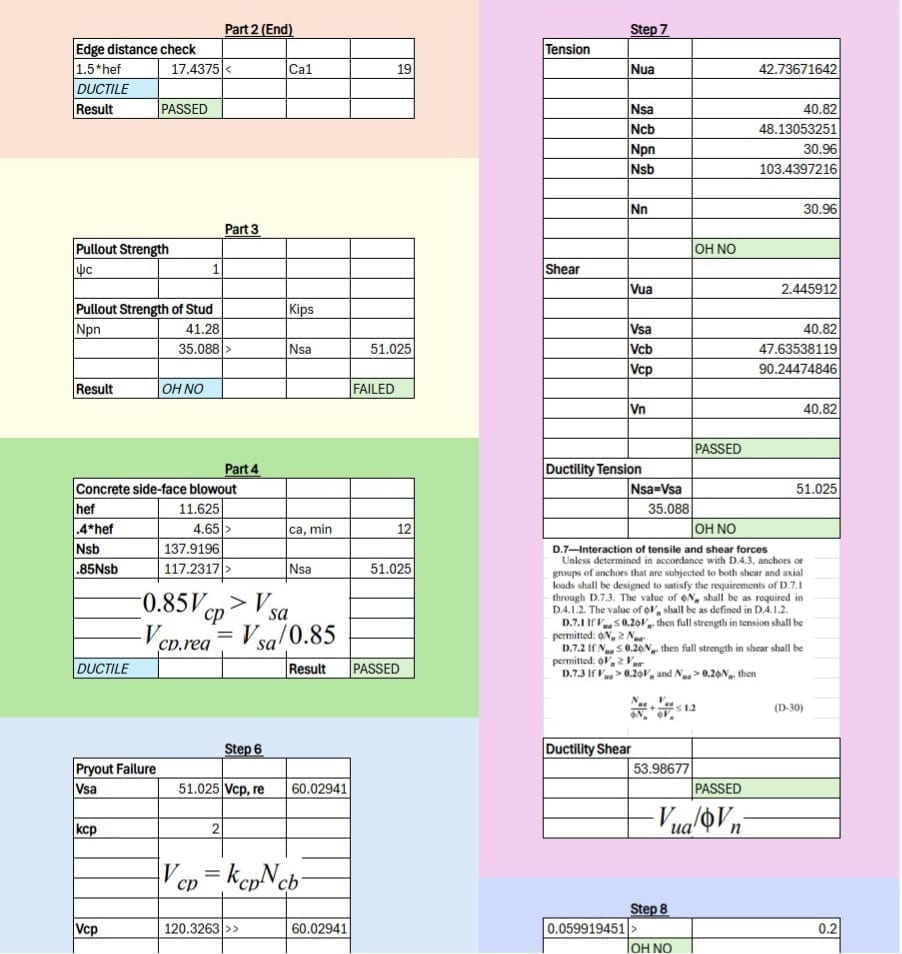

The paper that the formulas were sourced from

A screenshot from the Excel sheet, with each check marked pass or fail

The primary support structure holding the rocket and engines during testing anchors into the hole's concrete walls. My friend and I were given a paper with the governing ACI 318 formulas and were told to work out the final bolt diameter, length, required concrete embedment, plate thickness, and number of bolts, all for horizontal and vertical loads that were still changing.

We decided to split the work along our strengths. I built the initial calculations and the Excel sheet, while my teammate reformatted and validated every formula. I then added the optimal bolt spacing, checks validating strength at a 4x safety factor, and a written guide explaining how to use the calculator and where each formula comes from. The final design reached 150% of the required load capacity while using fewer fasteners than the pre-calculator estimates.

<h3 class="text-centered">Conclusion and Future Improvements</h3>

The nose cone taught me the hardest lesson: confirm the plan before finishing the design. This process taught me to overcommunicate and ask questions, even in an unfamiliar setting. However, even if communication is set, it's important to always have a backup plan.

The site model was my first time making an assembly in CAD. Previously, I had just modeled small parts like a small record player housing or a pencil holder. Although it seems obvious in hindsight, I learned how to use mates, so a change to one part updates the rest of the assembly instead of every piece having to be moved by hand. The full assembly also took a long time to render because of the grating geometry, so next time I would either drop that detail or keep it as a simplified solid body.

The bolt calculator showed me how much faster a project moves when the work is split by strengths. After I made the bolt calculator, a few teammates came to ask how to use it. This is when I also learned the importance of documentation.

<h2 class="text-centered">Conclusion</h2>

TREL taught me a lot of important lessons, especially early in my career. It was here that I found my passion for getting my hands dirty and working with a passionate team to create something amazing. Thank you TREL for everything!

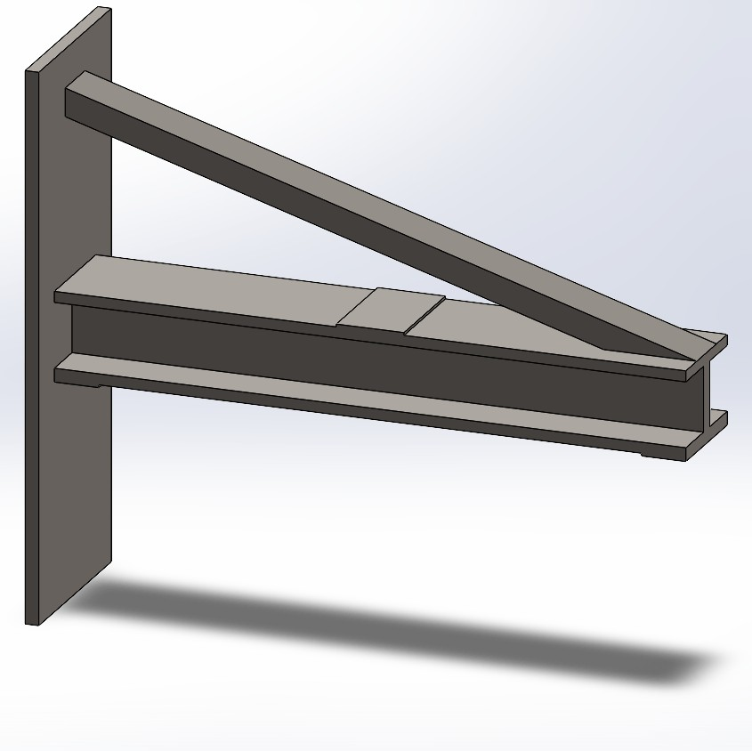

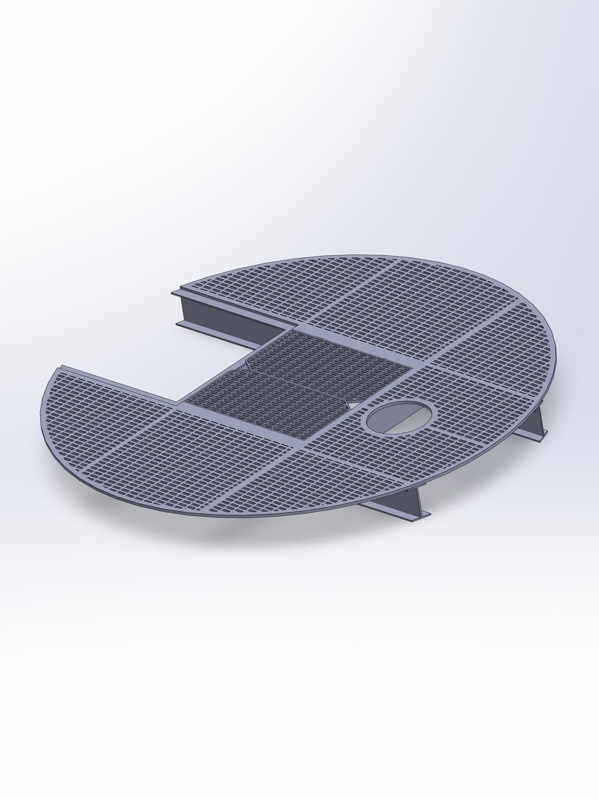
