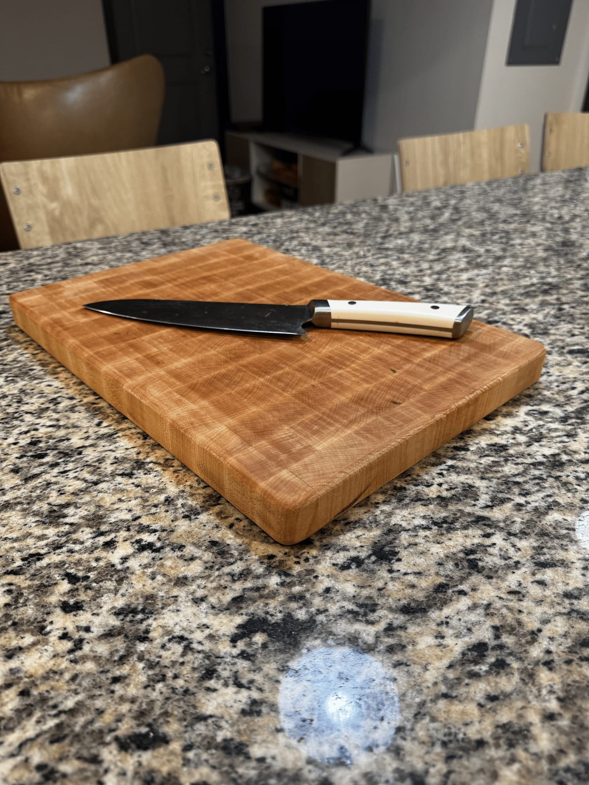
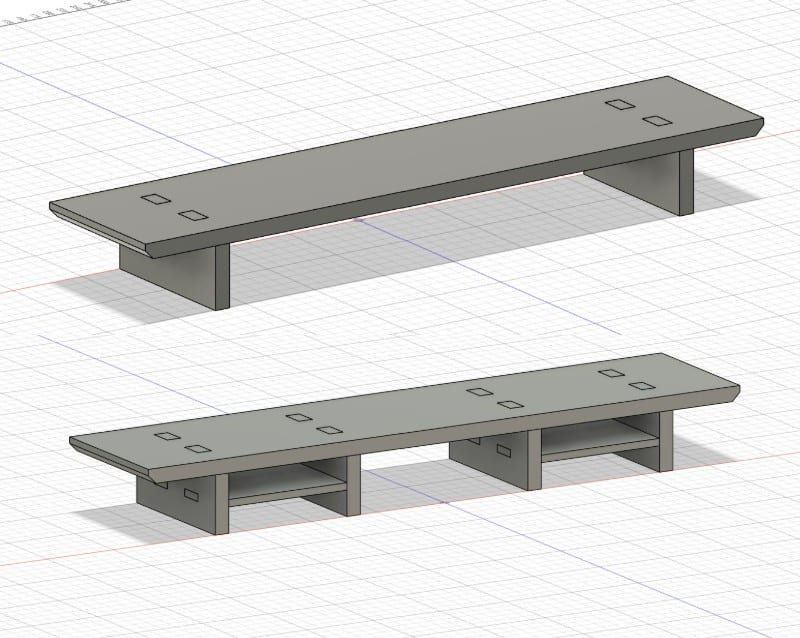

Texas Inventionworks, UT Austin's makerspace, has a woodshop stocked with a table
saw, miter saw, routing table, jointer, planer, and belt sander, among others.
These projects — the cutting board especially — were built to become
Instructables, the same way I approach my machine shop work: give students a
reason to walk in and use the space.

## End Grain Cutting Board

I have a habit of procrastinating on Mother's and Father's Day gifts, so in 2025
I started early. My parents are practical people, so I made them something they'd
use every day.

**Approach:** a YouTube video gave me the intuition for why end grain boards are
built the way they are. I kept the design minimal and used maple throughout.
After calculating the strip lengths and thicknesses I'd need, I bought the stock
and started cutting.

## Desk Riser

**The problem:** my monitor eats desk space I'd rather give to homework, class
notes, or my sketchbook. I also wanted joinery practice before a larger woodshop
project.

**Approach:** like most of my projects, this started as a sketch, then a pass
through Etsy and Pinterest to settle the final form. I usually lean minimal, but
here I added two shelves for my laptop hub and charging station. The CAD is fully
parametric — every dimension is relative — so I can re-target the same model to
someone else's desk and build one as a gift.
